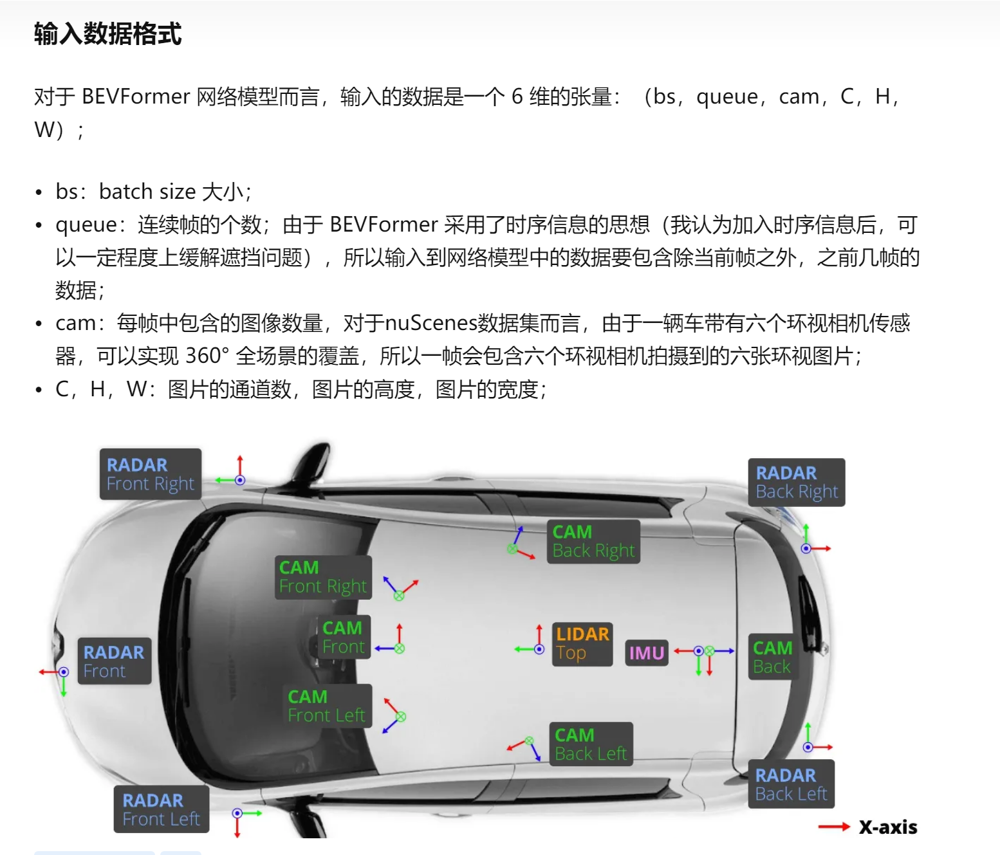

https://zhuanlan.zhihu.com/p/543335939
bevformer的显存最少需要24G（论文里给出的是20G）
bevformer是特征提取，最后输出的是一个特征图。这个特征可以直接输入给对应的BEV 3D的检测头去输出3D的目标框。

### 1.输入数据格式

### 2.可变性注意力机制

### 3.流程

先时间attention，再空间attention，每一个格子都是一个向量。整个bev是一个特征图。
一般bev格子的大小是200×200，分辨率是1m，bev的中心是自车。

## 4 训练时间
BEVFormer Base 模型需要每张 GPU 上 28G 的显存，在单张 A100 上训练完成（24 个 epoch）需要大约 14 天的时间，在 8 张 A100 上训练完成需要接近 2 天的时间。
