https://blog.csdn.net/CV_Autobot/article/details/129036228
# 整体流程
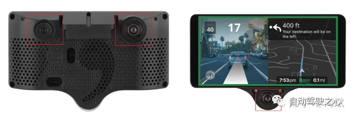

# 2流程详解

## 2.1 图像采集

comma 3设备上的2颗前视摄像头，FOV不同，1颗后视摄像头
前后的两颗超广角摄像头型号是一样的，FOV都为185度，可以形成360度环视。

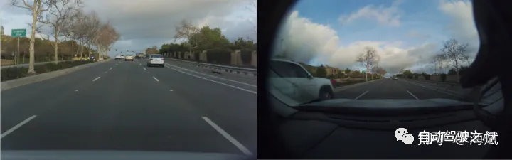

同一时刻，**2颗前视摄像头**拍摄的画面

**后视超广角摄像头**拍摄的画面，以及对他的语义分割标注

camerad会以20 FPS的频率从前视摄像头不断采集图像，再使用opencl把RGB转化成YUV420格式，再通过VisionIPC的共享内存机制把图像送到模型推理模块http://modeld.cc。

- 两颗前视摄像头，它们的FOV不同，从不同尺度给supercombo模型提供内容来预测后续的轨迹规划和车身姿态等信息。
    
- 一颗后视超广角摄像头，目前只用来监控司机的注意力是否可以随时接管车辆控制，但通过comma.ai众包的标注数据来看，未来可能会使用其拍摄的车窗外侧的内容辅助轨迹规划，如增加了并线时对侧后方车辆的判断。

## 2.2 模型处理

modeld进程在读取到VisionIPC发来的新图像后，会使用相机的外参、内参等信息对图像进行矫正，还会进行归一化等数据处理，这个预处理流程核心部分采用opencl来加速。
接下来，预处理后的结果被送入supercombo模型推理，产生的推理结果中与后续的纵向控制流程相关的部分是：
- **轨迹规划的结果plans**，其中每条轨迹含有未来一段时间33个轨迹点的位置、速度、加速度、横摆角、横摆角变化率等信息。
- **前车信息leads**，前方若干车辆的相对速度、相对距离等信息。（后续会与雷达数据进行融合）
- **车辆姿态temporal_pose**，其中包含对自车的速度和欧拉角旋转速度的估计值，作用和视觉里程计类似。

## 2.3 雷达

openpilot在纵向控制流程中，需要用到车载ACC雷达的感知信息，虽然其将来的目标是完全使用视觉信息进行端到端的规划，但目前阶段还是将原车**自带的ACC雷达信息与基于视觉判断的前车信息进行了融合后再进行纵向控制**。

openpilot适配的每种品牌车辆，**在selfdrive/car/XXX/radar_interface.py文件中实现了车载ACC雷达数据的获取函数**。如下图展示了“现代”汽车的实现，把CAN消息如，雷达的方位角(azimuth)、相对距离、相对速度、加速度原始信息，处理成符合radard后续要求的方式。方位角不再被需要，而是转换成了横向偏移yRel，距离也转换成了纵向距离dRel。（大部分车的ACC雷达不提供前车的加速度信息aRel，需要后续采用卡尔曼滤波来估计前车的加速度）

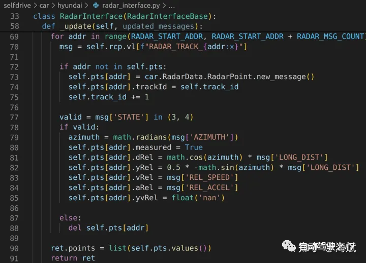

解析ACC雷达的CAN信息，转换成radard后续处理所需要的数据格式

radard中采用卡尔曼滤波来处理雷达返回的数据，这样第一个好处是比只使用测量值，可以进一步降低噪声；另一个好处是，很多雷达无法直接观测前车的加速度，用卡尔曼滤波后就可以通过系统的状态方程结合历史数据更好的估计出当前时刻的前车加速度。

这里的系统的的状态量是[v, a]，观测量是[v]。这里的系统动态是线性的，所以不需要使用rednose里的EKF，而是使用了一个简化的卡尔曼滤波，下图是此处的卡尔曼滤波相关参数设定代码，其中状态转移矩阵为A（其中包含dt），测量方程的测量矩阵为C（部分文档中用H），过程噪声协方差Q是[[10,0],[0, 100]]，测量噪声的协方差R是[[1e3, 0 ],[0, 1e3]]，估计误差协方差P为[[1,0],[0,1]]，不过代码中的Q和R是用注释方式展示的（P甚至没有注释的提示，但做实验可得约是1），实际并没有定义，而是提前计算了不同dt的情况，形成了K0/K1表示的卡尔曼增益。

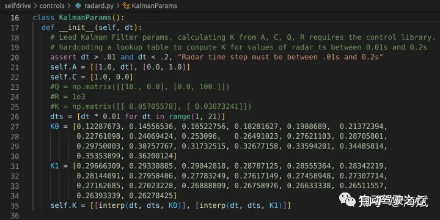

raderd代码中卡尔曼滤波参数

从卡尔曼滤波中的5个公式中可以看出， K,P 两个参数虽然也随步骤k不断迭代改变，但却与状态 X 的取值和观测 Z 的取值无关，卡尔曼增益  随着不断迭代必然需要收敛到稳定值。所以radard这里的卡尔曼增益参数K0/K1，代表dt从0.01s到0.2s时的20种不同的dt情况下，收敛后的卡尔曼增益（列向量）的第一行与第二行，后续用插值方式根据实际调用时雷达处理频率求得的dt得到更匹配的K。例如，有的雷达采样频率是15HZ，则需要用dt=1/15s 来求插值后的K。

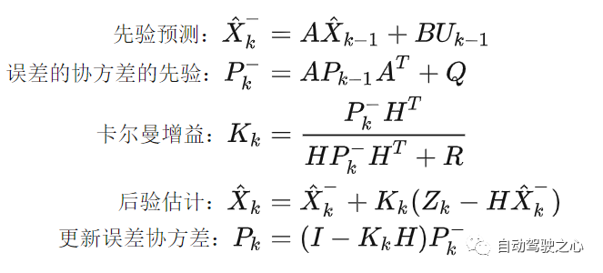

radar进程会将滤波后的雷达数据先进行聚类，然后再与模型返回的基于视觉感知的前车数据，进行融合，构造此模块的返回值。关键函数的注释分析如下图：

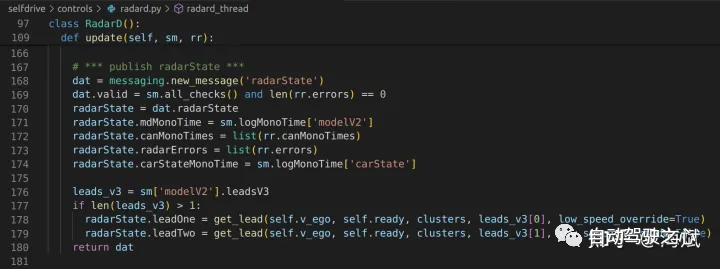

radard进程中，通过get_lead函数，融合两种模态得到的前车数据

虽然supercombo模型给出了3个不同时刻(0s, 2s, 4s)的前车信息预测，单radard中目前只使用了前两者leads_v3[0]和leads_v3[1]。最终构造的发给其他模块的消息radarState中，关键数据是leadOne和leadTwo，其中leadOne要考虑低速蠕行时，视觉感知不准，需要用雷达感知数据覆盖。细节如下图：

radard进程将构造要pub出去的radarState消息

从代码流程中可以看到，理论上可以不依赖ACC雷达，只依赖视觉感知预测出的前车数据，但目前代码细节还是体现出雷达的可靠度/优先级比视觉要更高。不过代码中也体现了使用视觉感知结果来“拒绝”雷达感知结果的优先级也非常高，get_lead函数中，若lead_msg<0.5，则会拒绝所有雷达的数据，产生“无前车”的最终输出。

## 2.4 规划（纵向）

selfdrive/controls/lib/longitudinal_planner.py 中的LongitudinalPlanner类，负责将supercombo推理输出的规划，结合融合后的雷达信息，**用MPC进行再次优化，使速度或加速度控制更加合理和舒适**。

每当模型推理部分给出新的轨迹规划输出后(周期0.05s)，LongitudinalPlanner的update和publish函数会依次被调用，其详细实现如下：

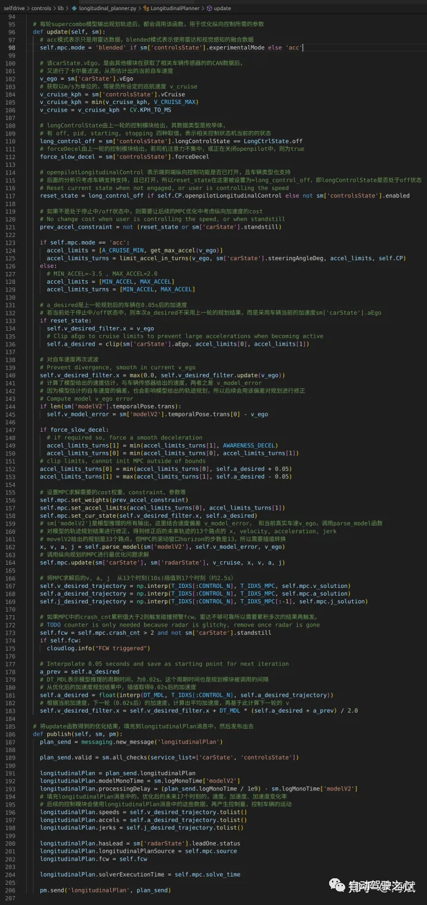

其中的parse_model函数，一方面将模型输出转换成了MPC需要的步骤数，另一方面修改了轨迹里的速度，防止横向加速度过大影响舒适和安全。该速度修正是taco2分支相比与master分支中新增的内容。

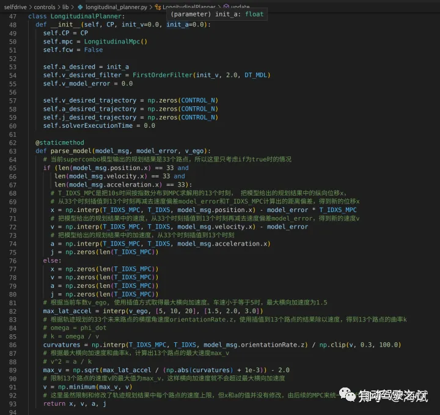

前面展示的主要是纵向规划器输入输出的部分，其优化工作的核心是使用了MPC来完成，其详细内容如下：

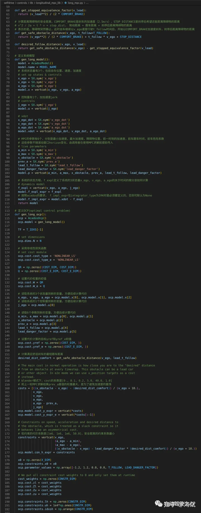

继续

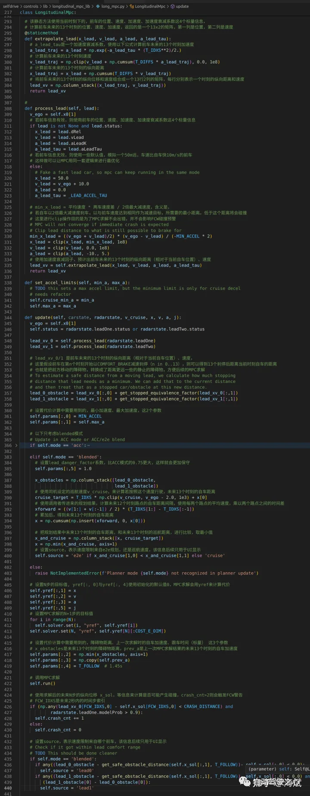

这里细节有点多，总结一下整个纵向规划的一些特点：

- 考虑了横向加速度不能过大的情况，会根据曲率设置速度上限。
- 虽然上游只给了前车的当前时刻的距离，速度，加速度等，这里使用了启发式的加速度衰减因子tau来估计前车在接下来10s内的速度变化情况，并以此估计出前车未来的多个时刻的信息。后续的安全车距计算，也依赖这个估计。
- 没有前车时，构造假想前车让整个流程更简单
- 使用驾驶员设定的巡航速度，作为上限来限制规划结果导出的未来时刻的纵向位移。但没有把巡航速度和规划速度直接做误差的代价计算。
- MPC代价计算中，两次优化结果的加速度差值的权重是最大的，也就是在不违反constraint前提下，最看中加速度的平稳。
- 从最小加速度的设定值(-3.5m/s^2)来看，无法产生紧急情况下的全力制动。不过从文档看openpilot并不影响原车自带的AEB功能的工作。（某些车型的AEB不受影响，但某些车型会被影响，具体可以参看openpilot车辆兼容性文档）
- 因为ACC雷达的噪音导致可能误报，所以需要该模块连续3轮判断会产生碰撞，才会触发FCW报警
- 从安全跟车距离的计算公式来看，目前的跟车策略比较偏保守。

## 2.5 控制

控制进程 selfdrive/controls/controlsd.py 负责比较多的内容，其中包括横向、纵向控制参数的进一步计算和对更底层车辆相关发送CAN命令部分的调用。

对于纵向控制，constrolsd会调用 selfdrive/controls/lib/longcontrol.py的LongControl类来进行，其关键部分如下：
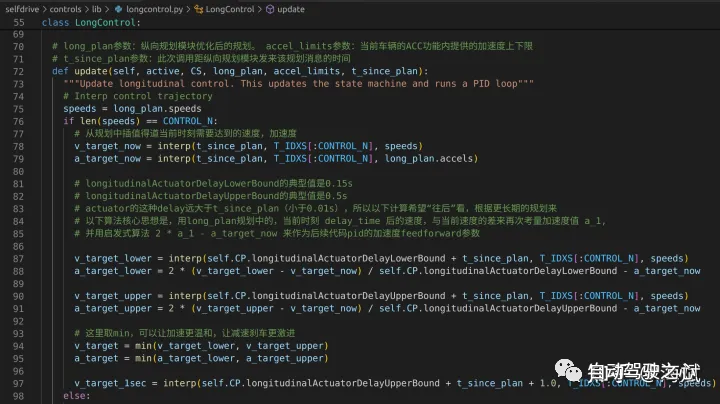
longcontrol.py

从上图代码可以看到，LongControl重点考虑了车辆的纵向执行器actuator的延迟，根据其部分车辆相关代码中的设置来看这个延迟有0.15-0.5s，所以简单的把规划中的当前时刻的加速度a和v作为pid的feedfoward和error是不太好的，加速和刹车会不够灵敏，这里根据车辆类型具体的延迟，做了考虑长远时间的目标加速度和目标速度修正，目的是通过预先考虑提前量使得最终执行后的结果与规划的结果的延迟更小。
LongControl的实现中，有一个状态机，有off/starting/stopping/pid 四种状态，pid状态是大部分正常行使时所处于的状态，此时会用PID方式来计算加速度。处于off状态下时，加速度会使用常数0，处于其它2种状态下时，加速度会使用CarParameter里的不同的预设值。

这里调用到的PID控制器代码分析如下图：
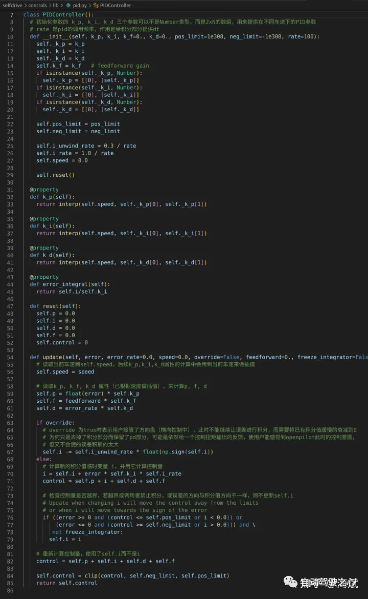
pid.py

该PIDController类采用feedforward+pid机制，所以有kf、kp、ki、kd 四组参数。它被openpilot的多个地方使用到，包括横向控制，所以他考虑了override情况，即用户对方向盘施加的扭矩超过了一定限度时会使override为true，此时PID不能再进行对误差的积分累积，防止“抢夺”方向盘。

使用PID计算出需要发给车辆的执行器的加速度后，controlsd会把LongControl给出的加速等车辆控制，调用每个车型独立的控制实现代码，selfdrive/car/XXXX/carcontroller.py，如下图是现代汽车的实现，会根据accel生成CAN命令并发送给执行器，**这里并没有直接产生油门和刹车控制的CAN命令，而是计算出发给ACC控制器的CAN命令，由它再去操作油门和刹车**。

![[images/Openpilot模型解析_image_14.png]]

hyundai现代汽车的车辆控制实现

controlsd在在每轮循环结尾的publish_logs函数中，一方面生成该模块日志进行记录，一方面构造CAN命令和和sendcan消息。

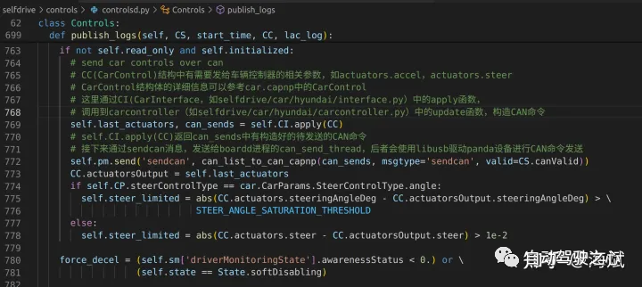

controlsd.py调用CI.apply构造CAN命令，再用sendcan消息publish出去

boardd进程负责接收和发送CAN消息。

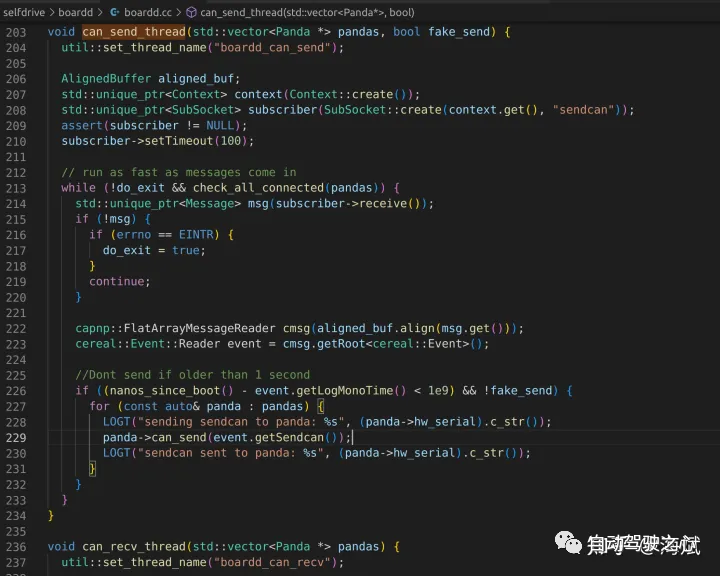
boardd.cc中的CAN消息发送线程，读取sendcan消息并发送

文中的更多注释代码放到了GitHub上 apache2046/openpilot 上