**Prescan、carsim、simulink联合仿真**

**    ****    ****    ****    ****    ****    **** ****   ****by 韩硕 2021.10.21**

前言：为什么要三者联合仿真
1.prescan可以专注于自动驾驶场景的搭建（其中有丰富的传感器与驾驶场景）
2.carsim的车辆动力学模型很精确，而prescan中提供的车辆动力学模型不够精确

一、准备工作

版本选择：matlab2020a或者b（我的是b），prescan8.5，carsim2019.1（注意，一定是2019.1，2019.0是不行的，我在这里花了很大功夫，才发现是carsim版本问题）。prescan和carsim都是要破解的，教程可以在网上找到。

二、carsim设置（前面有一小部分prescan）
①打开prescan,选择open experiment
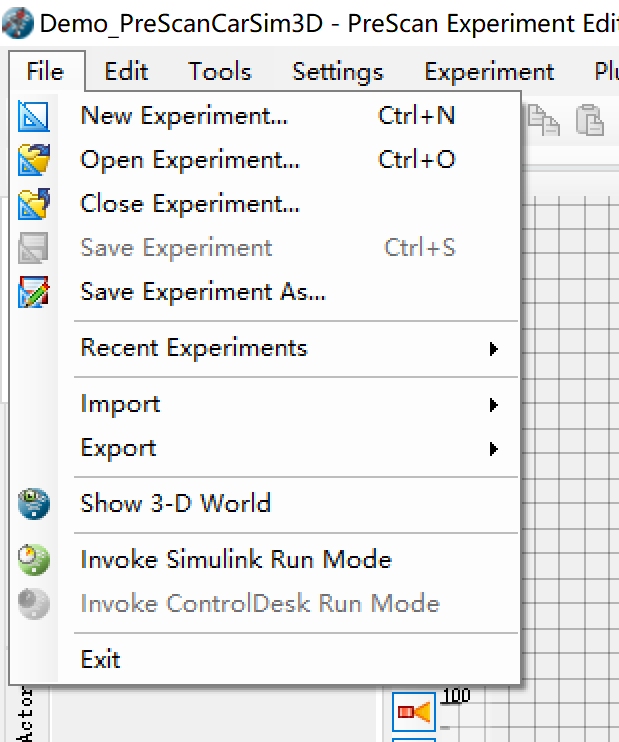

②选择DemoTemplates

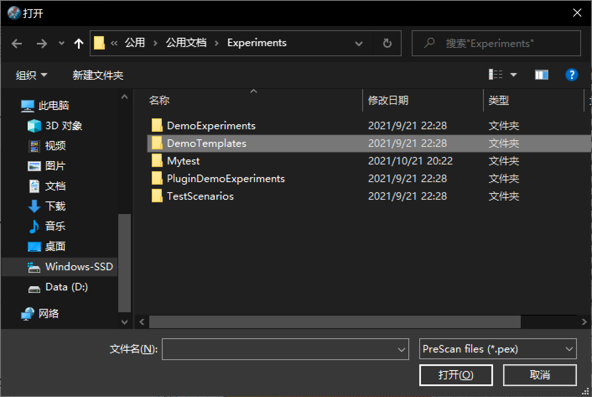
③选择carsim3d
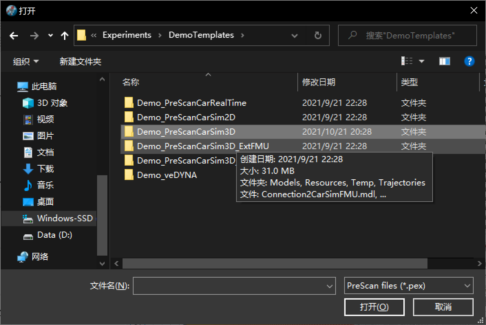

④打开prescan的carsimdemo
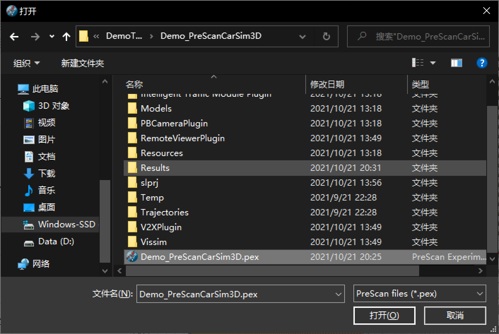

⑤打开后界面如图所示

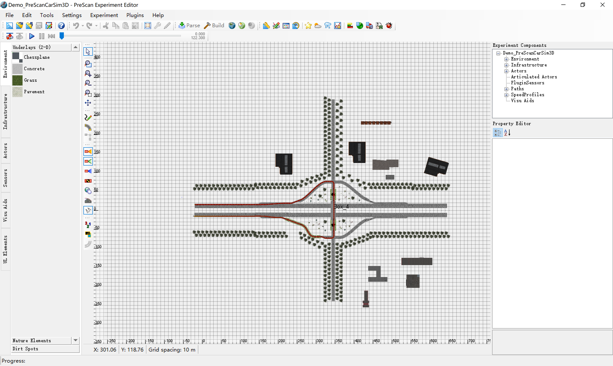

⑥打开carsim，在File下选择import parsfile（其实就是加载prescan提供的carp文件），cpar文件一般在目录：C:\Users\Public\Documents\Experiments\DemoTemplates\Demo_PreScanCarSim3D（如果你把prescan的数据库下载到了别的地方，就在别的目录下找，总之要找到carsim3D.cpar文件）

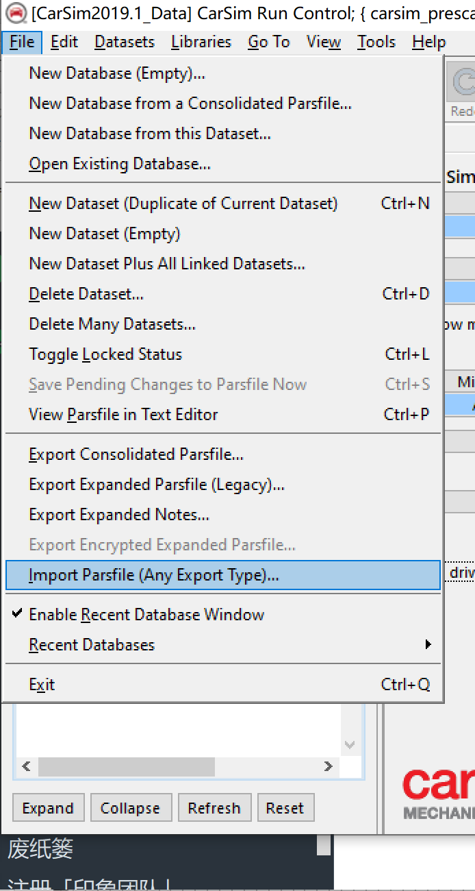

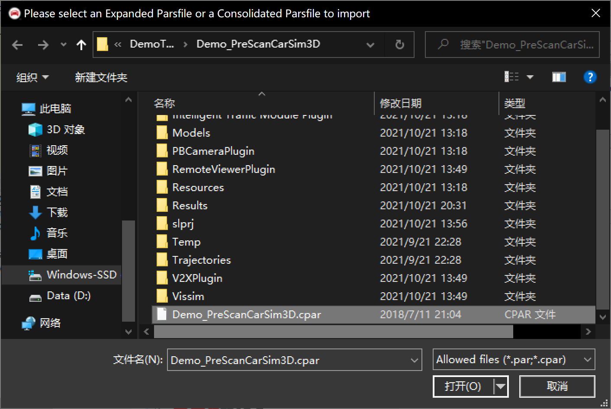

⑦打开cpar后进行如下设置（命名可以随便）：
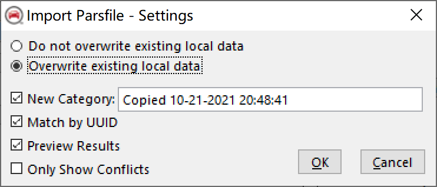

⑧一直下一步，等文件加载完就好了，加载完成后，carsim变为下面这样，可以看到出现了carsim_vehicledynamics的模型
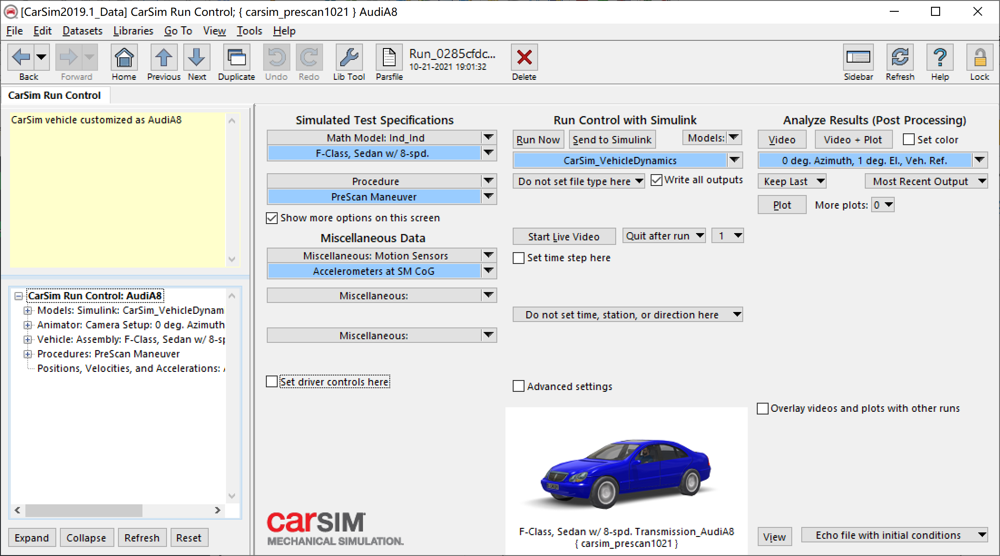

⑨点击send to simulink，看看carsim_vehicledynamics是否能在simulink里跑起来，这里会出现各种各样的错误，也是最花时间的（比如找不到求解器：求解器一般在carsim_prog文件夹下的program文件夹里。比如matlba里没有将carsim求解器文件夹和carsim_data文件夹下的Extension下的simulink文件夹加入。比如carsim求解器要设置成64位），会出现各种奇奇怪怪的错误，可以根据matlab的提示慢慢的debug

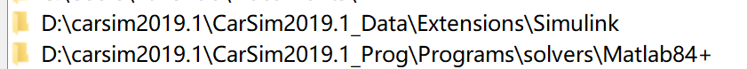

⑩设置carsim产生simfile的路径，最好放在Extensions\Simulink下：比如我自己放在了D:\carsim2019.1\CarSim2019.1_Data\Extensions\Simulink

如果出现了下列界面，则说明carsim的配置全部完成

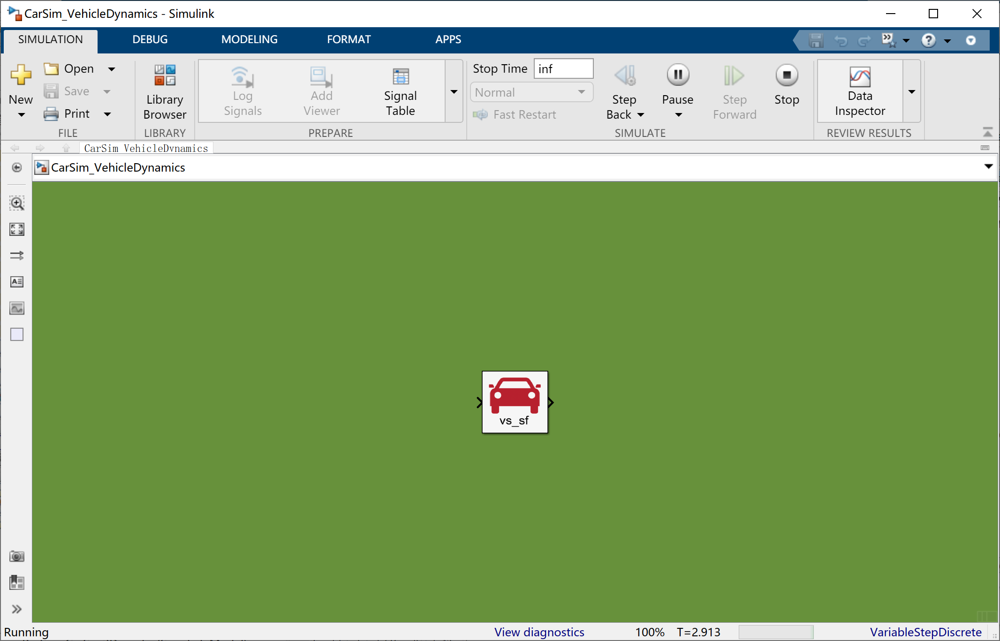

三、prescan设置

①承接二的步骤，打开prescan中的主车奥迪A8，进行设置（一定要是奥迪A8，因为prescan就只提供了奥迪A8的接口），点开Object configuration

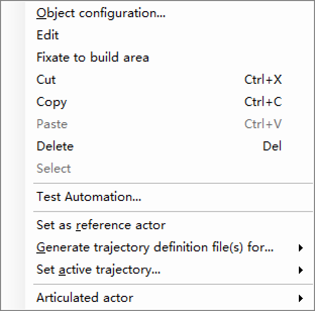

②找到prescan中的车辆动力学模块，选择使用自己定义的动力学模型，路径设置为carsim中动力学mdl的路径，我的为D:\carsim2019.1\CarSim2019.1_Data\Extensions\Simulink\CarSim_VehicleDynamics.mdl

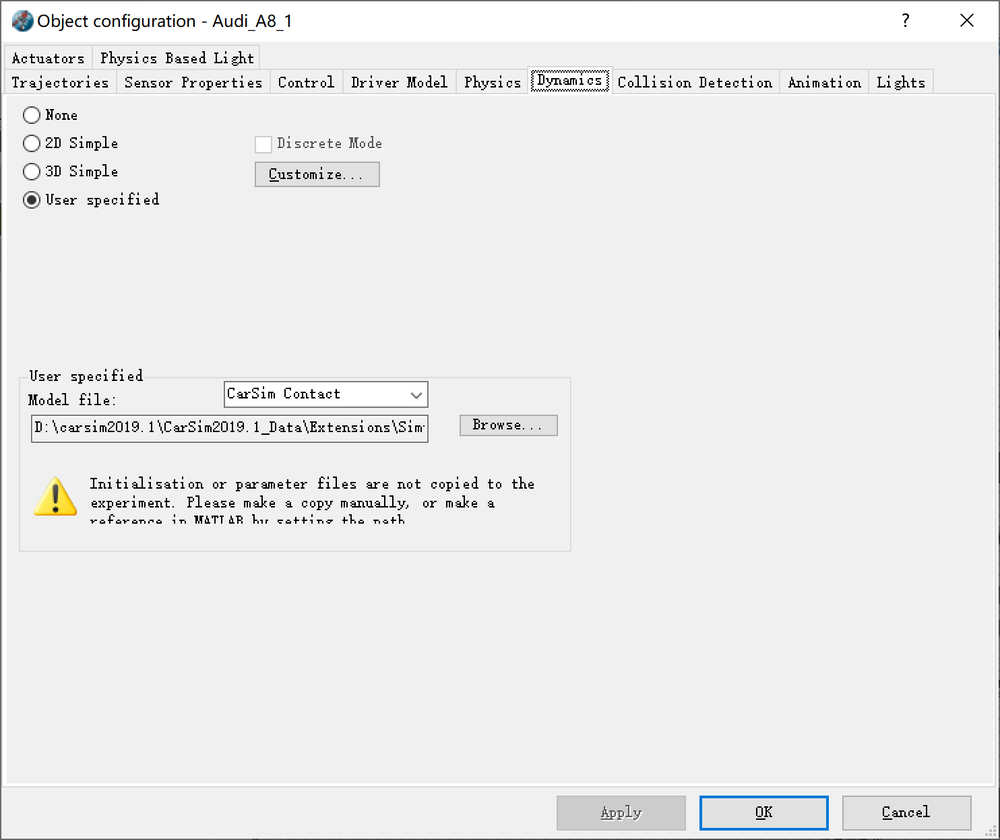

③点击build进行编译，然后发送到simulink
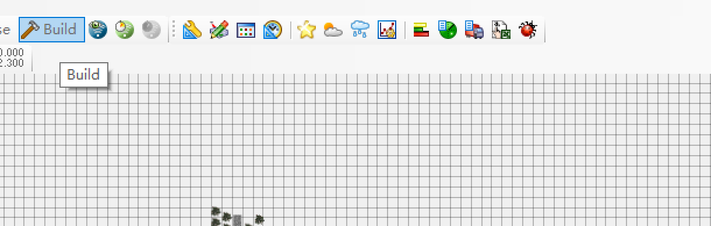

④在matlab中找到carsim3d的xls模型，打开后regenerate一下
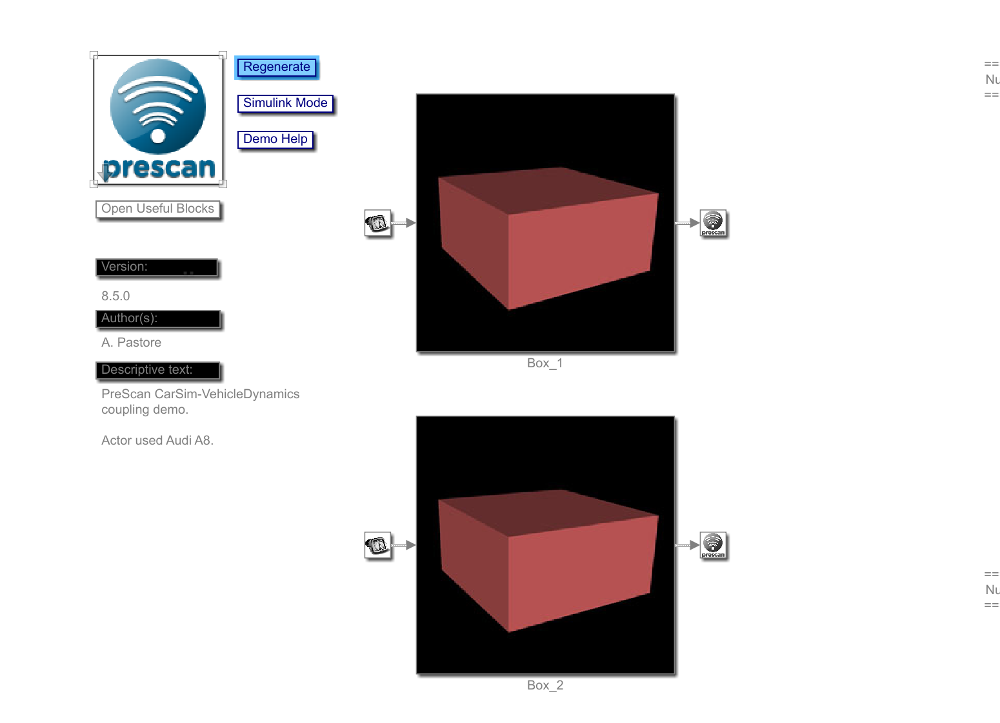

⑤然后就可以在simulink愉快的run了
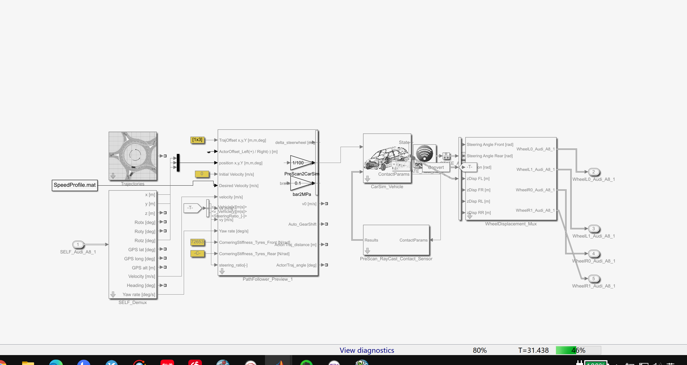

⑥我们点开carsim_vehicle这个模块，我们可以看到，prescan中的动力学模型已经替换为了carsim的动力学模型（注意：如果报错为找不到simfile文件，我们可以点开carsim模型，将simfile文件的路径设置为我们之前在carsim中设置的产生simfile的路径，我的为D:\carsim2019.1\CarSim2019.1_Data\Extensions\Simulink\simfile.sim，也就是一中第⑩步所提到的路径）

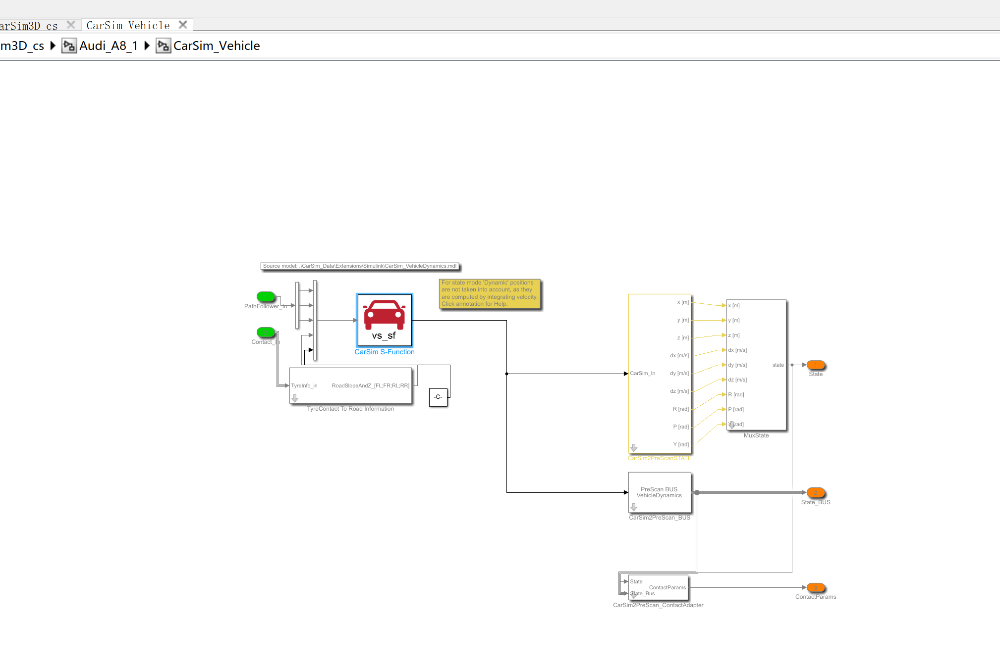