### 1. transformer的初始理解
[知乎](https://zhuanlan.zhihu.com/p/410776234)
[Tansformer简要介绍_哔哩哔哩_bilibili](https://www.bilibili.com/video/BV1nq4y1c7Ni/?spm_id_from=333.999.0.0&vd_source=d31a858cc26ae1ffa19e14058b339f40)
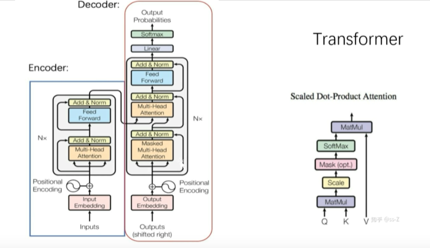

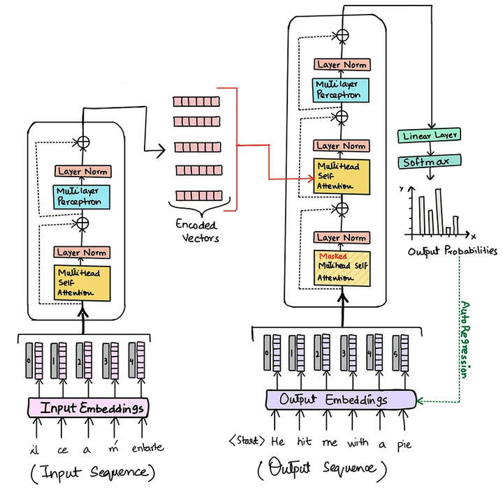
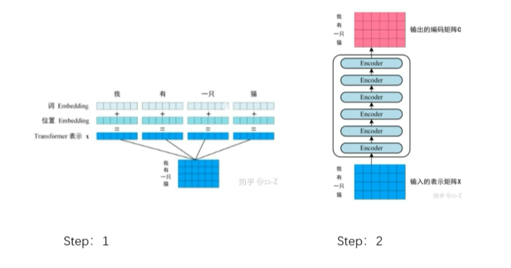
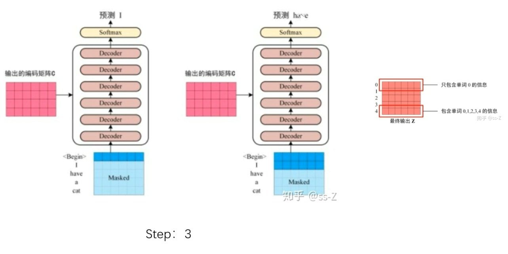

### 2. tansformer的代码简化实践
[知乎](https://zhuanlan.zhihu.com/p/411311520)

### 3.关于embedding的理解
[知乎](https://blog.csdn.net/qq_41477675/article/details/114645012)

### 4.关于bep算法的理解
[知乎](https://zhuanlan.zhihu.com/p/86965595)

### 5.transformer轨迹预测的一些项目（都有代码）

轨迹预测教程
https://blog.csdn.net/BIT_csy/article/details/129971757

行人轨迹预测
[Spatio-Temporal Graph Transformer Networks for Pedestrian Trajectory Prediction](https://arxiv.org/abs/2005.08514)

[Transformer Networks for Trajectory Forecasting](https://arxiv.org/abs/2003.08111)

商汤的轨迹预测
[ "Multimodal Motion Prediction with Stacked Transformers": official code implementation and project page)](https://github.com/decisionforce/mmTransformer)

### 6.attention和self-attention的区别：
attention和self-attention都包括q、k、v，但是自注意力不需要外部信息，直接计算同层特征的交互关系，比如输入一个句子就直接计算这个句子中的单词之间的相关性，即Q、K、V三个矩阵都是由句子本身产生的；**传统的注意力则用其他东西作为query**，如RNN中使用的注意力就是把前一个时间的输出作为query和当前的输入计算相关性（相当于对于前面的输入产生的历史信息和当前的输入进行加权，判断哪些信息更重要）

Attention(Query, Source)，突然冒出个Source，Source是什么？
Scoure =Q.K

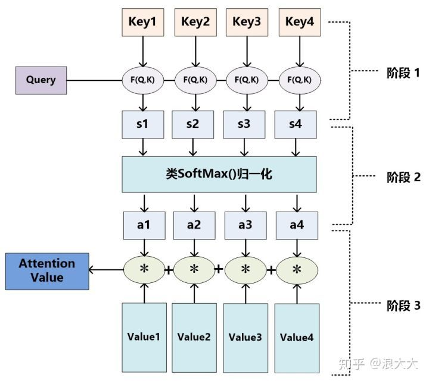
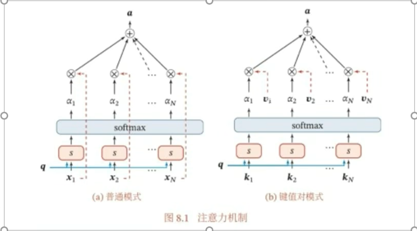

### 7. encoder-decoder模型
[Attention机制 Encoder-Decoder框架简要讲解_哔哩哔哩_bilibili](https://www.bilibili.com/video/BV1wq4y1C7xh/?spm_id_from=333.880.my_history.page.click&vd_source=d31a858cc26ae1ffa19e14058b339f40)

[冬于博客](https://ifwind.github.io/2021/08/15/Transformer%E7%9B%B8%E5%85%B3%E2%80%94%E2%80%94%EF%BC%881%EF%BC%89Encoder-Decoder%E6%A1%86%E6%9E%B6/)

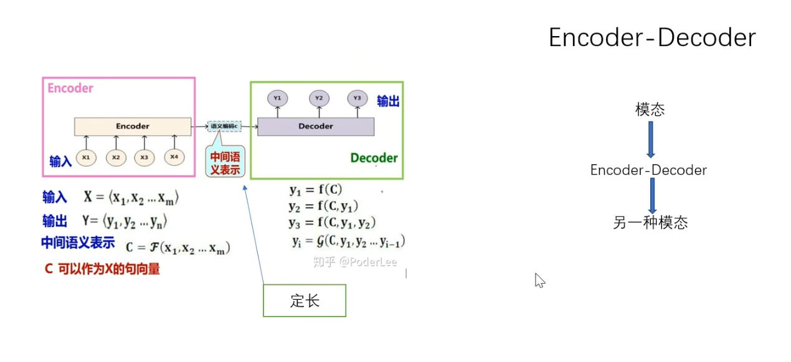

不加入attention时的ec模型（RNN、LSTM）：注意中间层c是定长的向量，不管输入是多长
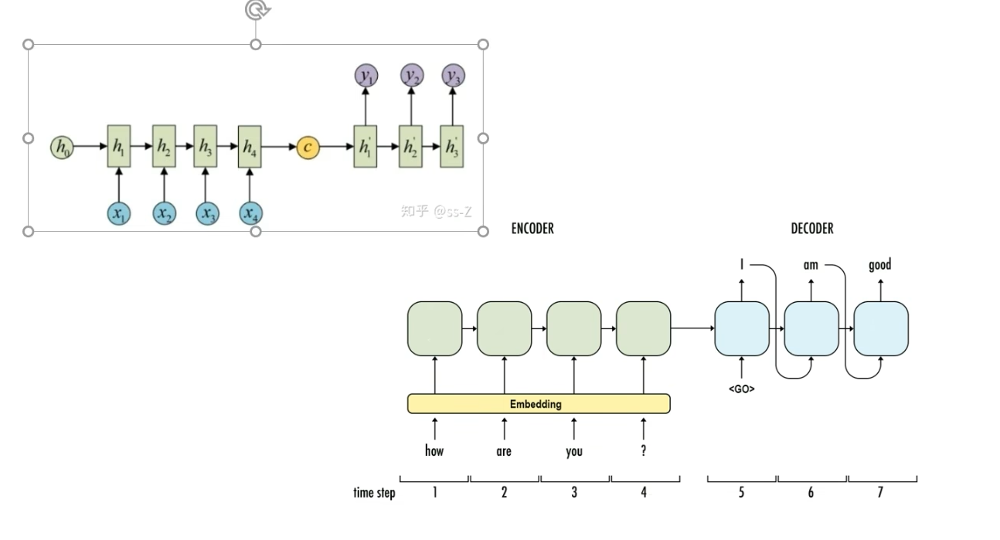

加入attention后的模型（RNN、LSTM等）：注意不是self attention，所以q是由decoder过来的，这时c不再是定长的向量，而是多个向量组成的序列

下图中encoder是双向rnn，decoder是rnn，对应是的图8.1中的普通模式，而不是键值对模式。相当于在decoder中预测$t_{j+2}$时，用$t_{j+1}$和前边encoder出来的值做attention加权，看看更关注那个一个encoder的向量。
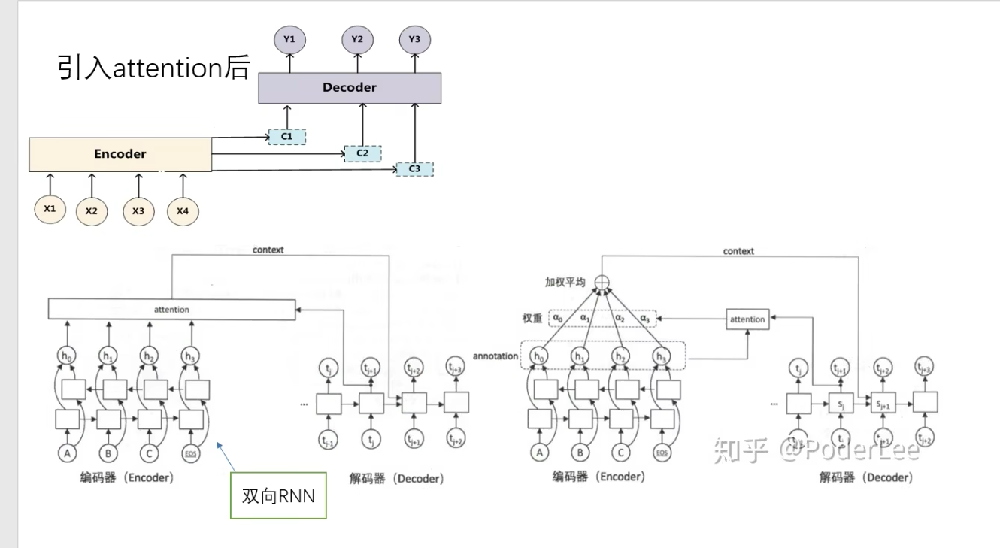

### 8. bert就是只有编码器的transformer，是NLP的预训练模型

### 9.transformer中的mask机制

[冬于博客](https://ifwind.github.io/2021/08/17/Transformer%E7%9B%B8%E5%85%B3%E2%80%94%E2%80%94%EF%BC%887%EF%BC%89Mask%E6%9C%BA%E5%88%B6/#%E5%8F%82%E8%80%83%E6%96%87%E7%8C%AE)

[狗中赤兔](https://www.bilibili.com/video/BV1E44y1Y7B4/?spm_id_from=333.788.recommend_more_video.-1&vd_source=d31a858cc26ae1ffa19e14058b339f40)

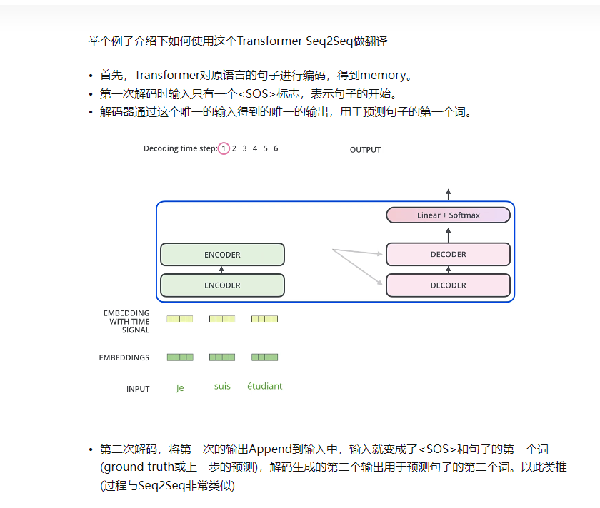
### 10. BERT和Transformer的区别

相同点：他们都采用了两阶段模型，也就是先预训练，在fine tune

不同点：
BERT用到了transformer的encoder架构（没有文本生成的能力）
GPT用的是decoder架构，有文本生成的能力（得益于mask attention）

![[images/Transformer的理解与实践_image_11.png]]

### 11.大模型的发展

从那篇《Attention is All You Need》开始，基于这篇由谷歌机器翻译团队提出的由多组 Encoder、Decoder 构成的机器翻译模型 Transformer 开始，大模型的发展大致走上了两条路，

**一条路是舍弃 Decoder 部分，仅仅使用 Encoder 作为编码器的预训练模型，其最出名的代表就是 Bert 家族**这些模型开始尝试“无监督预训练”的方式来更好的利用相较其他数据而言更容易获得的大规模的自然语言数据，**而“无监督”的方式就是 Masked Language Model（MLM），通过让 Mask 掉句子中的部分单词，让模型去学习使用上下文去预测被 Mask 掉的单词的能力。在 [Bert](https://so.csdn.net/so/search?q=Bert&spm=1001.2101.3001.7020) 问世之初，在 NLP 领域也算是一颗炸弹，同时在许多自然语言处理的常见任务如情感分析、命名实体识别等中都刷到了 SOTA，Bert 家族的出色代表除了谷歌提出的 Bert 、ALBert之外，还有百度的 ERNIE、Meta 的 RoBERTa、微软的DeBERTa等等。

可惜的是，Bert 的进路没能突破 Scale Law，而这一点则由当下大模型的主力军，**即大模型发展的另一条路，通过舍弃 Encoder 部分而基于 Decoder 部分的 GPT 家族真正做到了**。[GPT](https://so.csdn.net/so/search?q=GPT&spm=1001.2101.3001.7020) 家族的成功来源于一个研究人员惊异的发现：“**扩大语言模型的规模可以显著提高零样本（zero-shot）与小样本（few-shot）学习的能力**”，这一点与基于微调的 Bert 家族有很大的区别，也是当下大规模语言模型神奇能力的来源。GPT 家族基于给定前面单词序列预测下一个单词来进行训练，因此 GPT 最初仅仅是作为一个文本生成模型而出现的，而 GPT-3 的出现则是 GPT 家族命运的转折点，GPT-3 第一次向人们展示了大模型带来的超越文本生成本身的神奇能力，显示了这些自回归语言模型的优越性。而从 GPT-3 开始，当下的 ChatGPT、GPT-4、Bard 以及 PaLM、LLaMA 百花齐放百家争鸣，带来了当下的大模型盛世。

**从合并这家谱树的两支，可以看到早期的 Word2Vec、FastText，再到预训练模型的早期探索 ELMo、ULFMiT ，再到 Bert 横空出世红极一时，到 GPT 家族默默耕耘直到 GPT-3 惊艳登场，ChatGPT 一飞冲天，技术的迭代之外也可以看到 OpenAI 默默坚持自己的技术路径最终成为目前 LLMs 无可争议的领导者，看到 Google 对整个 Encoder-Decoder 模型架构做出的重大理论贡献，看到 Meta 对大模型开源事业的持续慷慨的参与，当然也看到从 GPT-3 之后 LLMs 逐渐趋向于“闭”源的趋势，未来很有可能大部分研究不得不变成 API-Based 的研究**。

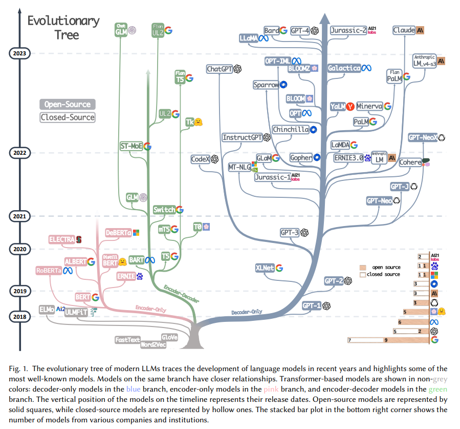

