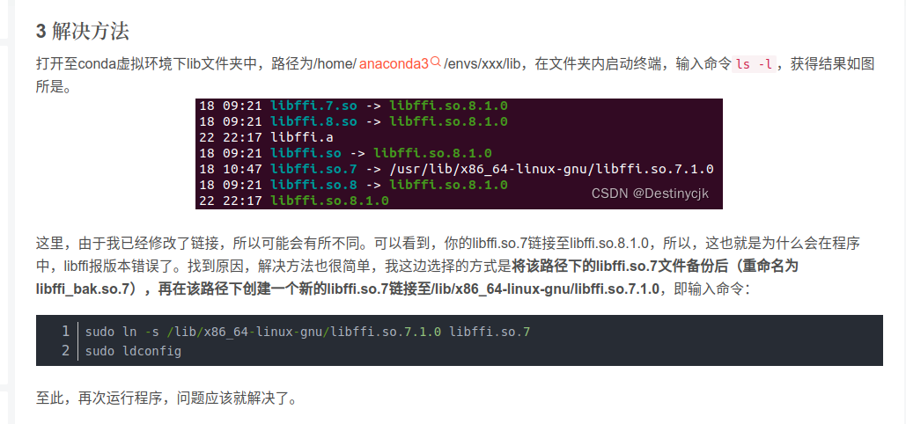

# 1.ros_manual_control一片黑的原因可是是ros的cv bradge的问题

https://blog.csdn.net/qq_38606680/article/details/129118491


# 2 carla安装后在zshrc或者bashrc中设置如下变量
```bash
#miniconda
PATH=$PATH:/home/thicv/miniconda3/bin
export CARLA_ROOT=/home/thicv/carla/CARLA_0.9.13 
export SCENARIO_RUNNER_ROOT=/home/thicv/scenario_runner-0.9.13
PYTHONPATH=$PYTHONPATH:${CARLA_ROOT}/PythonAPI/carla
PYTHONPATH=$PYTHONPATH:${CARLA_ROOT}/PythonAPI/carla/agents
```

# 3 carla的pygame的manual_control如果还是黑屏，可能是因为objects.json中没有配置好传感器

最少需要下列三个传感器，pygame才会有显示画面


# 4 carla_ros_bridge的同步模式有两个

synchronous mode是carla中client和server的同步。
synchronous mode wait for control command是需要有一个控制指令传过来，carla才会更新一步。这个更精确

