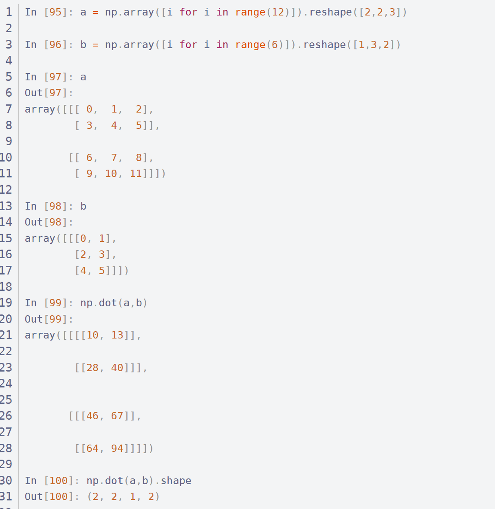
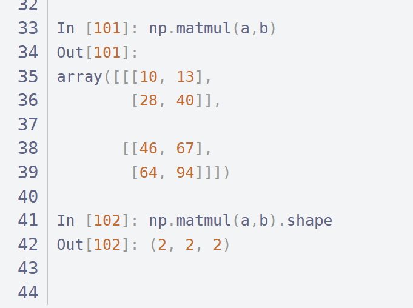
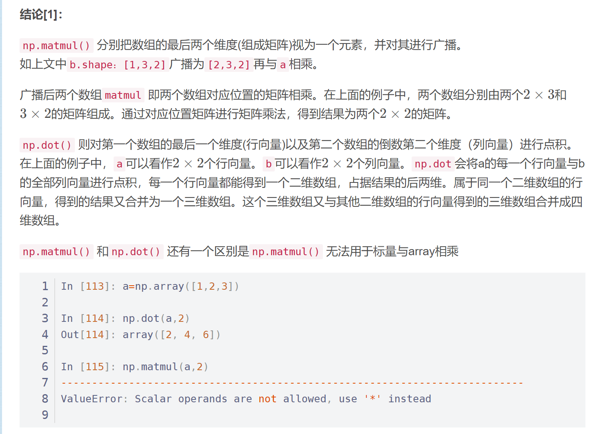

数组：np.array
矩阵：np.mat


numpy中表示乘法有 \* 、dot ()、multiply()、matmul()、@

np.matmul()函数同 @符号 
大部分情况下np.matmul()同np.dot()函数，但是也有区别：

考虑2维以上array：  
matmul()和np.dot()







总结，：
1. 数组乘法默认的是点乘，矩阵默认的是矩阵乘法，混合在一起默认的是矩阵乘法，
2. multiply转化为对应元素的乘积，
3. dot（d,f）会转化为矩阵的乘积，

## 1 np.multiply()函数，矩阵和数组都是对应位置相乘


```text
数组和矩阵对应位置相乘，输出与相乘数组/矩阵的大小一致
```

### 1.1 数组场景

```text
import numpy as np

a = np.array([[1, 2],
             [3,4]])
b = np.array([[5, 6],
              [7, 8]])
c = np.multiply(a, b)
print (c)
输出：
[[ 5 12]   #对应元素相乘
 [21 32]]
```

### 1.2矩阵场景

```text
a = np.array([[1, 2],
             [3,4]])
a = np.mat(a)
b = np.array([[5, 6],
              [7, 8]])
b = np.mat(b)
c = np.multiply(a, b)
print (c)
输出：
[[ 5 12]  #对应元素相乘
 [21 32]]
```


## 2 np.dot()函数，矩阵和数组都是矩阵相乘

```text
对于秩为1的数组，执行对应位置相乘，然后再相加

对于秩不为1的二维数组，执行矩阵乘法运算
```

### 2.1数组场景

2.1.1数组秩为1

```text
a = np.array([1,2])
b = np.array([3,4])
c = np.dot(a,b)
print (c)
输出：
11    #对应元素相乘再求和
```

2.1.2数组秩不为1

```text
a = np.array([[1, 2],
             [3,4]])
b = np.array([[5, 6],
              [7, 8]])
c = np.dot(a, b)
print (c)
输出：
[[19 22]    #数组执行矩阵相乘运算
 [43 50]]
```

### 2.2矩阵场景

```text
a = np.array([[1, 2],
             [3,4]])
a = np.mat(a)
b = np.array([[5, 6],
              [7, 8]])
b = np.mat(b)
c = np.dot(a, b)
print (c)
输出：
[[19 22]    #执行矩阵乘法运算
 [43 50]]
```


## 3（\*）运算，数组逐元素相乘，矩阵为矩阵相乘

```text
对数组执行对应位置相乘

对矩阵执行矩阵乘法运算
```

### 3.1数组场景

```text
a = np.array([[1, 2],
             [3,4]])
b = np.array([[5, 6],
              [7, 8]])
c = a * b
print (c)
输出：
[[ 5 12]    #对应元素相乘
 [21 32]]
```

### 3.2矩阵场景

```text
a = np.array([[1, 2],
             [3,4]])
a = np.mat(a)
b = np.array([[5, 6],
              [7, 8]])
b = np.mat(b)
c = a * b
print (c)
输出：
[[19 22]    #执行矩阵乘法运算
 [43 50]]
```

## 4 np.matmul()函数同 @符号 同np.dot

