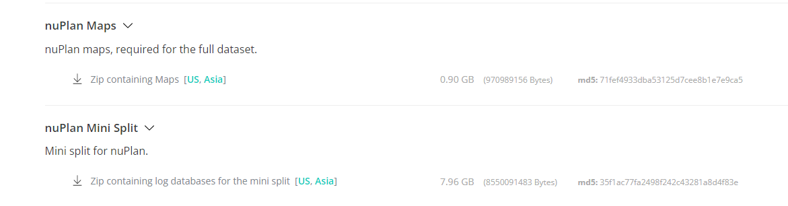
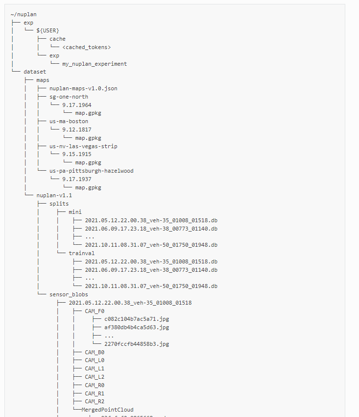
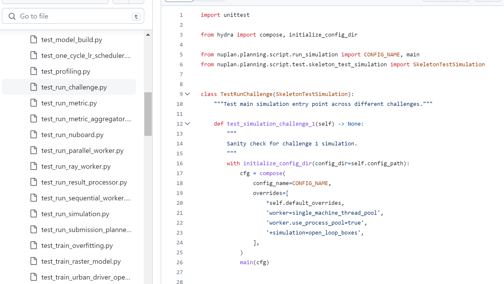

https://nuplan-devkit.readthedocs.io/en/latest/

## 1  下载数据集

先登录：


最少下载两个数据集：map和mini split


在home下新建文件夹nuplan/dataset/maps和nuplan/dataset/nuplan-v1.1/splits/mini

## 2 下载开发工具箱

	cd /home
	git clone https://github.com/motional/nuplan-devkit.git
	cd nuplan-devkit
	#创建conda环境（记得把requirements_torch.txt中的torch版本换成1.13.0+cu116，torhvision==0.14.0+cu116）不然训练会报错
	conda env create -f environment.yml
	conda activate nuplan
	#安装工具包
	cd ~/nuplan-devkit
	pip install -e .

环境变量：
export NUPLAN_DATA_ROOT="$HOME/nuplan/dataset"
export NUPLAN_MAPS_ROOT="$HOME/nuplan/dataset/maps"
export NUPLAN_EXP_ROOT="$HOME/nuplan/exp"
export NUPLAN_DB_FILES="$HOME/nuplan/datase/nuplan-v1.1/splits/mini"

## 3 运行jupyter教程

在运行nuplan_framework.ipynb时，可能会出现oom的现象（最好用btop监控一下）。

### 3.1扩展swap分区来解决oom
最直接的解决办法：增加swap分区大小，如果原有内存是16G，那么swap分区设置为32G

 nuplan最高可能会占用27G内存

```bash
# 将现有swap移动到主内存，可能需要几分钟
sudo swapoff -a

# 创建新的swap文件，bs×count=最后生成的swap大小，这里设置32G
sudo dd if=/dev/zero of=/swapfile bs=1G count=32

# 设置权限
sudo chmod 0600 /swapfile

# 设置swap
sudo mkswap /swapfile

# 打开swap
sudo swapon /swapfile

# 检查设置是否有效
btop

# 设置永久有效
sudo gedit /etc/fstab
# 在末尾行加上 
# /swapfile swap swap sw 0 0
```
刷新swap分区

```bash
sudo swapoff -a
sudo swapon-a
```


### 3.2 通过不适用ray来解决（没经过试验、只是理论上的）

  'worker=single_machine_thread_pool',
   'worker.use_process_pool=true',
https://github.com/motional/nuplan-devkit/issues/237

