### 1.torch.rand、randn、randint的区别


直接看文档：
- rand返回[0,1]的均匀分布

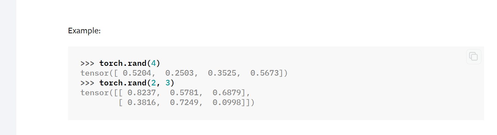


- randn返回(0,1)的正态分布
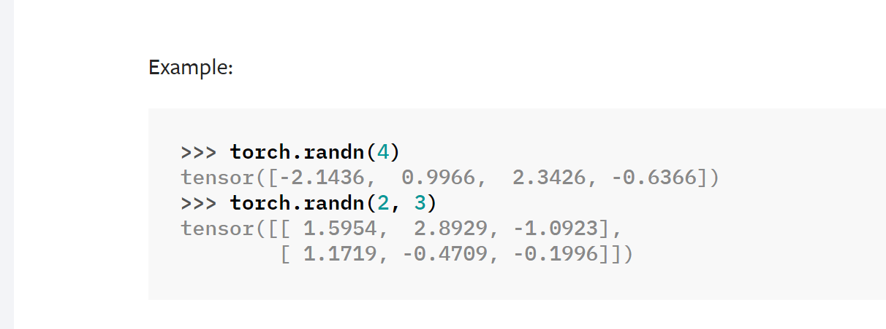
- randint返回\[low,high\)的整数均匀分布
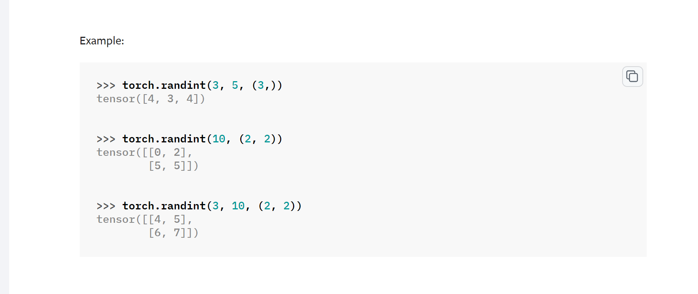

### 2.torch.normal

生成一个均值是mean，方差是std的正态分布数，如果mean是序列，那么std应该也是序列。
torch.normal(_mean_, _std_, _*_, _generator=None_, _out=None_) → Tensor
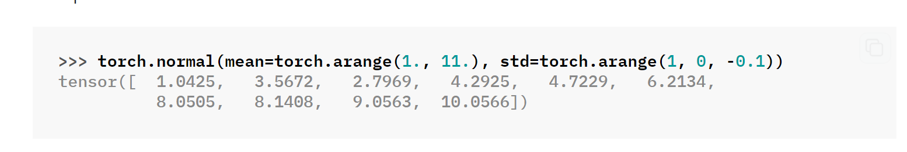
也可以mean是一个值，std是一个tensor序列
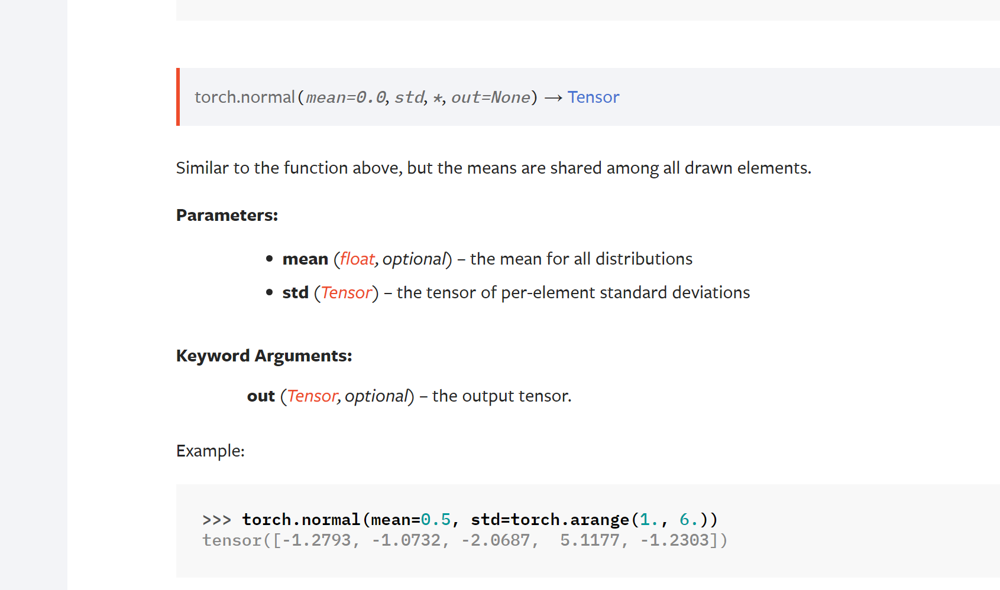


也可以mean是一个tensor序列，std是一个值
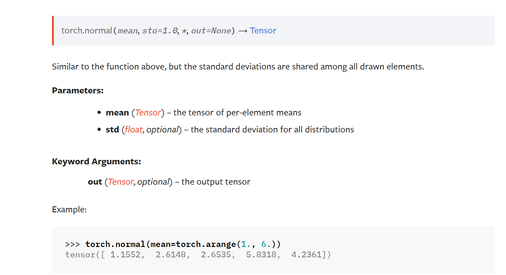

也可以都是一个值，然后指定size
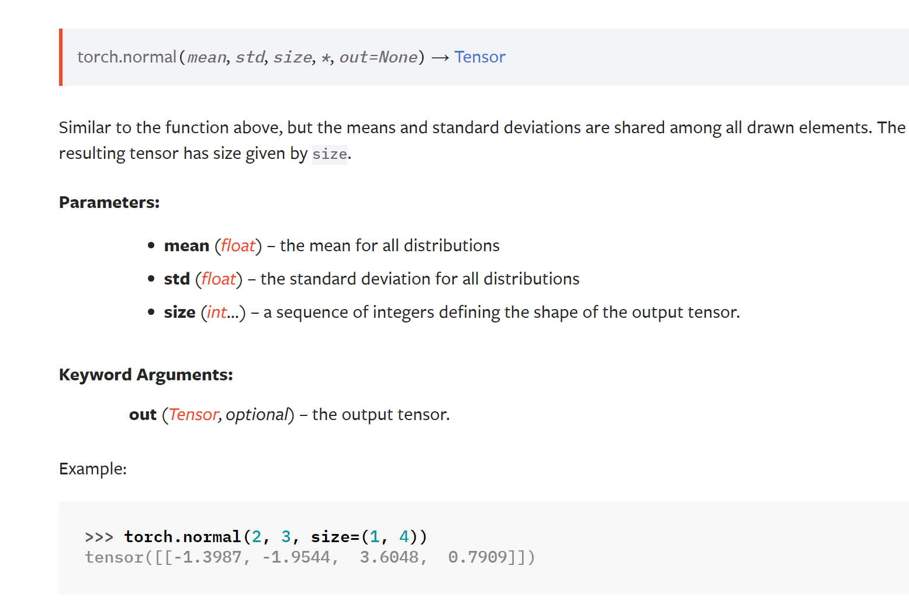

## 3. pytorch中一般函数后边跟一个_表示就地操作，也就是改变值本身


## 4. torch.unsqueeze和squeeze都是共享内存

### 4.1 unsqueeze

unsqueeze(input, dim, out=None)

**参数**

- input：输入张量
- dim ：维度信息（0 表示二维矩阵中的行，1 在二维矩阵中表示列）
- out ：输出张量

**说明**

对输入张量 input 的维度进行扩充。需要通过 dim 指定位置，给指定位置加上维数为 1 的维度。返回的张量与输入张量 input 共享内存，改变其中一个的内容另一个会跟着改变。

**示例**

```python
import torch

x1 = torch.Tensor([1, 2, 3, 4])
x2 = torch.unsqueeze(x1, 0) 
x3 = torch.unsqueeze(x1, 1)
print('x1: ', x1.dim(), x1.size())
print('x2: ', x2.dim(), x2.size())
print('x3: ', x3.dim(), x3.size())

x1[1] = 5 #返回张量与输入张量共享内存，所以改变其中一个的内容会改变另一个。
print('x1: ', x1)
print('x2: ', x2)
print('x3: ', x3)
```

输出结果：

```text
x1:  1 torch.Size([4])
x2:  2 torch.Size([1, 4])
x3:  2 torch.Size([4, 1])
x1:  tensor([1., 5., 3., 4.])
x2:  tensor([[1., 5., 3., 4.]])
x3:  tensor([[1.],
        [5.],
        [3.],
        [4.]])
```

### 4.2 torch.squeeze

**定义**

torch.squeeze(input, dim=**None**, out=**None**)

**参数**

- input：输入张量
- dim ：如果给定，则只会删除给定的维度；否则默认删掉所有为 1 的维度
- out ：输出张量

**说明**

对数据的维度进行压缩，去掉维数为 1 的维度，默认是将输入张量 input 中所有为 1 的维度删掉。也可以通过 dim 指定位置，删掉指定位置的维数为 1 的维度。返回张量与输入张量 input 共享内存，改变其中一个的内容会改变另一个。

**示例**

```python
import torch

#创建一个维度为 2*1*2*1 的张量
x = torch.zeros(2, 1, 2, 1)
y1 = torch.squeeze(x)    #默认删除所有为 1 的维度
y2 = torch.squeeze(x, 0) #位置 0 的维度为 2，所以保持不变
y3 = torch.squeeze(x, 1) #位置 1 的维度为 1，被删除
print("x:  ", x.dim(), x.size())
print("y1: ", y1.dim(), y1.size())
print("y2: ", y2.dim(), y2.size())
print("y3: ", y3.dim(), y3.size())
```

输出结果：

```text
x:   4 torch.Size([2, 1, 2, 1])
y1:  2 torch.Size([2, 2])
y2:  4 torch.Size([2, 1, 2, 1])
y3:  3 torch.Size([2, 2, 1])
```

## 5 scatter_

**定义**

scatter_(dim, index, src)

**参数**

- dim：沿着哪个轴向来进行填充
- index：用来进行索引的张量
- src：源张量或者标量

**说明**

将 src 中数据根据 index 中的索引按照 dim 的方向填充进调用 scatter_ 的向量中。

**示例1**

```python
src = torch.rand(2, 5)
# tensor([[0.2195, 0.8317, 0.7636, 0.7495, 0.3827],
#         [0.0923, 0.7731, 0.1602, 0.7769, 0.8141]])

# dim = 0，表示按行填充，列不变
torch.zeros(3, 5).scatter_(0, torch.tensor([[0, 1, 2, 0, 0], [2, 0, 0, 1, 2]]), src)
# tensor([[0.2195, 0.7731, 0.1602, 0.7495, 0.3827],
#         [0.0000, 0.8317, 0.0000, 0.7769, 0.0000],
#         [0.0923, 0.0000, 0.7636, 0.0000, 0.8141]])

# dim = 1，表示按列填充，行不变
torch.zeros(3, 5).scatter_(1, torch.tensor([[0, 3, 4, 1, 2], [3, 4, 0, 1, 2]]), src)
# tensor([[0.2195, 0.7495, 0.3827, 0.8317, 0.7636],
#         [0.1602, 0.7769, 0.8141, 0.0923, 0.7731],
#         [0.0000, 0.0000, 0.0000, 0.0000, 0.0000]])
```

**结果解释**

- **dim = 0，表示按行填充，列不变**

张量 src 的值如下：


调用 scatter_ 之后的结果如下。其中红色标识的数字为张量 src 中第 0 行的数字，可以看出每个数字所在的列并没有发生变化，只是被填充到了不同的行。


那么，src 中的数字是如何被填充到目标张量的呢？见下图。

图中给出了 0.2195 和 0.8141 的填充过程，其他值类似。


- **dim = 1，表示按列填充，行不变**

src 中的数字是填充到目标张量的过程参见下图。


**示例2**

参数 src 也可以是标量，经常用来对标签进行 one-hot 编码。

```python
label = torch.tensor([[2], [3]])
# tensor([[2],
#        [3]])

torch.zeros(2, 4).scatter_(1, label, 1)
# tensor([[0., 0., 1., 0.],
#         [0., 0., 0., 1.]])
```


## 5，view

view 用于 torch 中的形变，相当于 numpy 中 resize 功能。 我的理解是：把原先 tensor 中的数据按照行优先的顺序排成一个一维的数据，然后按照参数组合成其他维度的 tensor 。

**示例**

```python
a = torch.Tensor([[[1,2,3],[4,5,6]]])
b = a.view(3,2)
print(a)
print(b)
```

输出：

```python
tensor([[[1., 2., 3.],
         [4., 5., 6.]]])
tensor([[1., 2.],
        [3., 4.],
        [5., 6.]])
```

但是要注意原来的 tensor 与新的 tensor **是共享内存的**，也就是说对其中的一个tensor 进行更改的话，另外一个 tensor 也会自动进行相应的修改。**如果想生成不共享内存的 tensor ，可以使用 clone 函数克隆和再进行 view** 。

```python
a = torch.Tensor([[[1,2,3],[4,5,6]]])
b = a.view(3,2)
b[1,1] = 44
print(a)
print(b)

c = torch.Tensor([[[1,2,3],[4,5,6]]])
d = a.clone().view(3,2)
b[1,1] = 44
print(c)
print(d)
```

输出：

```python
# a
tensor([[[ 1.,  2.,  3.],
         [44.,  5.,  6.]]])
# b
tensor([[ 1.,  2.],
        [ 3., 44.],
        [ 5.,  6.]])
# c
tensor([[[1., 2., 3.],
         [4., 5., 6.]]])
# d
tensor([[ 1.,  2.],
        [ 3., 44.],
        [ 5.,  6.]])
```

  

view 的参数中如果出现 -1 ，就代表这个位置由其他位置的数字来推断。

```python
a = torch.Tensor([[[1,2,3],[4,5,6]]])
b = a.view(3,-1) # -1 表示这个位置可以根据前面的 3 进行自动调整
print(a)
print(b)

c = a.view(-1)
print(c)
```

输出：

```python
# a
tensor([[[1., 2., 3.],
         [4., 5., 6.]]])
# b
tensor([[1., 2.],
        [3., 4.],
        [5., 6.]])
# c
tensor([1., 2., 3., 4., 5., 6.])
```

## 6，transpose

**定义**

transpose(input, dim0, dim1)

**参数**

- input：输入的 tensor ；
- dim0 (int): 转置的第一维；
- dim1 (int): 转置的第二维；

**说明**

交换一个 tensor 的两个维度，实际上就是对输入 input 矩阵进行转置。transpose 只能一次操作两个维度。有两种调用方式。

**示例1**

```python
import torch

x = torch.randn(2, 3)
# 调用方式1
t1 = x.transpose(0,1)
#调用方式2
t2 = torch.transpose(x,0,1)
print(x)
print(t1)
print(t2)
```

输出：

```python
tensor([[ 0.7893, -1.9264, -2.4798],
        [ 1.5024, -0.3912,  0.6157]])
tensor([[ 0.7893,  1.5024],
        [-1.9264, -0.3912],
        [-2.4798,  0.6157]])
tensor([[ 0.7893,  1.5024],
        [-1.9264, -0.3912],
        [-2.4798,  0.6157]])
```

  

**示例2**

```python
x = torch.randn(2, 3, 4)
t = x.transpose(1, 2)
#t = x.transpose(1, 0, 2) #会报错
print(x)
print(t)
```

输出：

```python
tensor([[[-0.7952, -1.3478, -0.4179, -1.0324],
         [ 1.4844, -1.3820,  0.3297,  0.0797],
         [ 0.1177,  0.5511, -0.4678,  0.2325]],

        [[-1.0909, -0.1977,  0.8131, -1.7441],
         [-0.3850, -0.1359,  0.7452,  0.0250],
         [-0.1399, -1.0268, -1.3587,  0.3178]]])

tensor([[[-0.7952,  1.4844,  0.1177],
         [-1.3478, -1.3820,  0.5511],
         [-0.4179,  0.3297, -0.4678],
         [-1.0324,  0.0797,  0.2325]],

        [[-1.0909, -0.3850, -0.1399],
         [-0.1977, -0.1359, -1.0268],
         [ 0.8131,  0.7452, -1.3587],
         [-1.7441,  0.0250,  0.3178]]])
```

## 7，permute

**定义**

permute(*dims)

**参数**

*dims (int...): The desired ordering of dimensions

**说明**

可以对任意高维矩阵进行转置。但没有 torch.permute() 这个调用方式， 只能 Tensor.permute() 。

注意：transpose 只能一次操作两个维度，permute 可以一次操作多维数据，且必须传入所有维度数。

**示例1**

```python
x = torch.randn(2, 3, 4)
print(x)
x.permute(0, 2, 1)
#x.permute(2, 1) # 报错
```

输出：

```python
tensor([[[-0.7952, -1.3478, -0.4179, -1.0324],
         [ 1.4844, -1.3820,  0.3297,  0.0797],
         [ 0.1177,  0.5511, -0.4678,  0.2325]],

        [[-1.0909, -0.1977,  0.8131, -1.7441],
         [-0.3850, -0.1359,  0.7452,  0.0250],
         [-0.1399, -1.0268, -1.3587,  0.3178]]])

tensor([[[-0.7952,  1.4844,  0.1177],
         [-1.3478, -1.3820,  0.5511],
         [-0.4179,  0.3297, -0.4678],
         [-1.0324,  0.0797,  0.2325]],

        [[-1.0909, -0.3850, -0.1399],
         [-0.1977, -0.1359, -1.0268],
         [ 0.8131,  0.7452, -1.3587],
         [-1.7441,  0.0250,  0.3178]]])
```

  

**示例2**

```python
x = torch.randn(2, 3)
print(x)

y1 = x.permute(0,1) # 保持不变
print(y1)
y2 = x.permute(1,0)
print(y2)

y3 = x.transpose(0,1) # 要变
print(y3)
y4 = x.transpose(1,0)
print(y4)
```

输出：

```text
# x
tensor([[ 1.3479,  0.9395,  0.4514],
        [-0.3636, -0.2239,  0.8925]])
# y1
tensor([[ 1.3479,  0.9395,  0.4514],
        [-0.3636, -0.2239,  0.8925]])
# y2
tensor([[ 1.3479, -0.3636],
        [ 0.9395, -0.2239],
        [ 0.4514,  0.8925]])
# y3
tensor([[ 1.3479, -0.3636],
        [ 0.9395, -0.2239],
        [ 0.4514,  0.8925]])
# y4
tensor([[ 1.3479, -0.3636],
        [ 0.9395, -0.2239],
        [ 0.4514,  0.8925]])
```

## 8. 拼接

分为cat和stack
cat维度的个数不变，相当于拼接
stack会增加一个维度，相当于堆叠，比如两个二维平面堆叠成一个三维

### 8.1 torch.cat()  、dstack、hstack、vstack

对于需要拼接的张量，维度数量必须相同，进行拼接的维度的尺寸可以不同，但是其它维度的尺寸必须相同。

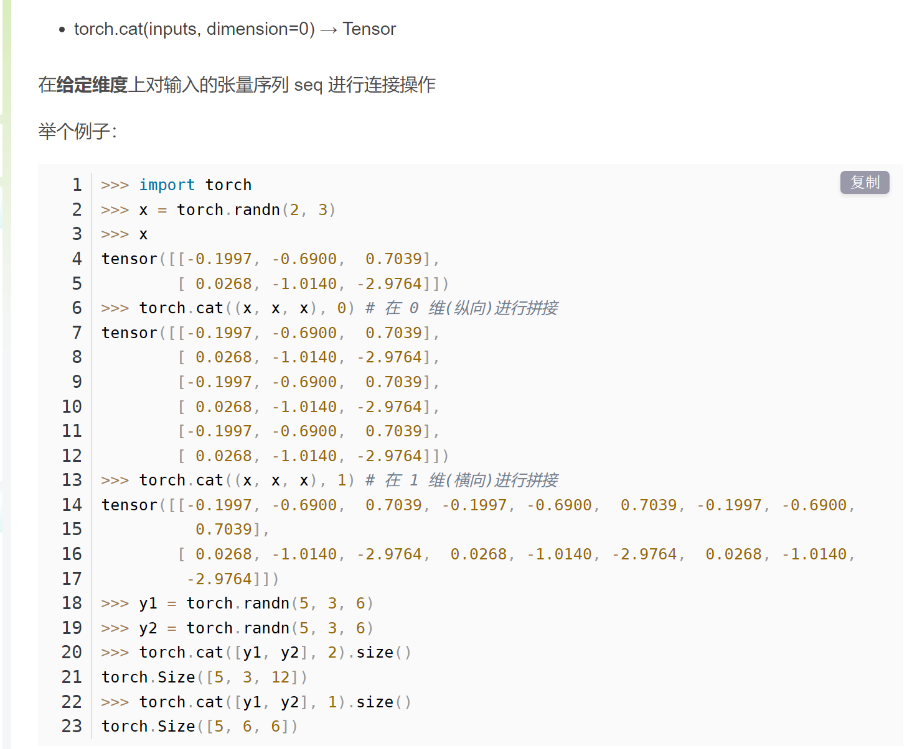


dstack、hstack、vstack和cat有关，和stack关系不大。只不过如果维度不够会扩冲

- dstack - dim=2
- hstack - dim=1
- vstack- dim=0
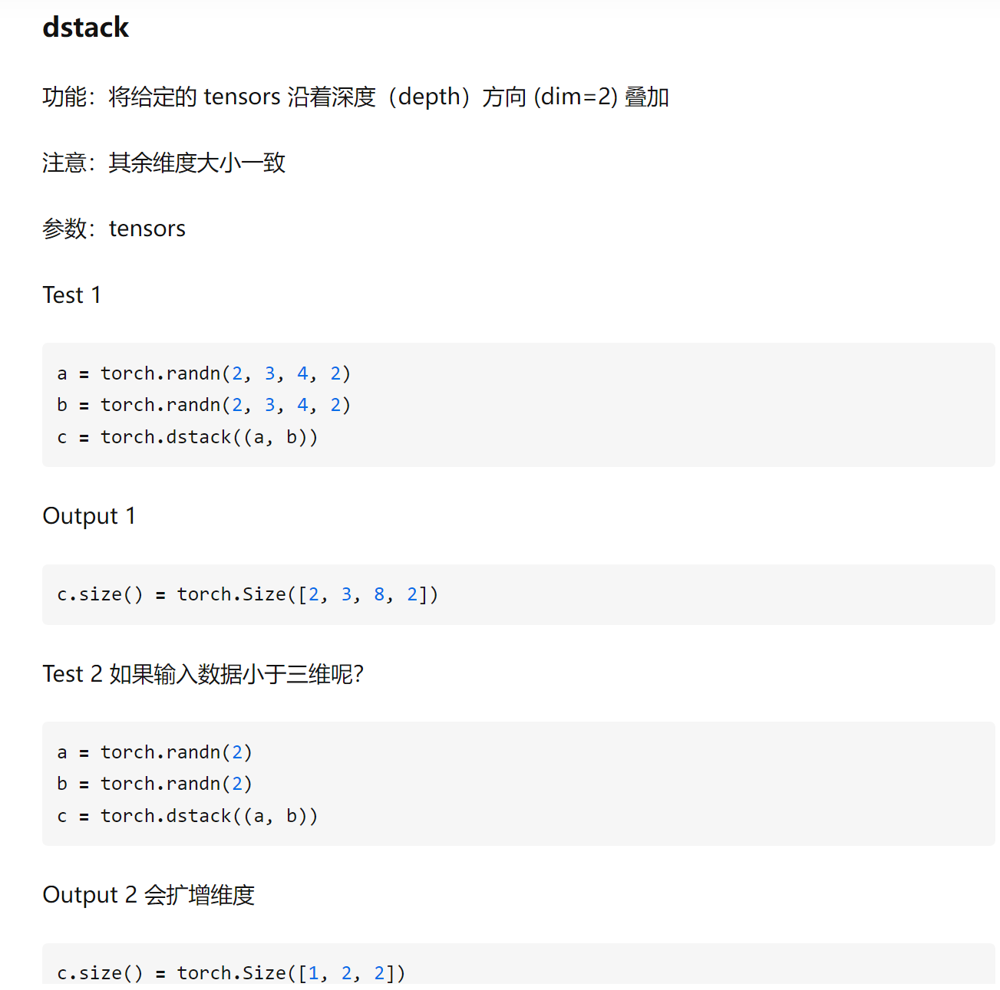
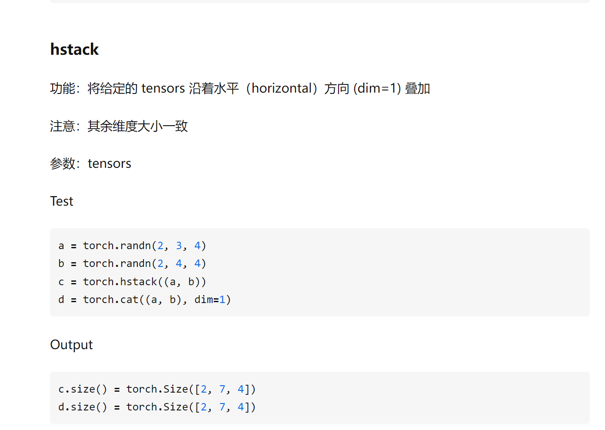
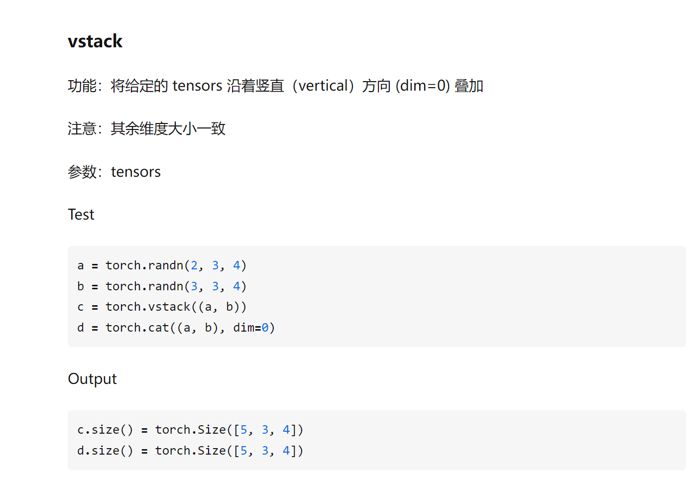

### 8.2 torch.stack()
沿着一个**新维度**对输入张量序列进行连接。 序列中所有的张量都应该为相同形状

浅显说法：把多个2维的张量凑成一个3维的张量；多个3维的凑成一个4维的张量…以此类推，也就是在**增加新的维度进行堆叠**。假如数据都是二维矩阵，它可以把这些一个个平面按第三维(例如：时间序列)压成一个三维的立方体，而立方体的长度就是时间序列长度。该函数常出现在自然语言处理（`NLP`）和图像卷积神经网络(`CV`)中。
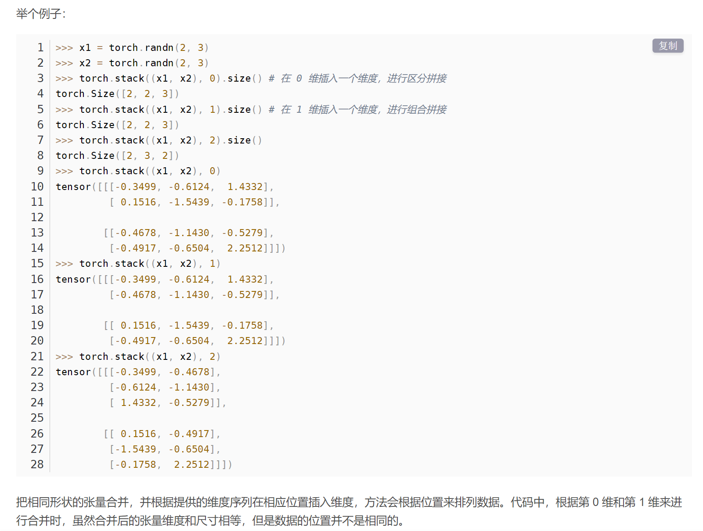

## 9 拆分

split()和chunk()差不多，只是参数不同
### 9.1  torch.split()、hsplit、vsplit

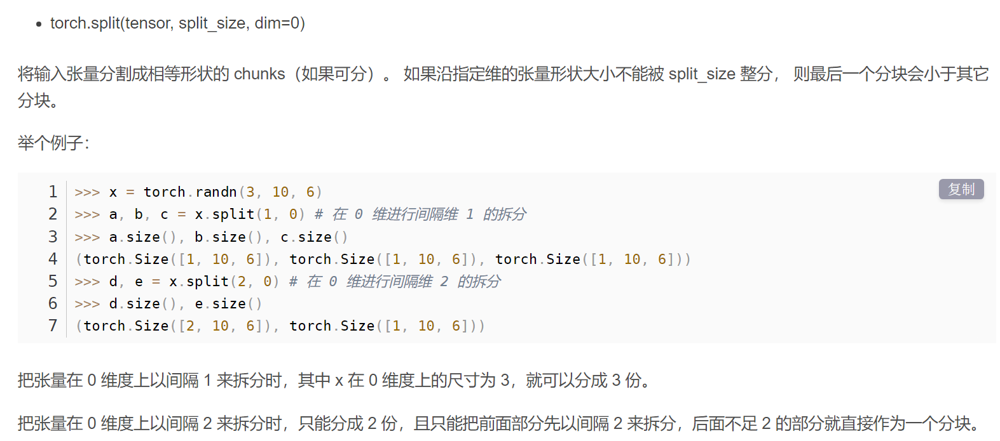

### 9.2 torch.chunk()

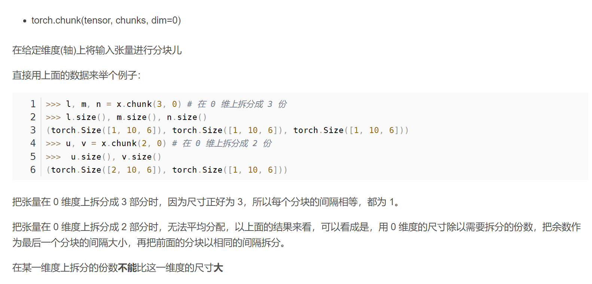
## 10 模型和数据保持再同一设备上

在使用pytorch时，保证模型和数据在同一设备上。不能一个在cpu，一个在gpu。（pytorch默认创建变量是在cpu的）

注意：模型在哪个设备其实指的是模型中的参数在哪个设备上，其实归根结底还是”数据“在哪个设备上。判断模型的设备，其实next(model.parameters())返回模型的第一组参数，然后判断该数据在哪个设备就可以了


首先判断一下模型和数据是在gpu还是cpu

判断模型：
```python
print('Is model on gpu: ', next(model.parameters()).device) #或者is_cuda

#输出是cpu或者cuda:0
```
判断数据：
```python
print(data.device)#或者is_cuda

#输出是cpu或者cuda:0
```

假设模型和数据定义如下：
```python
model = Model()
input = dataloader()
output = model(input)
```

移动到gpu上：
```python
#option1
device = torch.device('cuda') #或 torch.device('cuda:0') 针对多个gpu
model = model.to(device)
data = data.to(device)

#option2
model = model.cuda() #或 model.cuda(0) 针对多个gpu
data = data.cuda() #或 data.cuda(0) 针对多个gpu
```
如果有多个gpu


移动到cpu上：

```python
#option1
device = torch.device('cpu')

model = model.to(device)
data = data.to(device)

#option2
model = model.cpu()
data = data.cpu()
```


## 11 pytorch的部分生态


a) **PyTorch Lightning:** 基于PyTorch的轻量级高级计算框架，相当于PyTorch版本的Keras框架；

b) **Detectron2:** 由Facebook AI发布的下一代目标检测框架；

c) **Transformers:** 基于PyTorch的自然语言处理SOTA模型库；

d) **PyTorch Geometric:** 基于PyTorch的图神经网络深度学习扩展库，其对常见的图神经网络和数据集都进行了集成；

e) **PyTorch3D:** 基于PyTorch将深度学习与3D结合的框架；

f) **Skorch:** 一款综合scikit-learn和PyTorch的机器学习库；

g) **Fast.ai:** 是一个课程平台，一个讨论社区，同样也是一个基于PyTorch的顶层框架;

h) **PySyft:** 用于安全和隐私深度学习的Python库。

## 12 torch.view()和torch.reshape()
https://blog.csdn.net/Flag_ing/article/details/109129752
先说结论：
如果不考虑效率，直接用reshape，不会报错

torch的view()与reshape()方法都可以用来重塑tensor的shape，区别就是使用的条件不一样。**view()方法只适用于满足连续性条件的tensor，并且该操作不会开辟新的内存空间，只是产生了对原存储空间的一个新别称和引用，返回值是视图**。而**reshape()方法的返回值既可以是视图，也可以是副本，当满足连续性条件时返回view，否则返回副本**[ 此时等价于先调用contiguous()方法在使用view() ]。因此当不确能否使用view时，可以使用reshape。如果只是想简单地重塑一个tensor的shape，那么就是用reshape，但是如果需要考虑内存的开销而且要确保重塑后的tensor与之前的tensor共享存储空间，那就使用view()。


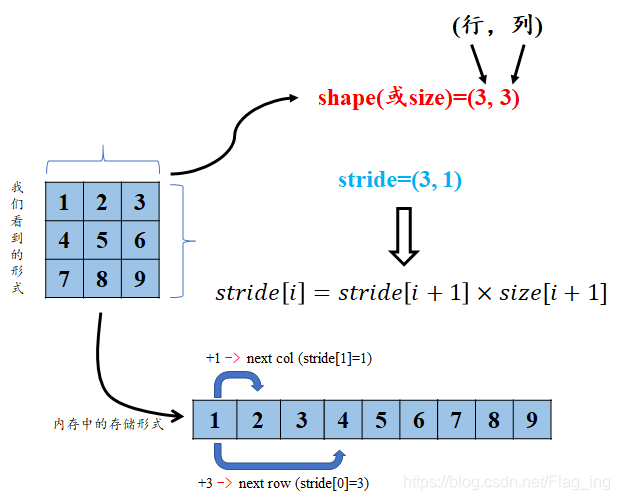
stride[0]：第0维的步长，上图中为3
stride[1]：第1维的步长，上图中为1

满足连续性条件(内存中的数据是否是按行展开的)：
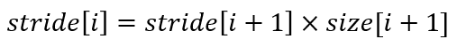
tensor.stride()和tensor.size()

view肯定不会改变内存，view后共享内存。不符合连续性条件view会报错
reshape会先检测符不符合连续性条件，如果不符合就创建一个副本，再调用view