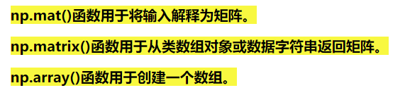
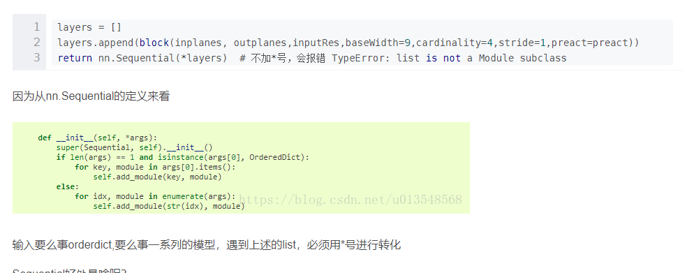
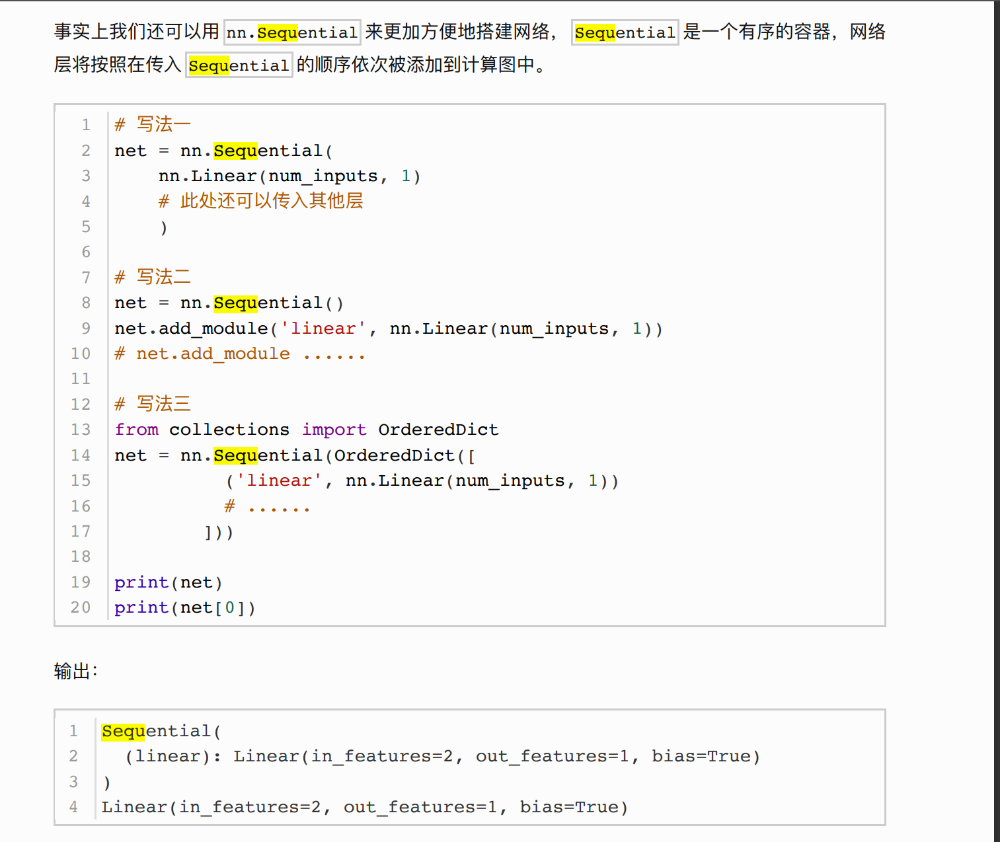

pytorch随记

padding=(1,2,3,4)  在矩阵的左右上下各补充1，2，3，4行/列
stride=（1，2）  步长：左右为1，上下为2

np.dot（A,B）  矩阵叉乘

np.matmul(A,B)矩阵叉乘    matmul与dot在两维时没有区别： [(4条消息) Numpy中np.dot()与np.matmul()的区别（矩阵乘积、矩阵乘法、矩阵相乘）_Dontla的博客-CSDN博客](https://blog.csdn.net/Dontla/article/details/106498504?utm_medium=distribute.pc_relevant.none-task-blog-2~default~baidujs_title~default-0.no_search_link&spm=1001.2101.3001.4242.1)

np.multiply（A,B）矩阵点乘
*表示两个np.array相乘时为矩阵点乘
*表示两个np.matrix相乘时为矩阵叉乘

isinstance(net, torch.nn.Module)  ：判断net是否为torch.nn.Module类型

[(4条消息) 【pytorch系列】 with torch.no_grad():用法详解_sazass的博客-CSDN博客](https://blog.csdn.net/sazass/article/details/116668755)

sequential（*layers）：为什么可以这么用

fashion-minist  分辨率 28*28   可以根据需要resize成224，但是并不会增加信息