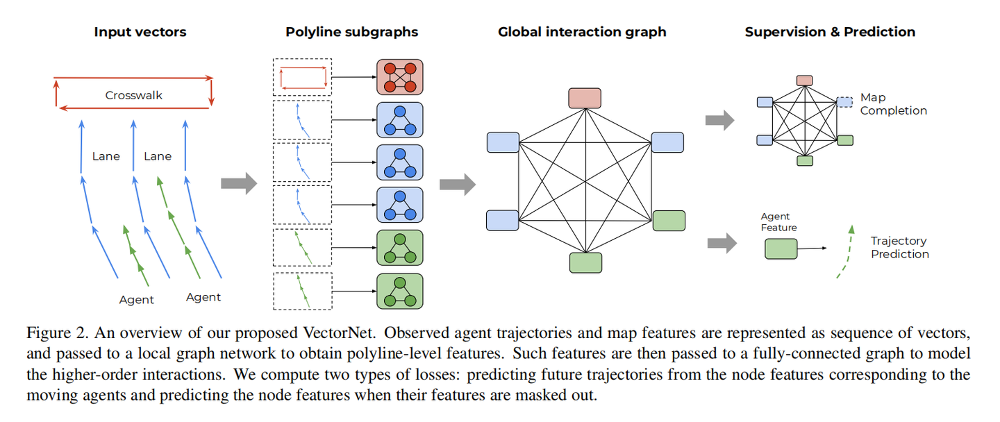
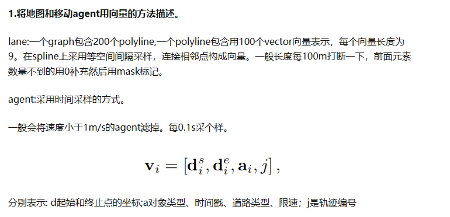
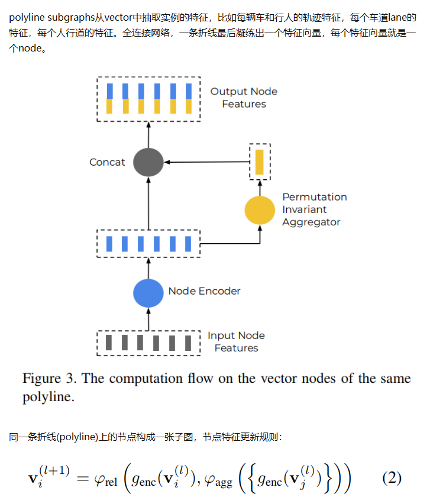
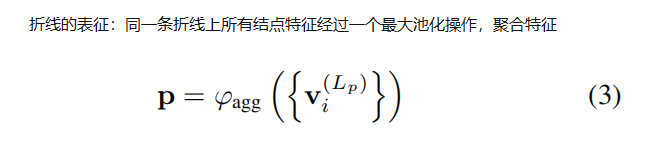
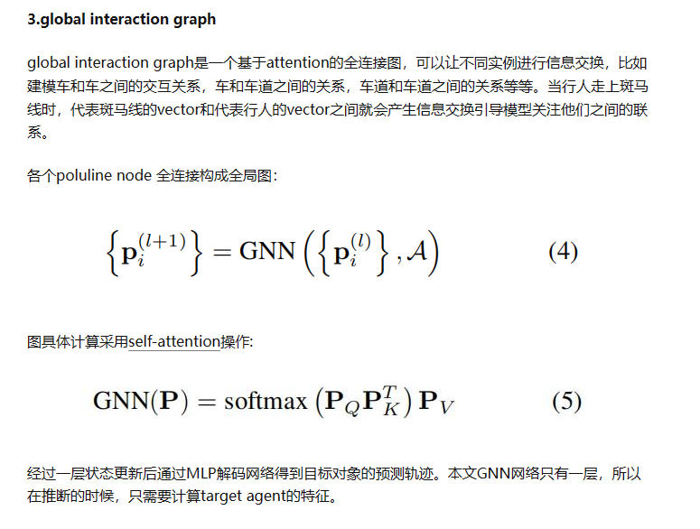

- 首先将车道线、人行横道、交通灯、agent都编码成向量，从而构成一个子图，子图中每个节点都是一个小向量段，每个节点的向量的长度为9维，也就是说agent0有3×9的特征矩阵和2×3的邻接矩阵，agent1有3×9的特征矩阵和2×3的邻接矩阵，三个polyline分别有3×9的特征矩阵和2×3的邻接矩阵，crosswork有4×9的特征矩阵和2×8的邻接矩阵。这样组成了六个subgraph

- 将每一个subgraph都做一次特征抽取，比如agent有6×9的特征矩阵（六个轨迹点），先做一次encoder（全连接）、然后对encoder后的结果做一个max_pooling，然后concat，得到6× 100的特征矩阵。然后

- 然后对抽取特征后的subgraph做一次max pooling（6×1），得到一个1×100的特征向量（也就是说，每一个子图最后都会被映射到1×100，不管这个子图中之前有多少个节点）

- 对每一个子图做attention（跟图没啥关系，就是为了写起来好看点），最后每一个子图的特征向量可能变为1×120，如果v的维度是120的话，具体取决于attention中v的维度
