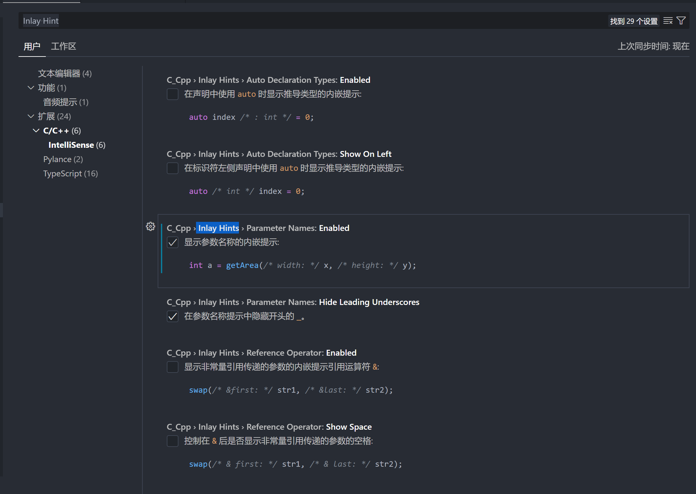
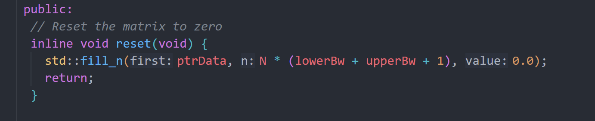
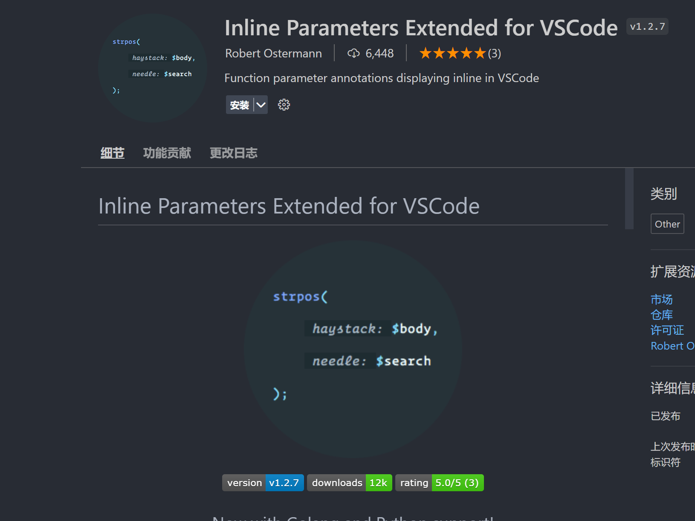

### 1.显示参数名，在设置里搜 Inlay Hint

总体设置
```
"editor.inlayHints.enabled": "on"
```

#### 1.1 针对C++
然后找到C++和pylance的启动项




#### 1.2 针对python
目前针对python（pylance）还实现不了这样的功能，需要借助另外一个插件 Inline Parameters for VSCode



### 2 C++插件设置

#### 2.1安装插件以及简单设置
下载C/C++ Extension Pack：

**c/c++ 提供代码跳转，主要配置如下：**

**提示与高亮相关：**
Compile Commands：设置为cmake生成的compile_commands.json
Cpp Standard：设置为C++17
Configuration Provider："ms-vscode.cmake-tools"
Intelli Sense Mode：windows-gcc-x64

**格式化相关：**
Clang_format_fallback Style：Google
Clang_format_path：C:/Program Files (x86)/LLVM/bin/clang-format.exe
Clang_format_style：file

**cmake 提供cmake的代码提示和语法高亮**

**cmake tools 提供cmake编译，配置如下：**
Export Compile Commands File：true

#### 2.2通过Configuration Provider配置include提示(与2.3选一个)

​​CMake Tools插件​​能够给​​C/C++插件​​提供信息，实现IntelliSense、代码补全、注释浏览、文件转跳等功能。一般在第一次使用​​CMake Tools插件​​时会出现如下提示：

Allow之后会在当前工作目录的​​.vscode/settings.json​​文件（即当前工作目录的设置文件，会覆盖用户设置文件）中添加：
```json
{
"C_Cpp.default.configurationProvider": "ms-vscode.cmake-tools"
}
```

当然，也可以在​​C/C++插件​​的配置文件​​.vscode/c_cpp_properties.json​​中手动指定​​configurationProvider​​：
```json
{
"configurations": [
        {
"name": "Linux",
"includePath": [],
"defines": [],
"compilerPath": "/usr/bin/gcc",
"cStandard": "gnu11",
"cppStandard": "gnu++14",
"intelliSenseMode": "gcc-x64",
"configurationProvider": "ms-vscode.cmake-tools"
        }
    ],
"version": 4
}
```


这样​​C/C++插件​​就能正常工作了，**不用自己指定​​.vscode/c_cpp_properties.json​​的​​includePath​​和​​defines**​​。

#### 2.3 通过​​compile_commands.json​​配置include
除了以上两种方式以外，还有另一种方式：

指定compile_commands.json
让cmake生成​​compile_commands.json​​，需要在运行​​cmake​​时添加参数​​-DCMAKE_EXPORT_COMPILE_COMMANDS=True​​或者在CMakeLists.txt中添加​​set(CMAKE_EXPORT_COMPILE_COMMANDS True)​​。

例子：假设在​​~​​目录下有一个hello的项目
```bash
cd ~/hello
mkdir build
cd build
cmake -DCMAKE_EXPORT_COMPILE_COMMANDS=True ..
```
会在​​~/hello/build​​下生成​​compile_commands.json​​。

在vscode中打开​​~/hello​​目录，配置​​.vscode/c_cpp_properties.json​​。指定​​compileCommands​​为上一步的​​~/hello/build/compile_commands.json​​：
```json
"configurations": [
        {
"name": "Linux",
"includePath": [],
"defines": [],
"compilerPath": "/usr/bin/g++",
"cStandard": "gnu11",
"cppStandard": "gnu++14",
"intelliSenseMode": "gcc-x64",
"compileCommands": "~/hello/build/compile_commands.json"
        }
    ],
"version": 4
}
```
这样和指定​​configurationProvider​​是一样的效果。
#### cmake插件的设置

选择不同的cmakelist.txt文件以获得cmake tools插件的支持：

settings.json添加如下
```json
"cmake.sourceDirectory":"/home/thicv/frenet_carla_ros/src/carla_ros_bridge_pnc/controller"
```


### 3 python的初始化插件设置

下载python插件、pylance插件，并把pylance作为python插件的语言服务器

**Pylance**

**强烈建议使用Pylance替代默认的Python语言服务器**，它支持一些很棒的功能，比如：

1. Docstrings
2. 自动导入
3. 类型检查
4. Code Lens
5. IntelliCode 兼容性

设置如下：

```text
{
    "python.languageServer": "Pylance"
}
```

**设置code formatter为black**

它和默认使用的`autopep8`的不同之处在于它不仅会指出代码中违反`PEP8`规范的地方，还会对没有违反`PEP8`但代码风格不一致的地方重新格式化，可以让令代码的可读性更强。

设置步骤：

1. 打开设置(`Ctrl+ ,`)：搜索`"formatting.provider"`
2. pip install black
3. 如果想在 [Jupyter Notebooks](https://jupyter.org/) 中使用，则可以通过如下代码安装：pip install black[jupyter]
4. 也可以直接打开设置文件添加一行：`"python.formatting.provider": "black",`
5. 使用方法：选中需要格式化的代码，右键选择格式化选定内容，快捷键：`Ctrl + K, Ctrl + F`或者`Alt+Shift+F`(ubuntu为`Ctrl+Shift+I`)

 **设置自动格式化**

可以打开保存时和键入一行后立即进行代码格式化，设置选项为：

```text
{
    "editor.formatOnSave": true,
    "editor.formatOnType": true
}
```

 
 **自动补全设置**

打开自动添加括号，在自动补全函数时，可以自动加上括号，提高效率：

```text
{
    "python.autoComplete.addBrackets": true,
}
```

 **添加自动补全库路径（设置了python.autoComplete.extraPaths就不用单独设置pylance了）**

为额外的Python库支持自动补全，设置路径：

```text
{
    "python.autoComplete.extraPaths": []
}
```

 **添加分析路径（防止找不到库，设置了python.autoComplete.extraPaths就不用单独设置pylance了）**

添加额外导入路径，设置：

```text
{
    "python.analysis.extraPaths": []
}
```

这对于导入项目中一些自己实现的python文件很有帮助。

 **添加垂直参考线**

Python的代码风格要求代码一行不超过79字符，所以我们可以给代码编辑器设置一条垂直参考线，直观判断代码是否太长，并且可以自定义参考线的颜色：

```text
{ 
    "editor.rulers": [
        80,
    ],
    "workbench.colorCustomizations": {
        "editorRuler.foreground": "#ff4081"
    }
}
```


### 4vscode快捷键


![[images/vscode_image_5.png]]
**vim配置**
```json
    "vim.handleKeys": {
        "<C-a>": false,
        "<C-f>": false,
        "<C-x>": false,
        "<C-c>": false,
        "<C-z>": false,
        "<C-v>": false,
        "<C-[>": false,
        "<C-]>": false,
        "<C-s>": false,
        "<C-b>": false,
        "<C-/>": false,
        "<C-w>": false,
        "<C-shift+f>": false,

    },
    "vim.insertModeKeyBindings": [
        {
            "before": [
                "<c-h>"
            ],

            "after": [
                "<left>"
            ]
        },
        {
            "before": [
                "<c-l>"
            ],
            "after": [
                "<right>"
            ]
        },
        {
            "before": [
                "<c-j>"
            ],
            "after": [
                "<down>"
            ]
        },
        {
            "before": [
                "<c-k>"
            ],
            "after": [
                "<up>"
            ]
        },
        {
            "before": [
                "<c-u>"
            ],
            "after": [
                "<esc>",
                "b",
                "i",
            ]
        },
        {
            "before": [
                "<c-d>"
            ],
            "after": [
                "<esc>",
                "e",
                "a",
            ]
        }
    ],

```

vscode快捷键：keybindings.json
```json
[
  {
    "key": "ctrl+shift+i",
    "command": "-workbench.action.toggleDevTools",
    "when": "isDevelopment"
  },
  {
    "key": "ctrl+shift+i",
    "command": "editor.action.formatDocument",
    "when": "editorHasDocumentFormattingProvider && editorTextFocus && !editorReadonly && !inCompositeEditor"
  },
  {
    "key": "shift+alt+f",
    "command": "-editor.action.formatDocument",
    "when": "editorHasDocumentFormattingProvider && editorTextFocus && !editorReadonly && !inCompositeEditor"
  },
  {
    "key": "ctrl+shift+i",
    "command": "editor.action.formatDocument.none",
    "when": "editorTextFocus && !editorHasDocumentFormattingProvider && !editorReadonly"
  },
  {
    "key": "shift+alt+f",
    "command": "-editor.action.formatDocument.none",
    "when": "editorTextFocus && !editorHasDocumentFormattingProvider && !editorReadonly"
  },
  {
    "key": "ctrl+up",
    "command": "workbench.action.terminal.focusPrevious",
    "when": "terminalFocus && terminalHasBeenCreated && !terminalEditorFocus || terminalFocus && terminalProcessSupported && !terminalEditorFocus"
  },
  {
    "key": "ctrl+pageup",
    "command": "-workbench.action.terminal.focusPrevious",
    "when": "terminalFocus && terminalHasBeenCreated && !terminalEditorFocus || terminalFocus && terminalProcessSupported && !terminalEditorFocus"
  },
  {
    "key": "ctrl+down",
    "command": "workbench.action.terminal.focusNext",
    "when": "terminalFocus && terminalHasBeenCreated && !terminalEditorFocus || terminalFocus && terminalProcessSupported && !terminalEditorFocus"
  },
  {
    "key": "ctrl+pagedown",
    "command": "-workbench.action.terminal.focusNext",
    "when": "terminalFocus && terminalHasBeenCreated && !terminalEditorFocus || terminalFocus && terminalProcessSupported && !terminalEditorFocus"
  },
  {
    "key": "ctrl+m",
    "command": "editor.action.addSelectionToNextFindMatch",
    "when": "editorFocus"
  },
  {
    "key": "ctrl+d",
    "command": "-editor.action.addSelectionToNextFindMatch",
    "when": "editorFocus"
  }

]

```

cmake tools:
编译并运行：shift+f5
编译并调试：ctrl+f5

python:
快速运行：ctrl+alt+n

latex：
快速编译：ctrl+shift+b

## 5 vscode配色

one dark pro配色详解：

蓝色：函数、

红色：变量

黄色：类、结构体、命名空间

紫色：关键词

深黄色：数字

绿色：text

## 6 VScode中的task.json和launch.json

	task.json：一般用来编译文件(ctrl+shift+b可运行task.json。或者也可以ctrl+shift+p，搜索build task)
	launch.json：一般用来调试debug文件（可以通过label调用不同的task）（f5可以运行launch.json，也可以点击debug按钮）
	
**快速创建launch.json**：点击debug按钮，或者ctrl+shift+p搜索run and debug，在生成的launch.json的config中打一个c，选择C/C++gdb启动，就会自动生成模板。

**快速创建task.json** ：ctrl+shift+p，搜索build task，选择配置task

对于一般的C++工程来说，f5直接会运行launch.json.

**参数解释：**
**cwd（current work directory）**：当前工作目录
**"problemMatcher"**:问题分析器，对于编译后输出的结果可以提取有用的部分，不同的插件会提供一些预定义好的问题分析器，比如"/$ catkin-gcc"、"/$ roslaunch"、 "cmake"等，也可以自己用正则表达式实现。
**label**：可以随便取


### 普通Cmake工程的launch.json和task.json
例如对于一个cmke工程：

**launch.json用来debug，主要修改"program"，"preLaunchTask"（要跟task.json配合），"miDebuggerPath"三个参数**
```json
{
    // 使用 IntelliSense 了解相关属性。 
    // 悬停以查看现有属性的描述。
    // 欲了解更多信息，请访问: https://go.microsoft.com/fwlink/?linkid=830387
    "version": "0.2.0",
    "configurations": [
        {
            "name": "(gdb) 启动",
            "type": "cppdbg",
            "request": "launch",
            "program": "${workspaceFolder}/build/${fileBasenameNoExtension}",
            "args": [],
            "stopAtEntry": false,
            "cwd": "${workspaceFolder}",
            "environment": [],
            "externalConsole": false,
            "MIMode": "gdb",
            "setupCommands": [
                {
                    "description": "为 gdb 启用整齐打印",
                    "text": "-enable-pretty-printing",
                    "ignoreFailures": true
                },
                {
                    "description": "将反汇编风格设置为 Intel",
                    "text": "-gdb-set disassembly-flavor intel",
                    "ignoreFailures": true
                }
            ],
            "preLaunchTask": "g++ build active file",  //这里要和tasks.json中的make的label保持一致
            "miDebuggerPath": "/usr/bin/gdb"
        }
    ]
}
```

**tasks.json:用来编译，包含了三个任务，第一个任务执行cmake，第二个任务执行make，第三个任务名称是Build，执行cmake和make两个任务，将Build设置成launch.json中preLaunchTask的值，正是代表，在调试之前先执行cmake和make两个命令；**
```json
{
    "version": "2.0.0",
    "options": {
        "cwd": "${workspaceRoot}/build"
    },//指定命令执行所在路径
    "tasks": [
        {
            "label": "cmake",//该任务的名称，随意取；
            "type": "shell",//任务的类型，可设置成`shell`和`process`。前者将任务当成命令，启动终端运行，后者直接运行。
            "command": "cmake",//命令
            "args": [
                "-DCMAKE_BUILD_TYPE=Debug",
                // "-DCMAKE_BUILD_TYPE=Release",
                "-DCMAKE_EXPORT_COMPILE_COMMANDS=1", // 这是生成compile_commands.json文件的选项
                ".."
            ]
        },
        {
            "label": "g++ build active file",//要执行的第二个make命令
            "type": "shell",
            "command": "make",
            "args": [],
            "group": {
                "kind": "build",
                "isDefault": true//可以用ctrl+shift+b调用
            },
            "dependsOn":["cmake"]///指定，在执行make之前，需先执行cmake
        },
    ]
}
```

### ROS工程的launch.json和task.json

launch.json：ros中launch.json可以用来启动launch节点，也可以用来debug。可以选择其中一种用法

**启动launch节点的launch.json**
```json
{
    "version": "0.2.0",
    "configurations": [
        {
            "name": "movebase.launch",
            "type": "ros",
            "request": "launch",
            //tarhet: `launch`文件所在的绝对路径
            "target":"/home/chelizi/biyesehji_ws/src/rbx1/rbx1_bringup/launch/movebase.launch"
        }
    ]
}

```

**用于调试的launch.json**
```json
{
    "configurations": [
        {
            "name": "kindynamic_path_node",
            "type": "cppdbg",
            "request": "launch",
            "program": "${workspaceFolder}/devel/lib/kindynamic_planner/test",
            "args": [],
            "stopAtEntry": false,
            "cwd": "${workspaceFolder}",
            "environment": [],
            "externalConsole": false,
            "MIMode": "gdb",
            "setupCommands": [
                {
                    "description": "Enable pretty-printing for gdb",
                    "text": "-enable-pretty-printing",
                    "ignoreFailures": true
                }
            ]
        }
    ]
}

```

## 7 Latex设置

### 1 安装 texlive，配置好环境变量（不需要装smartpdf）

window 在清华镜像下载iso：https://mirrors.tuna.tsinghua.edu.cn/#

linux在官网下载：https://tug.org/texlive/acquire-netinstall.html
下载[install-tl-unx.tar.gz](https://mirror.ctan.org/systems/texlive/tlnet/install-tl-unx.tar.gz),解压
并且sudo ./install-tl-unx

为了能够在linux 的vscode中格式化需要安装一些包（windows不需要）
sudo cpan Log::Log4perl
sudo cpan Log::Dispatch
sudo cpan YAML::Tiny
sudo cpan File::HomeDir
sudo cpan Unicode::GCString

### 2vscode 安装latex workshop

### 3.配置settings.json


```json
    //  LaTeX 设置 BEGIN  
    // bibtex 格式
    "latex-workshop.bibtex-format.tab": "tab",
    // 自动编译，全部关闭，当且仅当你认为有需要的时候才会去做编译
    "latex-workshop.latex.autoBuild.run": "never",
    "latex-workshop.latex.autoBuild.cleanAndRetry.enabled": false,
    // 设置什么时候对上文设置的辅助文件进行清除：
    //  onBuilt: 无论是否编译成功，都清除辅助文件
    // onFailed: 编译失败时，清除辅助文件
    //    never: 不清除辅助文件
    "latex-workshop.latex.autoClean.run": "onBuilt",
    // 设置 vscode 编译 tex 文档时的默认编译链：
    "latex-workshop.latex.recipe.default": "lastUsed",
    // 反向同步PDF的内部查看器的快捷键绑定,正向同步默认为ctrl+alt+j：
    "latex-workshop.view.pdf.internal.synctex.keybinding": "double-click",
    // 这是一些独立的编译选项，可以作为工具被编译方案调用
    "latex-workshop.latex.tools": [
        {
            // Windows 原生安装 TeX Live 2020 的编译选项
            "name": "xelatex",
            "command": "xelatex",
            "args": [
                "-synctex=1",
                "-interaction=nonstopmode",
                "-file-line-error",
                "-pdf",
                "%DOCFILE%"
            ]
        },
        {
            // Windows Biber 编译
            "name": "bibtex",
            "command": "biber",
            "args": [
                "%DOCFILE%"
            ]
        },
        {
            "name": "pdflatex",
            "command": "pdflatex",
            "args": [
                "-synctex=1",
                "-interaction=nonstopmode",
                "-file-line-error",
                "%DOC%"
            ]
        },
    ],
    // 这是一些编译方案，会出现在 GUI 菜单里
    "latex-workshop.latex.recipes": [
        {
            // 1.1 Windows 编译简单的小文档，这个选项不太常用，因为绝大多数文章都需要有参考文献索引
            "name": "Windows pdftex 简单编译",
            "tools": [
                "pdflatex"
            ]
        },
        {
            // 1.1 Windows 编译简单的小文档，这个选项不太常用，因为绝大多数文章都需要有参考文献索引
            "name": "Windows XeLaTeX 简单编译",
            "tools": [
                "xelatex"
            ]
        },
        {
            // 1.2 Windows 编译带有索引的论文，需要进行四次编译；-> 符号只是一种标记而已，没有程序上的意义
            "name": "Windows xe->bib->xe->xe 复杂编译",
            "tools": [
                "xelatex",
                "bibtex",
                "xelatex",
                "xelatex"
            ]
        },
        {
            "name": "pdflatex -> bibtex -> pdflatex*2",
            "tools": [
                "pdflatex",
                "bibtex",
                "pdflatex",
                "pdflatex"
            ]
        }
    ],
    // 清空中间文件
    "latex-workshop.latex.clean.fileTypes": [
        "*.aux",
        "*.bbl",
        "*.blg",
        "*.idx",
        "*.ind",
        "*.lof",
        "*.lot",
        "*.out",
        "*.toc",
        "*.acn",
        "*.acr",
        "*.alg",
        "*.glg",
        "*.glo",
        "*.gls",
        "*.ist",
        "*.fls",
        "*.log",
        "*.fdb_latexmk",
        "*.bcf",
        "*.run.xml",
    ],
    //  LaTeX 设置 END 
```

## 8 settings.json

```json
{
    "security.workspace.trust.untrustedFiles": "open",
    "code-runner.runInTerminal": true,
    "workbench.editorAssociations": {
        "*.ipynb": "jupyter-notebook"
    },
    "notebook.cellToolbarLocation": {
        "default": "right",
        "jupyter-notebook": "left"
    },
    "debug.onTaskErrors": "debugAnyway",
    "cmake.configureOnOpen": false,
    "explorer.confirmDelete": false,
    "git.path": "C:/Program Files/Git/bin/git.exe",
    "workbench.iconTheme": "vscode-icons",
    "git.enableSmartCommit": true,
    "remote.SSH.remotePlatform": {
        "thicvhs": "linux",
        "zhanjun": "linux",
        "zhanjun-out": "linux",
        "jetson": "linux"
    },
    "git.ignoreLegacyWarning": true,
    "terminal.integrated.inheritEnv": false,
    "vsicons.dontShowNewVersionMessage": true,
    "update.mode": "manual",
    "notebook.lineNumbers": "on",
    "python.defaultInterpreterPath": "C:\\Users\\hanshuo\\.conda\\envs\\pytorch\\python.exe",
    "EnglishChineseDictionary.enableHover": true,
    "[cpp]": {
        "editor.defaultFormatter": "ms-vscode.cpptools"
    },
    "editor.tabSize": 2,
    "editor.inlineSuggest.enabled": true,
    "github.copilot.enable": {
        "*": true,
        "yaml": false,
        "plaintext": false,
        "markdown": false
    },
    "window.commandCenter": false,
    "workbench.layoutControl.enabled": false,
    "C_Cpp.clang_format_fallbackStyle": "Google",
    "git.confirmSync": false,
    "editor.minimap.enabled": false,
    "editor.fontSize": 15,
    "gitlens.hovers.currentLine.over": "line",
    "gitlens.mode.active": "zen",
    "vim.handleKeys": {
        "<C-a>": false,
        "<C-f>": false,
        "<C-x>": false,
        "<C-c>": false,
        "<C-z>": false,
        "<C-v>": false,
        "<C-[>": false,
        "<C-]>": false,
        "<C-s>": false,
        "<C-b>": false,
        "<C-/>": false,
        "<C-w>": false,
        "<C-shift+f>": false,
    },
    "vim.insertModeKeyBindings": [
        {
            "before": [
                "<c-h>"
            ],
            "after": [
                "<left>"
            ]
        },
        {
            "before": [
                "<c-l>"
            ],
            "after": [
                "<right>"
            ]
        },
        {
            "before": [
                "<c-j>"
            ],
            "after": [
                "<down>"
            ]
        },
        {
            "before": [
                "<c-k>"
            ],
            "after": [
                "<up>"
            ]
        },
        {
            "before": [
                "<c-u>"
            ],
            "after": [
                "<esc>",
                "b",
                "i",
            ]
        },
        {
            "before": [
                "<c-d>"
            ],
            "after": [
                "<esc>",
                "e",
                "a",
            ]
        }
    ],
    "workbench.colorTheme": "Default Dark+",
    "[python]": {
        "editor.defaultFormatter": "ms-python.python"
    },
    "workbench.startupEditor": "none",
    "cmake.automaticReconfigure": false,
    "cmake.autoSelectActiveFolder": false,
    "C_Cpp.inlayHints.parameterNames.enabled": true,
    "C_Cpp.default.intelliSenseMode": "windows-gcc-x86",
    "python.languageServer": "Pylance",
    "C_Cpp.default.cppStandard": "c++17",
    "editor.cursorSurroundingLines": 15,
    "cmake.configureOnEdit": false,
    //  LaTeX 设置 BEGIN  
    // bibtex 格式
    "latex-workshop.bibtex-format.tab": "tab",
    // 自动编译，全部关闭，当且仅当你认为有需要的时候才会去做编译
    "latex-workshop.latex.autoBuild.run": "never",
    "latex-workshop.latex.autoBuild.cleanAndRetry.enabled": false,
    // 设置什么时候对上文设置的辅助文件进行清除：
    //  onBuilt: 无论是否编译成功，都清除辅助文件
    // onFailed: 编译失败时，清除辅助文件
    //    never: 不清除辅助文件
    "latex-workshop.latex.autoClean.run": "onBuilt",
    // 设置 vscode 编译 tex 文档时的默认编译链：
    "latex-workshop.latex.recipe.default": "lastUsed",
    // 反向同步PDF的内部查看器的快捷键绑定,正向同步默认为ctrl+alt+j：
    "latex-workshop.view.pdf.internal.synctex.keybinding": "double-click",
    // 这是一些独立的编译选项，可以作为工具被编译方案调用
    "latex-workshop.latex.tools": [
        {
            // Windows 原生安装 TeX Live 2020 的编译选项
            "name": "xelatex",
            "command": "xelatex",
            "args": [
                "-synctex=1",
                "-interaction=nonstopmode",
                "-file-line-error",
                "-pdf",
                "%DOCFILE%"
            ]
        },
        {
            // Windows Biber 编译
            "name": "bibtex",
            "command": "biber",
            "args": [
                "%DOCFILE%"
            ]
        },
        {
            "name": "pdflatex",
            "command": "pdflatex",
            "args": [
                "-synctex=1",
                "-interaction=nonstopmode",
                "-file-line-error",
                "%DOC%"
            ]
        },
    ],
    // 这是一些编译方案，会出现在 GUI 菜单里
    "latex-workshop.latex.recipes": [
        {
            // 1.1 Windows 编译简单的小文档，这个选项不太常用，因为绝大多数文章都需要有参考文献索引
            "name": "Windows pdftex 简单编译",
            "tools": [
                "pdflatex"
            ]
        },
        {
            // 1.1 Windows 编译简单的小文档，这个选项不太常用，因为绝大多数文章都需要有参考文献索引
            "name": "Windows XeLaTeX 简单编译",
            "tools": [
                "xelatex"
            ]
        },
        {
            // 1.2 Windows 编译带有索引的论文，需要进行四次编译；-> 符号只是一种标记而已，没有程序上的意义
            "name": "Windows xe->bib->xe->xe 复杂编译",
            "tools": [
                "xelatex",
                "bibtex",
                "xelatex",
                "xelatex"
            ]
        },
        {
            "name": "pdflatex -> bibtex -> pdflatex*2",
            "tools": [
                "pdflatex",
                "bibtex",
                "pdflatex",
                "pdflatex"
            ]
        }
    ],
    // 清空中间文件
    "latex-workshop.latex.clean.fileTypes": [
        "*.aux",
        "*.bbl",
        "*.blg",
        "*.idx",
        "*.ind",
        "*.lof",
        "*.lot",
        "*.out",
        "*.toc",
        "*.acn",
        "*.acr",
        "*.alg",
        "*.glg",
        "*.glo",
        "*.gls",
        "*.ist",
        "*.fls",
        "*.log",
        "*.fdb_latexmk",
        "*.bcf",
        "*.run.xml",
    ],
    //  LaTeX 设置 END 
}
```

## 9 配置远程免密码登录

注意：不论是远程ssh还是github、gitee，只要想在本地免密码登录ssh-server、github、gitee，就要把本地的公钥放到ssh-server、github、gitee上。

1. 在本地（windows）生成sshkey：
    ssh-keygen -t rsa
2. 在C盘用户下的.ssh文件夹下找到id_rsa.pub 公钥
3. 复制公钥里的内容
4. 在远程linux下生成sshkey（可选，如果之前生成就不用此步骤，此步骤主要是为了在home下生成.ssh文件夹）
  ssh-keygen -t rsa
5. 进入到远程linux下的.ssh下创建一个文件 authorized_keys，并把3中的内容复制进去。
