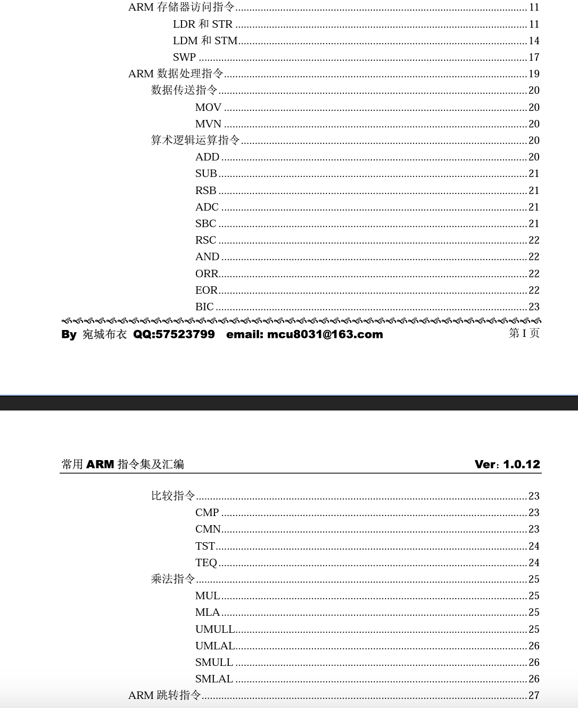

# 1 mcu、cpu（mpu）、ap的区别

- CPU是Central Processing Unit的缩写，计算机的运算控制核心就是CPU。CPU是由运算器、控制器和寄存器及相应的总线构成。众所周知的三级流水线：取址、译码、执行的对象就是CPU，CPU从存储器或高速缓冲存储器中取出指令，放入指令寄存器，并对指令译码，然后执行指令。而计算机的可编程性其实就是指对CPU的编程。CP U只有处理单元，没有片上ram和flash，比如intel的i5。

- mcu一般指单片机的处理器，他不光包含cpu，还包括片上的ram和flash，比如51、stm32f1，stm32f4等。一般都是arm架构。

- ap（或者soc）：在mcu的基础上，可以扩展片外的ram和flash，甚至包含GPU核心，性能更加强大，常用在高性能嵌入式设备，比如手机，苹果的m1芯片。

# 2 x86、arm、risc-v的区别与联系

1. 设计理念：
    
    - x86（或称为x86-64）是由Intel和AMD开发的复杂指令集计算机（CISC）架构。它的设计目标是提供广泛的指令集和功能，以支持复杂的软件任务。
    - ARM是由ARM Holdings开发的精简指令集计算机（RISC）架构。它的设计目标是简化指令集，提高能效和性能，广泛应用于移动设备和嵌入式系统。
    - RISC-V是一个开源指令集架构，由加州大学伯克利分校开发。它的设计目标是提供一个简洁、灵活和可扩展的指令集，用于各种应用领域。
2. 市场应用：
    
    - x86架构主要用于个人电脑（包括台式机和笔记本电脑）和服务器领域。它在桌面计算和企业级计算方面具有广泛的应用。
    - ARM架构主要用于移动设备（如智能手机和平板电脑）、嵌入式系统和低功耗设备。它在移动领域具有显著的市场份额，并且在物联网（IoT）和嵌入式领域也很受欢迎。
    - RISC-V架构目前在嵌入式系统和一些特定领域的研究和实验中得到广泛应用，如人工智能加速器、高性能计算和边缘计算等。
3. 生态系统：
    
    - x86架构具有庞大的生态系统和广泛的软件支持。它有丰富的操作系统、编译器、开发工具和应用程序可用，以及大量的第三方硬件设备和扩展。
    - ARM架构也有强大的生态系统，特别是在移动设备领域。它有广泛的操作系统支持（如Android和iOS），并且有许多ARM架构的芯片供应商和开发工具。
    - RISC-V作为一个相对新的架构，其生态系统正在不断发展中。虽然它已经有了一些操作系统和开发工具的支持，但与x86和ARM相比，其生态系统还相对较小。

精简指令集：arm、risc-v。精简指令集一共只有几十个指令。比如

复杂指令集：x86。复杂指令集有几百个指令，比如数据传输的MOV、算数运算的ADD（加法），ADC（带位加法），INC（加1），逻辑运算 AND、OR。

# 3 各指令集的汇编格式

## 3.1 arm

## 3.2 x86
