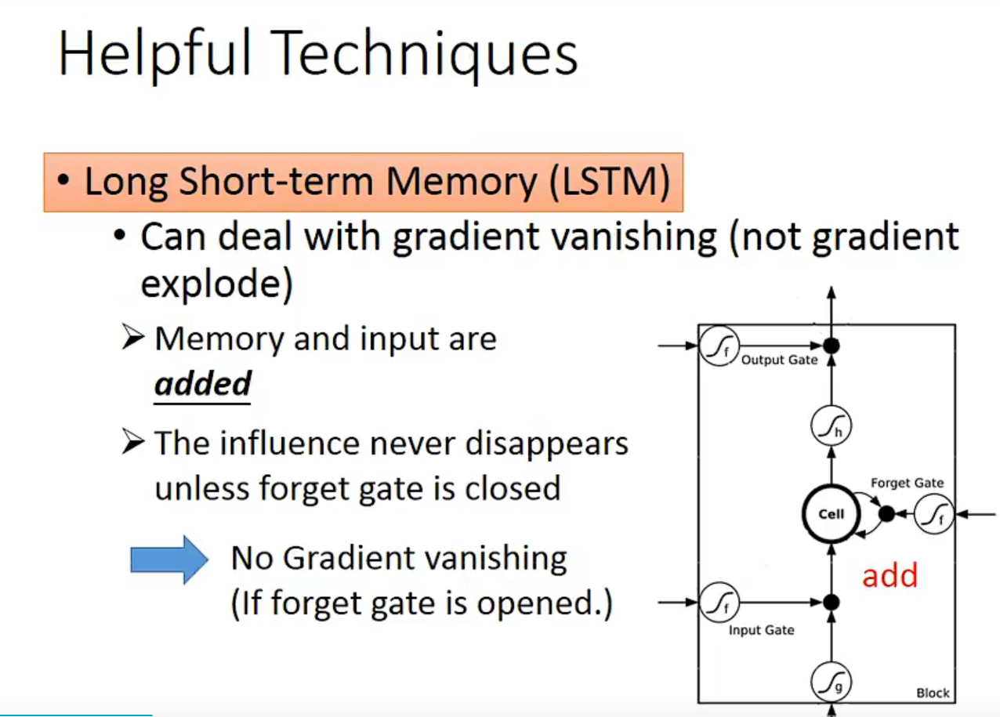

1、RNN是sequence的，梯度相乘会造成爆炸或者消失。导致它的error surface很崎岖(rough)

2、LSTM有了输入门、输出门、遗忘门，一定程度上梯度消失（但还是解决不了梯度爆炸）了上述情况，使得error surface变得比较flat
3、如果LSTM overfitting了，可以考虑GRU（只有两个门）

4、LSTM（RNN）可以做encoder-decoder，来实现word embedding（transformer同样可以）

