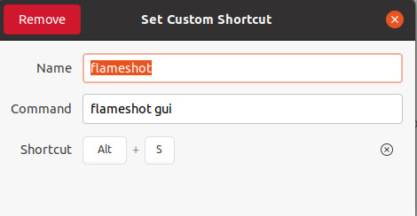
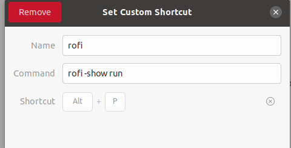
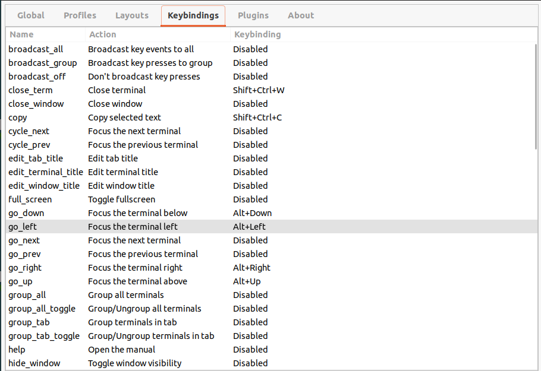
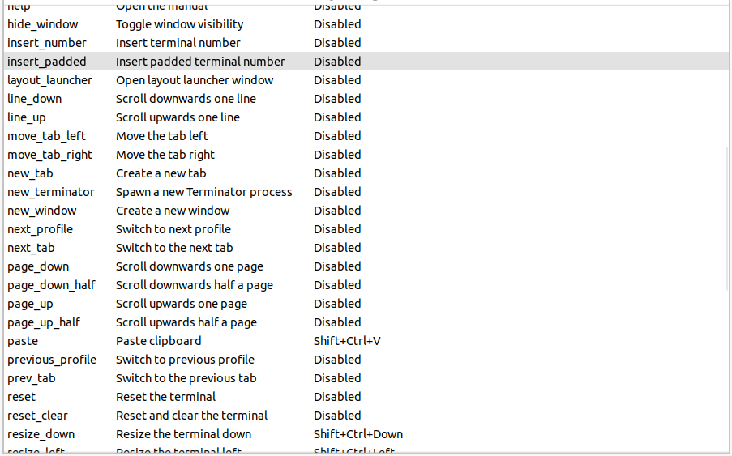
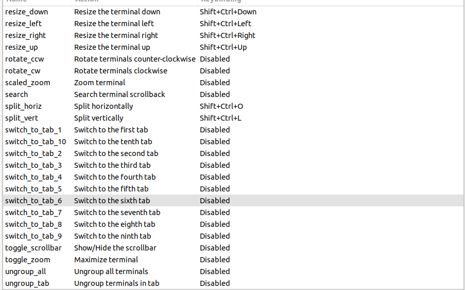
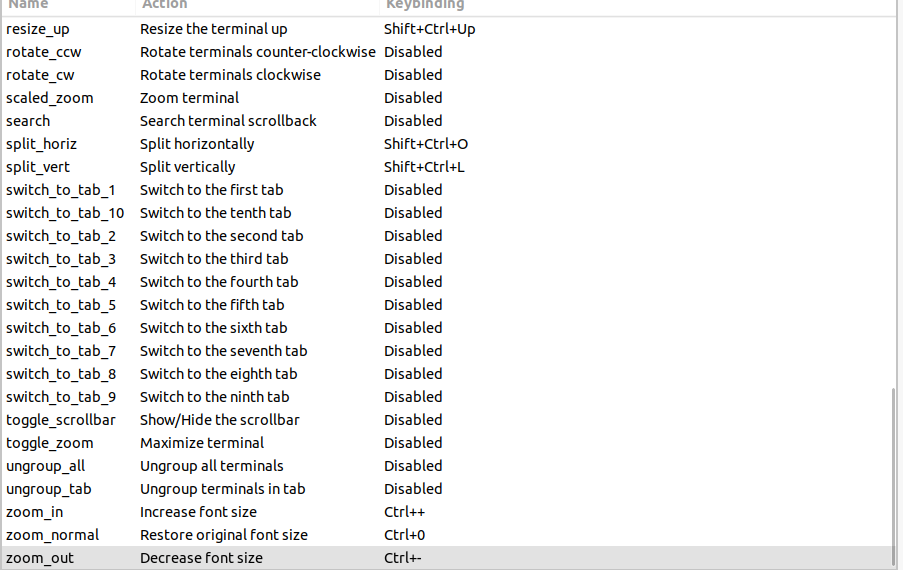
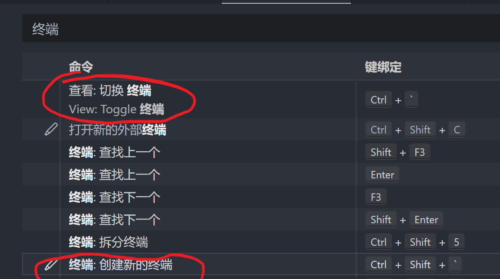
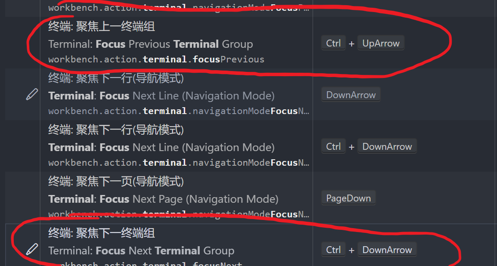
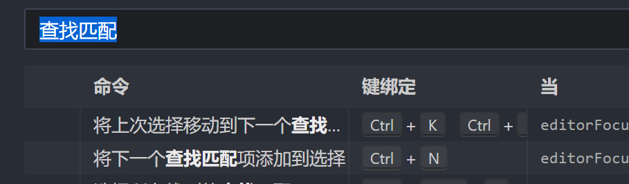

## 1. windows

### 桌面相关
	新建桌面 win+ctrl+d
	删除桌面 win+ctrl+f4
	移动桌面 win+ctrl+ 左/右
	显示所有桌面 win + tab
	桌面内切换活动窗口 alt+tab

### 窗口相关

	窗口磁贴 win+左 或者 win+ 右
	最大化窗口 win+上
	最小化窗口 win+下
	

### 打开应用相关

	打开任务栏对应的应用 win+1、2、3
	任务栏间切换程序  win+T

### 浏览器相关

	切换标签页 ctrl+tab

## 2.linux桌面（ubuntu）
	win代表super键
	
### 窗口相关

	窗口磁贴 win+左 或者 win+ 右
	最大化窗口 win+上
	还原窗口 win+下
	隐藏窗口 win+h
	调出窗口 alt+tab
	
### 桌面相关
	新建桌面 linux自动新建
	删除桌面 linux自动删除
	移动桌面 alt+1/2/3/4 改键switch to workspace 
	移动到上一个/下一个桌面 ctrl+alt+左/右 改建move to work space above
	将窗口移动到特定桌面：ctrl+alt+1/2/3/4 改键move window to work space
	
	显示所有桌面 win

### 快捷启动

![[../linux/images/ubuntu-setup_image_5.png]]


![[../linux/images/ubuntu-setup_image_6.png]]






## 2. linux终端

**光标快速移动**
- ctrl + a：光标回到输入的命令首部  （对应Home键）
- ctrl + e：光标回到输入的命令尾部  （对应End键）
- ctrl + 左(或者alt+b) ：向左移动一个单词
- ctrl + 右(或者alt+f) ：向右移动一个单词
- 
- ctrl + b：光标向前移动一位    （对应方向键←）
- ctrl + f ：光标向后移动一位    （对应方向键→）

**清屏**
- ctrl + u：删除输入的整条命令
- ctrl + l 或 clear：清屏

**放大缩小**
- ctrl + + :放大
- ctrl + - ：缩小

**terminator终端**
- ctrl+shift+o：横向分割
- ctrl+shift+L：改建，纵向分割
- ctrl+shift+w：关闭当前窗口
- alt+上/下/左/右：移动聚焦终端
- ctrl+shift+上/下/左/右：改变终端大小






## 3. vscode

**vim配置**
```json
    "vim.handleKeys": {
        "<C-a>": false,
        "<C-f>": false,
        "<C-x>": false,
        "<C-c>": false,
        "<C-z>": false,
        "<C-v>": false,
        "<C-[>": false,
        "<C-]>": false,
        "<C-s>": false,
        "<C-b>": false,
        "<C-/>": false,
        "<C-w>": false,
        "<C-shift+f>": false,

    },
    "vim.insertModeKeyBindings": [
        {
            "before": [
                "<c-h>"
            ],

            "after": [
                "<left>"
            ]
        },
        {
            "before": [
                "<c-l>"
            ],
            "after": [
                "<right>"
            ]
        },
        {
            "before": [
                "<c-j>"
            ],
            "after": [
                "<down>"
            ]
        },
        {
            "before": [
                "<c-k>"
            ],
            "after": [
                "<up>"
            ]
        },
        {
            "before": [
                "<c-u>"
            ],
            "after": [
                "<esc>",
                "b",
                "i",
            ]
        },
        {
            "before": [
                "<c-d>"
            ],
            "after": [
                "<esc>",
                "e",
                "a",
            ]
        }
    ],

```

vscode快捷键：keybindings.json
```json
[
  {
    "key": "ctrl+shift+i",
    "command": "-workbench.action.toggleDevTools",
    "when": "isDevelopment"
  },
  {
    "key": "ctrl+shift+i",
    "command": "editor.action.formatDocument",
    "when": "editorHasDocumentFormattingProvider && editorTextFocus && !editorReadonly && !inCompositeEditor"
  },
  {
    "key": "shift+alt+f",
    "command": "-editor.action.formatDocument",
    "when": "editorHasDocumentFormattingProvider && editorTextFocus && !editorReadonly && !inCompositeEditor"
  },
  {
    "key": "ctrl+shift+i",
    "command": "editor.action.formatDocument.none",
    "when": "editorTextFocus && !editorHasDocumentFormattingProvider && !editorReadonly"
  },
  {
    "key": "shift+alt+f",
    "command": "-editor.action.formatDocument.none",
    "when": "editorTextFocus && !editorHasDocumentFormattingProvider && !editorReadonly"
  },
  {
    "key": "ctrl+up",
    "command": "workbench.action.terminal.focusPrevious",
    "when": "terminalFocus && terminalHasBeenCreated && !terminalEditorFocus || terminalFocus && terminalProcessSupported && !terminalEditorFocus"
  },
  {
    "key": "ctrl+pageup",
    "command": "-workbench.action.terminal.focusPrevious",
    "when": "terminalFocus && terminalHasBeenCreated && !terminalEditorFocus || terminalFocus && terminalProcessSupported && !terminalEditorFocus"
  },
  {
    "key": "ctrl+down",
    "command": "workbench.action.terminal.focusNext",
    "when": "terminalFocus && terminalHasBeenCreated && !terminalEditorFocus || terminalFocus && terminalProcessSupported && !terminalEditorFocus"
  },
  {
    "key": "ctrl+pagedown",
    "command": "-workbench.action.terminal.focusNext",
    "when": "terminalFocus && terminalHasBeenCreated && !terminalEditorFocus || terminalFocus && terminalProcessSupported && !terminalEditorFocus"
  },
  {
    "key": "ctrl+m",
    "command": "editor.action.addSelectionToNextFindMatch",
    "when": "editorFocus"
  },
  {
    "key": "ctrl+d",
    "command": "-editor.action.addSelectionToNextFindMatch",
    "when": "editorFocus"
  }

]

```


**代码快捷键：**

- cmake tools:
- 编译并运行：shift+f5
- 编译并调试：ctrl+f5

- python:
- 快速运行：ctrl+alt+n

- latex：
- 快速编译：ctrl+shift+b


**编辑快捷键：**
- ctrl+\[：左缩进
- ctrl+\]：右缩进
- ctrl+/ ：注释
- ctrl+shif+i：格式化代码
- alt+左：向前
- alt+右：向后
- ctrl+b ：打开侧边文件栏
- ctrl+\` ：打开/关闭终端
- ctrl+w：关闭窗口
- ctrl+M（改键）：查找下一个匹配单词并选中
- ctrl+q：多光标
- ctrl+shift+L：查找所有匹配单词并选中
- alt+上：将当前行向上移动一行
- alt+下：将当前行向下移动一行
- ctrl+backspace：删除上一个词
- ctrl+shfit+左/右：选中整个词
- alt+\[ 或\]：copilot 选项切换
- alt+enter：显示所有copilot选项
- alt+\\：主动要求copilot给出建议
- 


**快速移动：**
- ctrl+1、2、3：切换编辑窗口
- ctrl+tab：切换同一个窗口下的文件
- alt+1、2、3：切换同一个窗口下的文件
- ctrl+\`：切换终端
- ctrl+shift+e：切换文件窗口与编辑器
- ctrl+上（改键）：切换到上一终端
- ctrl+下（改键）：切换到下一终端




## 4.vim快捷键

**插入：**
- a、A、o、O、i、I

**normal下替换单个字符：**
- r

**删除（换成c进入插入模式）：**
- dd：删除整行
- 4dd：删除四行
- x：删除一个字符
- 4x：删除四个字符
- dw：删除一个单词
- d4w：删除后边4个单词
- d$：删除到最后
- di(：删除()内的内容
- da(：删除()内的内容包括括号

**复制：**
同删除

**粘贴：**
p

**查找：**
- /string：查找string，按下enter，然后n是下一个

**快速移动：**
- ctrl+d：下翻半页
- ctrl+u：上翻半页
- zz：把鼠标当前位置放到屏幕中央
- 0：每行开头
- ^：每行的第一个字符
- $：每行的最后一个字符
- gg：第一行
- G：最后一行
- ：【num】：跳转到num行
- w：向后跳转一个单词
- b：向前跳转一个单词
- %：快速跳转到括号匹配的另一个括号，包括(){}[]
- \#：跳转到光标处的单词上一个出现的地方
- * ：跳转到光标处的单词下一个出现的地方
- 

**观察模式：**
- v：进入观察模式
- V：进入以行为单位的观察模式

**代码补全：**
- ctrl+n
- ctrl+p

**注释（多光标）：**
- 插入：ctrl+v进入块模式，选中，shift+i插入#或//，然后esc
- 取消：ctrl+进入块模式，选中，delete，esc