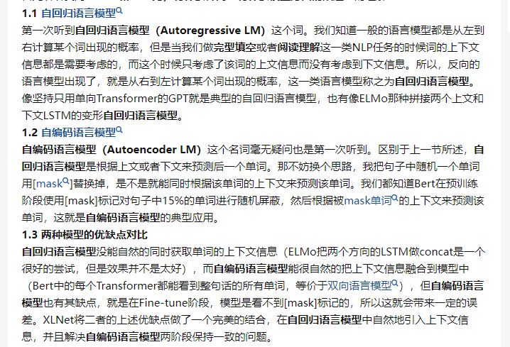
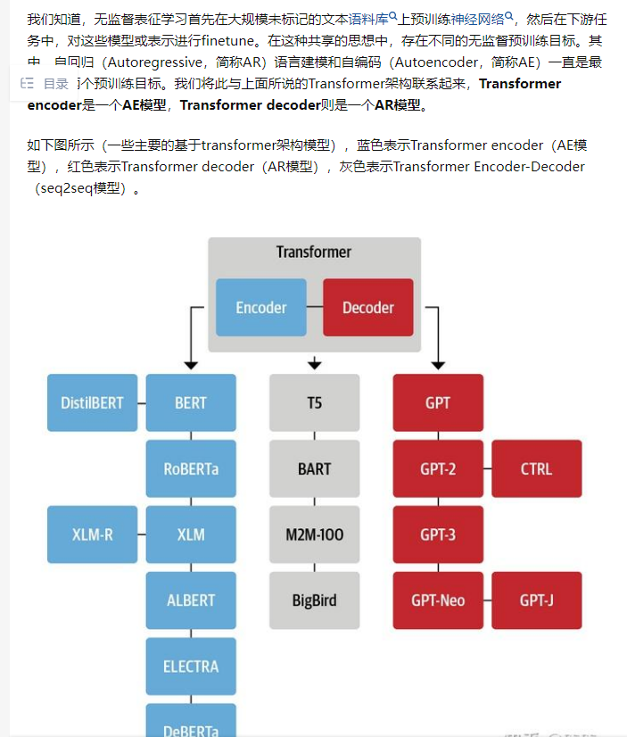
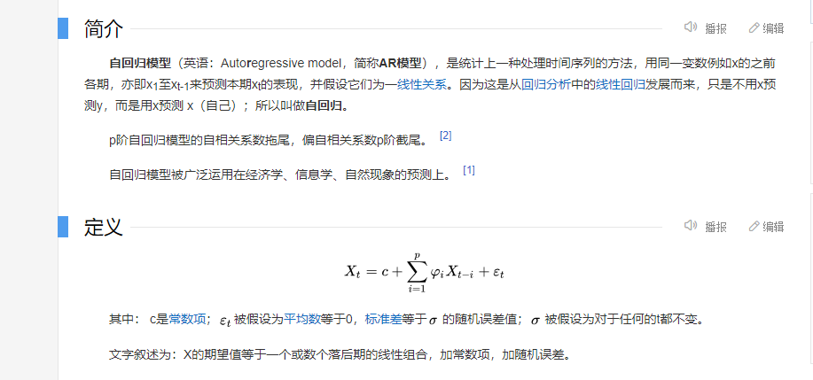
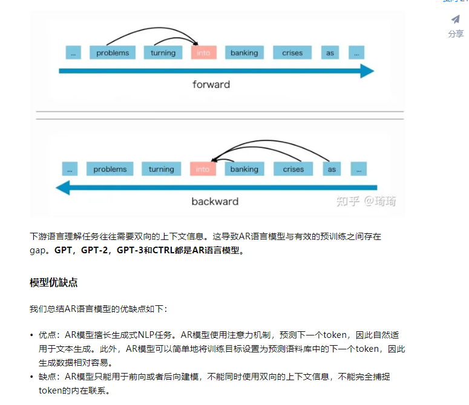
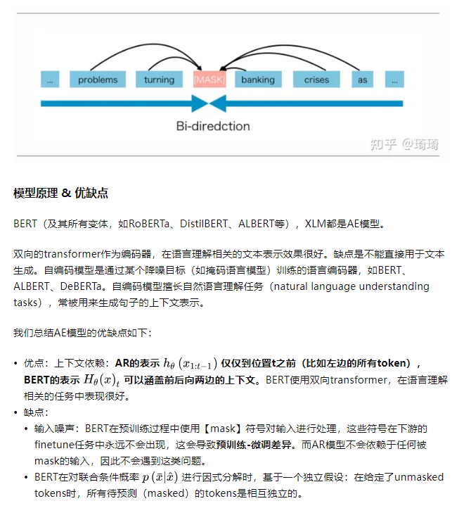

## 1 自回归模型

自回归模型的定义：
用之前的x预测x本身，而不是用x预测y

AR模型，代表作GPT，从左往右学习的模型。AR模型从一系列time steps中学习，并将上一步的结果作为回归模型的输入，以预测下一个time step的值。AR模型通常用于生成式任务，**在长文本的生成能力很强**，比如自然语言生成（NLG）领域的任务：**摘要、翻译或抽象问答**。

## 2自编码模型

**AE模型，代表作BERT**，它不会进行精确的估计，但却具有从被mask的输入中，重建原始数据的能力，即fill in the blanks_（填空）。AE模型通常用于内容理解任务，比如自然语言理解（NLU）中的分类任务：**情感分析、提取式问答**。
BERT一直都是很先进的预训练方法，它可以利用双向上下文信息，对原始输入进行重建（恢复）。这个就是相比于AR模型来说的直接优势：缩小了双向信息gap，从而可提高模型性能。然而，BERT在预训练期间使用的[MASK]符号，在微调阶段的真实数据中并不存在，这就导致了预训练-微调的差异。此外，由于预测的token在输入中被mask，导致BERT无法像AR语言模型那样，使用乘积方式对联合概率进行建模。换言之，BERT假设，在给定unmask的token时，待预测的token彼此之间相互独立，这个假设过于简单化了，在自然语言中，high-order和long-range依赖是非常普遍的。

