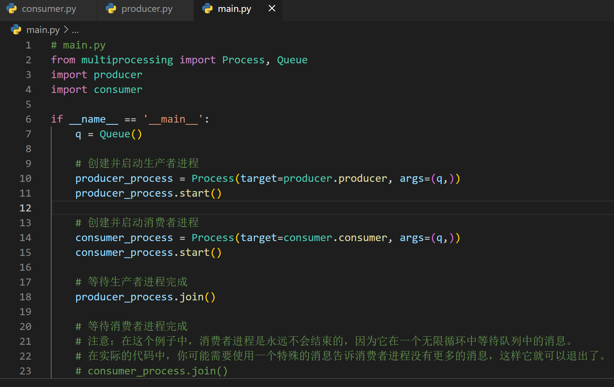

实现进程间通信的多类方法:
下面以python代码作为演示

# 1 管道
管道是一种半双工的通信方式，数据只能单向流动，而且只能在具有亲缘关系的进程间使用。进程的亲缘关系通常是指父子进程关系。
left:发送包子
right：接收宝子

```python
from multiprocessing import Process, Pipe
import time

#可以是一个单独的python文件
def consumer(p, name):
    left, right = p
    left.close()
    while True:
        try:
            baozi = right.recv()
            print('%s 收到包子:%s' % (name, baozi))
        except EOFError:
            right.close()
            break

#可以是一个单独的python文件
def producer(seq, p):
    left, right = p
    right.close()
    for i in seq:
        left.send(i)
        time.sleep(1)
    else:
        left.close()


if __name__  '__main__':
    left, right = Pipe()

    c1 = Process(target=consumer, args=((left, right), 'c1'))
    c1.start()

    seq = (i for i in range(10))
    producer(seq, (left, right))

    right.close()
    left.close()

    c1.join()
    print('进程间通信-管道-主进程')

```
# 2 队列
```python
from multiprocessing import Process, Queue, set_start_method
import time,random,os

#可以是一个单独的python文件，代表一个进程
def consumer(q):
    while True:
        res=q.get()
        if res is None: break #收到结束信号则结束
        time.sleep(random.randint(1,3))
        print('\033[45m%s 吃 %s\033[0m' %(os.getpid(),res))

#可以是一个单独的python文件，代表一个进程
def producer(q):
    for i in range(10):
        time.sleep(random.randint(1,3))
        res='包子%s' %i
        q.put(res)
        print('\033[46m%s 生产了 %s\033[0m' %(os.getpid(),res))
    q.put(None) #发送结束信号


if __name__  '__main__':
    set_start_method('fork')

    q=Queue()
    #生产者们:即厨师们
    p1=Process(target=producer,args=(q,))

    #消费者们:即吃货们
    c1=Process(target=consumer,args=(q,))

    #开始
    p1.start()
    c1.start()
    print('进程间通信-队列-主进程')

```



# 3 socket
socket实际上是网络通信，所以可以实现两个不同主机上的不同进程之间的通信。也可以实现本机不同进程间的通信。

Python socket 使用方法如下

socket = socket.socket(family, type[, protocal])

- family代表地址家族，一般为AF_UNIX，AF_INET和AF_INET6。AF_UNIX用于同一台机器上的进程通信，AF_INET用于IPV4协议的TCP和UDP，AF_INET6用于IPV6协议；
- type代表套接字类型，一般为SOCK_STREAM，SOCK_DGRAM和SOCK_RAW。SOCK_STREAM为流式套接字，用于TCP通信，SOCK_DGRAM为数据报式套接字，用于UDP通信，SOCK_RAW为原始套接字，可以用于处理ICMP、IGMP等网络报文，这是普通套接字无法处理的;
- protocal代表协议编号，默认为0。

server.py
```python
import socket
import os

if __name__  '__main__':
    server = socket.socket(socket.AF_INET, socket.SOCK_STREAM)
    server.bind(("localhost", 8888))
    server.listen(0)
    while True:
        connection, address = server.accept()
        connection.send("test: %s"% connection.recv(1024))
    connection.close()
```
client.py
```python
import socket
import os

if __name__  '__main__':
    client = socket.socket(socket.AF_INET, socket.SOCK_STREAM)
    client.connect(("localhost", 8888))

    instr = raw_input()
    client.send(instr)
    print client.recv(1024)

    client.close()
```

# 4 共享内存

两个进程操作一块内存，**但是需要加锁。**
```python
from multiprocessing import Manager, Process,Lock

def work(d,lock):
      with lock: # 不加锁而操作共享的数据,肯定会出现数据错乱
        print(f"计数器减一，当前为：{d['count']}")
        d['count']-=1


if __name__  '__main__':
    lock=Lock()
    with Manager() as m:
        dic=m.dict({'count':20})
        p_l=[]
        for i in range(20):
            p=Process(target=work, args=(dic, lock))
            p_l.append(p)
            p.start()

        for p in p_l:
            p.join()
        print(dic)

```

# 5 信号量