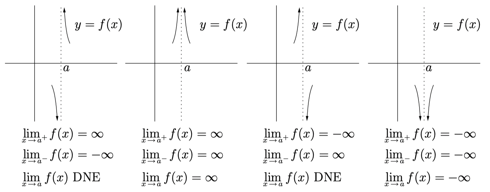

# Limit Problems of Polynomials
When you're talking about the limit of a ratio of two polynomials, it's really important to notice where the limit is being taken. In particular, the techniques for dealing with $x \to \infty$ and $x \to a$ (some finite $a$) are completely different.

## Limits Involving Rational Functions as $x \to a$
If the denominator is not $0$, you can just substitute the variable $x$ with its value:

$$
\lim_{x \to -1} \frac{x^2 - 3x + 2} {x - 2} = \frac{(-1)^2 - 3(-1) + 2}{-1 - 2} = \frac{6}{-3} = -2
$$

But if you want to find:

$$
\lim_{x \to 2} \frac{x^2 - 3x + 2} {x - 2}
$$

the substitutiong method may not work, you'll get $(4 - 6 + 2) / (2 - 2)$, which is $0 / 0$. This is called an **indeterminate form**. The technique we used to solve this is called `factoring`:

$$
\lim_{x \to 2} \frac{x^2 - 3x + 2} {x - 2} = \lim_{x \to -2} \frac{(x - 2)(x - 1)} {x - 2} = \lim_{x - 2}(x - 1)
$$

Now we plug $x = 2$ into the expression $(x - 1)$, then we get $1$. That's the value of the limit we're looking for.

In addition to knowing how to factor quadratics, it's really useful to know the formula for the difference of two cubes:

$$
a^3 - b^3 = (a - b)(a^2 + ab + b^2)
$$

But what if the denominator is $0$ but the numerator is not $0$? There are four types of behavior that could arise: 

## Limits Involving Square Roots as $x \to a$
Consider the following limit:

$$
\lim_{x \to 5} \frac{\sqrt{x^2 - 9} - 4} {x - 5}
$$

If you plug in $x = 5$, you get the indeterminate form $0 / 0$. What you need to do is multiply and divide by $\sqrt{x^2 - 9} + 4$, which is called `conjugate expression` of $\sqrt{x^2 - 9} - 4$:

$$
\lim_{x \to 5} \frac{\sqrt{x^2 - 9} - 4} {x - 5} = \lim_{x \to 5} \frac{\sqrt{x^2 - 9} - 4} {x - 5} \times \frac{\sqrt{x^2 - 9} + 4} {\sqrt{x^2 - 9} + 4} = \lim_{x \to 5} \frac{x + 5} {\sqrt{x^2 - 9} + 4} = \frac{10}{8}
$$

## Limits Involving Rational Functions as $x \to \infty$
In symbols, we are now trying to find limits of the form:

$$
\lim_{x \to \infty} \frac{p(x)}{q(x)}
$$

where p and q are polynomials.

The very important property of a polynomial:
> When x is large, the leading term dominates.

And we have the theoram:

$$
\lim_{x \to \infty} \frac{C}{x^n} = 0
$$

For example, the limit is solved:

$$
\lim_{x \to \infty} \frac{3x^3 - 1000x^2 + 5x - 7} {3x^3} = \lim_{x \to \infty}(1 - \frac{1000}{3x} + \frac{5}{3x^2} - \frac{7}{3x^3}) = 1 - 0 + 0 + 0 = 1
$$

## Limits Involving Poly-type Function as $x \to \infty$

The principles for poly-type functions are similar to those for polynomials, except that this time it may not be so clear what the leading term is.

## Limits Involving Rational Functions as $x \to -\infty$

Now we solve the limits of the form:

$$
\lim_{x \to \infty} \frac{p(x)} {q(x)}
$$

where p and q are polynomials or even poly-type functions.

All the principles we've been using apply equally well here.

The only situation we need to pay attention is:
> if $x < 0$ and you want to write $^n\sqrt{x^y} = x^m$, the only time you need a minus sign in front of $x^m$ is when $n$ is even and m is odd.
