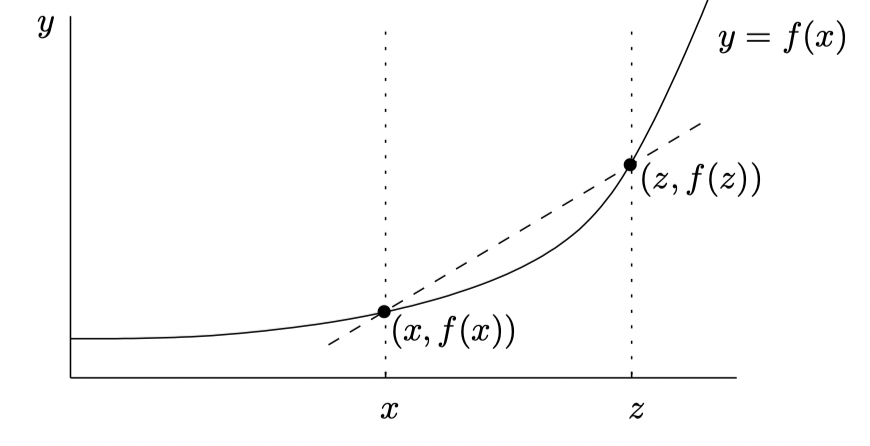
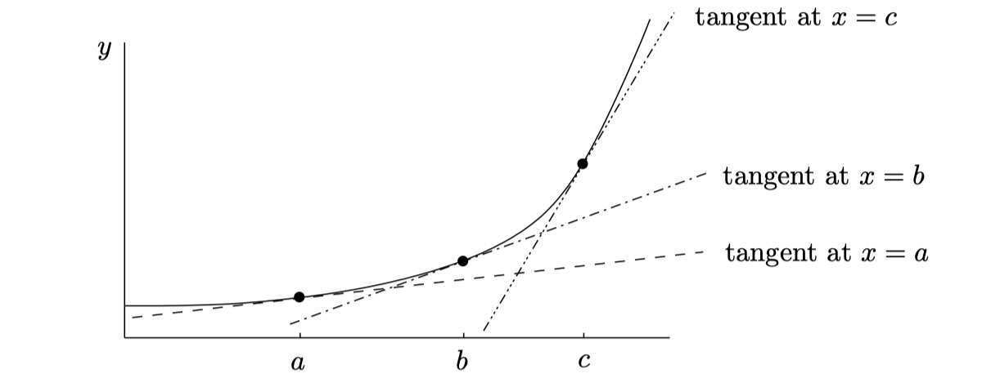

# Continuity and Differentiability
Now we're going to look at two types of `smoothness`:

- `continuity`, which means the graph now has to be drawn in one piece, whithout taking the pen off the page;
- `differentiability`, which means there are no sharp corners in the graph.

## Continuity
The intuition of continuity is that you can draw the graph of the function in one piece without lifting your pen off the page.

### Continuity at A Point
When we talk about continuity at a point, we want a stream of points $(x, f(x))$ which get closer and closer to the point $(a, f(a))$. In other words, as $x \to a$ we need $f(x) \to f(a)$. We can now give a proper definition:
> A function $f$ is `continuity` at $x = a$ if $\lim_{x \to a} f(x) = f(a)$

So if a function is continuity, it requires:

1. The two-side limit $\lim_{x \to a}f(x)$ exists(and is finite);
2. The function is defined at $x = a$; that is, $f(a)$ exists(and is finite);
3. The two above quantities are equal: $\lim_{x \to a}f(x) = f(a)$

### Continuity on An Interval
We now know what it means for a function to be continuous at a single point, we extend this definition and say that a function $f$ is continuous on the interval $(a, b)$ if it is continuous at every point in the interval.

We say a function $f$ is continuous on $[a, b]$ if:

1. the function $f$ is continuous at every point in $(a, b)$;
2. the function $f$ is right-continuous at $x = a$, that is, $\lim_{x \to a^+}f(x)$ exists(and is finite), $f(a)$ exists, and these two quantities are equal; 
2. the function $f$ is left-continuous at $x = a$, that is, $\lim_{x \to b^-}f(x)$ exists(and is finite), $f(b)$ exists, and these two quantities are equal.
;

### The Intermediate Value Theorem(IVT)
Knowing that a function is continuous brings some benefits:

1. Intermediate Value Theoram(IVT);
2. Max-Min Theorem.

We can state the Intermediate Value Theorem as:
> If $f$ is continuous on $[a, b]$ and $f(a) < 0$ and $f(b) > 0$, then there is at least one number $c$ in the interval $(a, b)$ such that $f(c) = 0$. The same is true if instread $f(a) > 0$ and $f(b) < 0$.

### Maxima and Minima of Continuous Functions

The Max-Min Theorem can be stated as:
> If $f$ is continuous on $[a, b]$, then $f$ has at least one maximum and one minimum on $[a, b]$.

## Differentiability
The differentiablility essentially means that the function has a derivative.

### Instantaneous Velocity
How can we measure the velocity of the car at a given instant? The idea is to take the average velocity of the car over smaller and smaller time periods.

Suppose that $u$ is a short time later than $t$, let's write $v_{t \leftrightarrow u}$ to mean the average velocity of the car during the time interval beginning at time $t$ and ending at time $u$. Now we just push $u$ closer and closer to $t$:

$$
v_{t \leftrightarrow u} = \frac{P_u - P_t} {u - t} = \frac{f(u) - f(t)} {u - t}
$$

Notice that the denominator $u - t$ is the length of time involved, we can just take a limit as $u \to t$:

$$
v_{t} = \lim_{u \to t} \frac{f(u) - f(t)} {u - t}
$$

Since $u$ is very close to $t$, we can just write the equotion as:

$$
v_{t} = \lim_{h \to 0} \frac{f(t + h) - f(t)} {h}
$$

### Tanget Lines
We pick a number $z$ which is close to $x$ and plot the point $(z, f(z))$ on the curve and draw the graph:

Since the slope is the rise over the run, the slope of the dashed line is:

$$
\frac{f(z) - f(x)} {z - x}
$$

Let's set $h = z - x$ then we see that as $z \to x$, we have $h \to 0$, so we also have:

$$
slope\_of\_tangent\_line\_through (x, f(x)) = \lim_{h \to 0} \frac{f(x + h) - f(x)} {h}
$$

### The Derivative Function
In the following picture, I've drawn in the tangent lines through three different points on the curve:

These lines have different slopes. That is, the slope of the tangent line `depends` on which value of $x$ you start with. Another way of saying this is that the slope of the tangent line through $(x, f(x))$ is itself a function of $x$. This function is called the `derivative` of $f$ and is witten as $f'$:

$$
f'(x) = \lim_{h \to 0} \frac{f(x + h) - f(x)} {h}
$$

If $y = f(x)$, then you can write $\frac{dy}{dx}$ instead of $f'(x)$. For example, if $y = x^2$, then $\frac{dy}{dx} = 2x$. In fact, if you replace $y$ by $x^2$, you get a variety of different ways of expressing the same thing:

$$
f'(x) = \frac{dy}{dy}{dx} = \frac{d(x^)} {dy} = \frac{d}{dx}(x^2) = 2x
$$

### Differentiability and Continuity
Now it's time to relate the two big concepts in this chapter:
> If a function $f$ is differentiable at $x$, then it's continuous at $x$.

To prove this claim, we have known that $f$ is continuous at $x$:

$$
\lim_{u \to x} f(u) = f(x)
$$

as $u \to x$ we can also replace above equation as:

$$
\lim_{h \to 0} f(x + h) = f(x)
$$

Now we are aware of our destination, let's start with what we actually know that $f$ is differentiable at $x$, which means that $f'(x)$ exists:

$$
\lim_{h \to 0} \frac{f(x + h) - f(x)}{h} = f'(x)
$$

$$
\lim_{h \to 0} \frac{f(x + h) - f(x)}{h} \times h = \lim_{h \to 0}f'(x) \times h
$$

$$
\lim_{h \to 0} f(x + h) - f(x) = \lim_{h \to 0}f'(x) \times h = 0
$$

so we got:

$$
\lim_{h \to 0} f(x + h) = f(x)
$$
