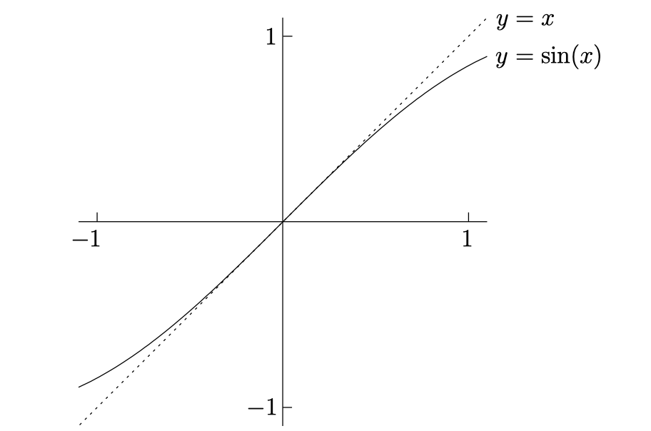

# Trig Limits and Derivatives
So far, most of our limits and derivativess have involved only polynomials or poly-type functions. Lets expand our horizons by looking aat trig functions.

## Limits Involving Trig Functions
Consider the following two limits:

$$
\lim_{x \to 0} \frac{sin(5x)} {x}
$$

and 

$$
\lim_{x \to \infty} \frac{sin(5x)} {x}
$$

They look almost the same, the only difference is that the first limit is taken as $x \to 0$ while the second it taken as $x \to \infty$.

### The small case

We know that $sin(0) = 0$, so what does $sin(x)$ look like when $x$ is **near** $0$? It turns out that $sin(x)$ is approximately the same as $x$ itself:

The graphs of $y = sin(x)$ and $y = x$ are very similar, especially when $x$ is close to $0$. So we have the conclusion:

$$
\lim_{x \to 0} \frac{sin(x)} {x} = 1
$$

How about $cos(x)$? Well, $cos(0) = 1$, so we write:

$$
\lim_{x \to 0} cos(x) = 1
$$

As for $tan(x)$, we can write $tan(x)$ as $\frac{sin(x)}{cos(x)}$ and get the equation:

$$
\lim_{x \to 0} \frac{tan(x)} {x} = 1
$$

### The large case
As we all know:

$$
-1 \le sin(x) \le 1
$$

So the limit is:

$$
\lim_{x \to \infty} \frac{sin(x)} {x} = 0
$$

## Derivatives Involving Trig Functions
Using the definition of derivative:

$$
f'(x) = \lim_{h \to 0} \frac{f(x + h) - f(x)} {h}
$$

and the conclusion above:

$$
\lim_{h \to 0} \frac{sin(h)} {h} = 1
$$

we can get:

$$
\begin{align}
sin'(x) 
&= \lim_{h \to 0} \frac{sin(x + h) - sin(x)} {h} \\
&= \lim_{h \to 0} \frac {sin(x)cos(h) + cos(x)sin(h) - sin(x)} {h} \\
&= \lim_{h \to 0} (sin(x)(\frac{cos(h) - 1} {h}) + cos(x)(\frac{sin(h)}{h})) \\
&= \lim_{h \to 0} (sin(x) \times 0 + cos(x) \times 1) \\
&= cos(x)
\end{align}
$$

Use the samme method, we can get other equations:

$$
\begin{align}
cos'(x) &= -sin(x) \\
tan'(x) &= \frac{1}{cos^2(x)} = sec^2(x) \\
sec'(x) &= sec(x)tan(x) \\
csc'(x) &= -csc(x)cot(x) \\
cot'(x) &= -csc^2(x)
\end{align}
$$
