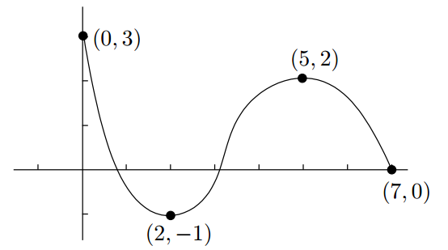

# Extrema of Functions

We have seen how to differentiate functions from several different families, now we can use this knowledge to help us understand the maxima and minima of functions.

## Extrema of Functions

If we say $x = a$ is an `extremum` of a function $f$, this means that $f$ has a maximum or minimum at $x = a$. (The plural of "extremum" is "extrema", of course.)

### Definition

The basic idea of a maximum is that it occurs when the function value is highest:

Let's say that a

- `global maximum`(or *absolute maximum*) occurs at $x = a$ if $f(a)$ is the highest value of $f$ on the **entire** domain of $f$;
- `local maximum`(or *relative maximum*) occurs at $x = a$ if $f(a)$ is the highest value of $f$ on **some small interval containing a**.

Every global maximum is also a local maximum.

### The Extreme Value Theorem

Let's say that $x = c$ is a *critical point* for the function $f$ is either $f'(c) = 0$ or $f'(c) = DNE$. Then we have the `Extreme Value Theorem`:

> Suppose that $f$ is defined on $(a,b)$ and $c$ is in $(a, b)$. If $c$ is a local maximum or minimum of $f$, then $c$ must be a critical point for $f$. That is, either $f'(c) = 0$ or $f'(c) = DNE$.

### How to Find Global Maxima and Mimima

In glory detail, here's how to find the global maximum and minimum of the function $f$ with domain $[a, b]$:

1. Find $f'(x)$. Make a list of all the points in $(a, b)$ where $f'(x) = 0$ or $f'(x) = DNE$. That is, make a list of all the critical points in the interval $(a, b)$.
2. Add the endpoints $x = a$ and $x = b$ to the list.
3. For each of the points in the list, find the y-coordinates by substituting into the equation $y = f(x)$.
4. Pick the highest y-coordinate and note all the values of x from the list coresponding to that y-coordinate. These are the global maxima.
5. Do the same for the lowest y-coordinate to find the global minima.

## Rolle's Theorem

> Suppose that $f$ is continuous on $[a, b]$ and differentiable on $(a, b)$. If $f(a) = f(b)$, then there must be at least one number $c$ in $(a, b)$ such that $f'(c) = 0$.

## The Mean Value Theorem

> Suppose that $f$ is continuous on $[a, b]$ and differentiable on $(a, b)$. Then there's at least one number $c$ in $(a, b)$ such that:

$$
f'(c) = \frac{f(b) - f(a)} {b - a}
$$

The Mean Value Theorem looks a lot like Rolle's Theorem. In fact, the conditions for applying the two theorems are almost the same. In both cases, your function $f$ has to be continuous on a closed interval $[a, b]$ and differentiable on $(a, b)$. Rolle's Theorem also requires that $f(a) = f(b)$, but Mean Value Theorem doesn't require that. In fact, if you apply the Mean Value Theorem to a function $f$ statisfying $f(a) = f(b)$, you'll see that $f(b) - f(a) = 0$, so you get a number $c$ in $(a, b)$ statisfying $f'(c) = 0$. So **Mean Value Theorem reduces to Rolle's Theorem**.
