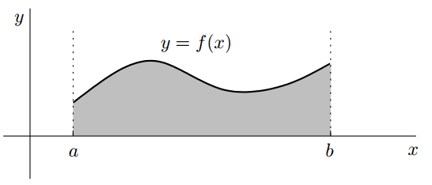
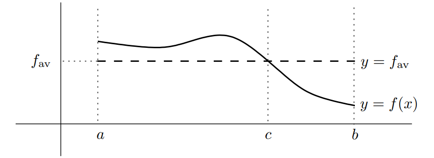

# The Fundamental Theorems of Calculus

Now it's time to get some facts straight about definite integrals.

## The Basic Idea
We start off with some function $f$ and an interval $[a, b]$. Take the graph of $y = f(x)$, and consider the region between the curve, the x-axis, and the two vertical lines $x = a$ and $x = b$:

It would be nice to have a compact way to express the area of the shaded region. Let's say the the area of the shaded region above, is

$$
\int_{a}^b f(x)dx
$$

This is a `definite integral`. You would read it out loud as `the integral from a to b of f(x) with respect to x`.

- $f(x)$ is called `integrand`, and tells you what the curved part looks like;
- $a$ and $b$ is called `limits of integration` or `endpoints of integration`, tell you where the two vertical lines go;
- $dx$ tells you that x is the variable on the horizontal axis.

What if the function dips below the x-axis? Actually, the part of the area below the x-axis counts as negtive area. In general, the integral gives the total amount of signed area.

And, if $f$ is an odd function, then:

$$
\int_{-a}^a f(x) dx = 0
$$

$a$ can be any number.

## Definition of the Definite Integral
We have a nice working definition of the definite integral in terms of area, but that doesn't really help us to calculate specific integrals. We can state the definition:

$$
\int_a^b f(x) dx = \lim_{mesh \to 0} \sum_{j = 1}^n f(c_j)(x_j - x_{j - 1})
$$

where $a = x_0 < x_1 < \cdots < x_{n - 1} < x_n = b$ and $c_j$ is in $[x_{j - 1}, x_j]$ for each $j = 1, \cdots, n$.

## Properties of Definite Integral

- If you reverse the limits of integration, you need to put in a minus sign out front.

$$
\int_{b}^{a} f(x) dx = -\int_{a}^{b} f(x) dx
$$

- If the limits of integration are equal, the integration is 0.

$$
\int_{a}^{a} f(x) dx = 0
$$

- You can split an integral into two pieces.

$$
\int_{a}^{b} f(x) dx = \int_{a}^{c} f(x) dx + \int_{c}^{b} f(x) dx
$$

- Constants can move through integral signs.

$$
\int_{a}^{b} C f(x) dx = C \int_{a}^{b} f(x) dx
$$

- Integrals respect sums and differences.

$$
\int_{a}^{b} (f(x) + g(x)) dx = \int_{a}^{b} f(x) dx + \int_{a}^{b} g(x) dx
$$

## Averages and the Mean Value Theorem for Integrals
Let's return to average velocities. All you have to do is to find the displacement and divide it by the total time. If the time interval goes from a to b, and the velocity at time t is $v(t)$, then we've already seen that:

$$
displacement = \int_{a}^{b} v(t) dt
$$

Since the total time is $b - a$, we have

$$
average \quad velocity = \frac{displacement} {total time} = \frac{1}{b - a} \int_a^b v(t) dt
$$

More general, we can define the **average value** of an integrable function $f$ on the interval $[a, b]$ as follow:

$$
average \quad value \quad of \quad f \quad on \quad [a, b] = \frac{1}{b - a} \int_a^b f(x) dx
$$

As for a function, the average theorem actually says that the following two areas are equal:

Let's label the correspongding point on the x-axis as c, like this:

So we have $f(x) = f_{av}$. It turns out that if $f$ is continuous, then there is always such a number c(**Mean Value Theorem for integral**):
>  If $f$ is continous on $[a, b]$, then there exists c in $(a, b)$ such that:

$$
f(c) = \frac{1}{b - a} \int_{a}^{b} f(x) dx
$$
