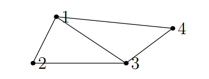
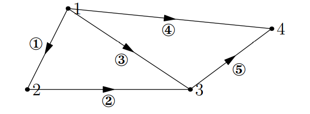
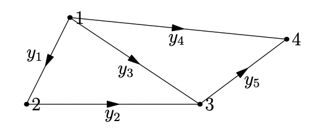

# Graphs, Networks and Incidence Matrices

When we use linear algebra to understand physical systems, we often find more structure in the matrices and vectors than appears in the examples we make up in class. There are many applications of linear algebra; for example, chemists might use row reduction to get a clearer picture of what elements go into a complicated reaction. In this lecture we explore the linear algebra associated with electrical networks.

## Graphs and networks

A `graph` is a collection of nodes joined by edges; figure below shows one small graph with 4 nodes and 5 edges:

We put an arrow on each edge to indicate that the positive direction for currents running through the graph.

## Incidence matrices

The `incidence matrix` of this directed graph has one column for each node of the graph and one row for each edge of the graph:

$$
A =
\begin{bmatrix}
-1 & 1 & 0 & 0 \\
0 & -1 & 0 & 0 \\
-1 & 0 & 1 & 0 \\
0 & 0 & -1 & 1 \\
\end{bmatrix}
$$

If an edge runs from node $a$ to node $b$, the row corresponding to that edge has $-1$ in column $a$ and $1$ in column $b$; all other entries in that row are $0$. If we were studying a larger graph we would get a larger matrix but it would be `sparse`; most of the entries in that matrix would be 0. This is one of the ways matrices arising from the applications might have extra structure.

Note that nodes $1, 2$ and $3$ and edge $(1), (2)$ and $(3)$ form a loop. The matrix describing just those nodes and edges looks like:

$$
\begin{bmatrix}
-1 & 1 & 0 & 0 \\
0 & -1 & 1 & 0 \\
-1 & 0 & 1 & 0 \\
\end{bmatrix}
$$

Note that the third row is the sum of the first two rows; loops in the graph corresponds to linearly dependent rows of the matrix.

To find the nullspace of A, we solve $A\mathbf{x}= \mathbf{0}$:

$$
A\mathbf{x}=
\begin{bmatrix}
x_2 - x_1 \\
x_3 - x_2 \\
x_3 - x_1 \\
x_4 - x_1 \\
x_4 - x_3 \\
\end{bmatrix}
=
\begin{bmatrix}
0 \\
0 \\
0 \\
0 \\
0 \\
\end{bmatrix}
$$

If the components $x_i$ of the vector $\mathbf{x}$ describe the electrical potential at the nodes $i$ of the graph, then $A\mathbf{x}$ is a vector discribing the `difference` in potential across each edge of the graph. We see $A\mathbf{x} = \mathbf{0}$ when $x_1 = x_2 = x_3 = x_4$, so the nullspace has dimension 1. In terms of an electrical network, the potential difference is zero on each edge if each node has the same potential. We can't tell what that potential is by observing the flow of electricity through the network, but if one node of the network is grounded then its potential is zero. From that we can determine the potential of all other nodes of the graph.

The matrix has 4 columns and a 1 dimensional nullspace, so its rank is 3. The first, second and fourth columns are its pivot columns; these edges connect all the nodes of the graph without forming a loop - a graph with no loops is called a `tree`.

The left nullspace of $A$ consists of the solutions $\mathbf{y}$ to the equation: $A^T \mathbf{y} = \mathbf{0}$. Since $A^T$ has 5 columns and rank 3 we know that the dimension of $N(A^T)$ is $m - r = 2$. Note that 2 is the number of loops in the graph and $m$ is the number of edges. The rank $r$ is $n - 1$, one less than the number of nodes. This gives us:

$$
\# loops = \# edges - (\# nodes - 1)
$$

or

$$
\text{number of nodes } - \text{number of edges } + \text{number of loops } = 1
$$

This is Eular's formula for connected graphs.

## Kirchhoff's law

In our example of an electrical network, we started with the potentials $x_i$ of the nodes. The matrix $A$ then told us something about potential differences. An engineer could create a matrix $C$ using Ohm's law and information about the conductance of the edges and use that matrix to determine the current $y_i$ on each edge. `Kirchhoff's Current Law` then says that $A^T\mathbf{y} = \mathbf{0}$, where $\mathbf{y}$ is the vector with components $y_1, y_2, y_3, y_4, y_5$. Vectors in the nullspace of $A^T$ correspond to collections of currents that satisfy Kirchhoff's law.

Written out, $A^T\mathbf{y} = \mathbf{0}$ looks like:

$$
\begin{bmatrix}
-1 & 0 & -1 & -1 & 0 \\
1 & -1 & 0 & 0 & 0 \\
0 & 1 & 1 & 0 & -1 \\
0 & 0 & 0 & 1 & 1 \\
\end{bmatrix}
\begin{bmatrix}
y_1 \\
y_2 \\
y_3 \\
y_4 \\
y_5 \\
\end{bmatrix}
=
\begin{bmatrix}
0 \\
0 \\
0 \\
0 \\
0 \\
\end{bmatrix}
$$

Multiplying the first row by the column vector $\mathbf{y}$ we get $-y_1 - y_3 - y_4 = 0$. This tells us that the total current flowing out of node 1 is zero - its a balance equation, or conservation law. Multiplying the second row by $\mathbf{y}$ tells us $y_1 - y_2 = 0$; the current coming into node 2 is balanced with the current going out. Multiplying the bottom rows, we get $y_2 + y_3 - y_5 = 0$ and $y_4 + y_5 = 0$.

We could use the method of elimination on $A^T$ to find its column space, but we already know the rank. To get a basis for $N(A^T)$ we just need to ind two independent vectors in this space. Looking at the equations $y_1 - y_2 = 0$ we might guess $y_1 = y_2 = 1$. Then we could use the conservation laws for node 3 to guess $y_3 = -1$ and $y_5 = 0$. We satisfy the conservation conditions on node 4 with $y_4 = 0$, giving us a basis vector $\begin{bmatrix}1 \\ 1 \\ -1 \\ 0 \\ 0 \end{bmatrix}$. This vector represents one unit of current flowing around the loop joining nodes 1, 2 and 3; a multiple of this vector represents a different amount of current around the same loop.

We find a second basis vector for $N(A^T)$ by looking at the loop formed by nodes 1, 3 and 4:  $\begin{bmatrix}0 \\ 0 \\ 1 \\ -1 \\ 1 \end{bmatrix}$. The vector $\begin{bmatrix}0 \\ 0 \\ 1 \\ -1 \\ 1 \end{bmatrix}$ that represents a current around the outer loop is also in the nullspace, but it is the sum of the first two vectors we found.

We've almost completely convered the mathematics of simple circuits. More complex circuits might have batteries in the edge, or current sources between nodes. Adding current sources changes the $A^T\mathbf{y}=\mathbf{0}$ in Kirchhoff's current law to $A^T \mathbf{y} = \mathbf{f}$. Combining the equation $\mathbf{e}= A\mathbf{x}$, $\mathbf{y} = C\mathbf{e}$ and $A^T\mathbf{y} = \mathbf{f}$ gives us:

$$
A^T C A \mathbf{x} = \mathbf{f}
$$
