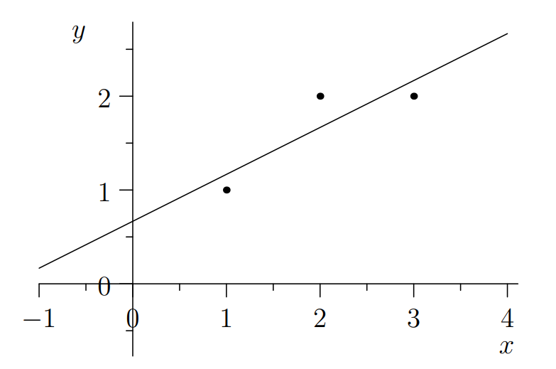

# Projection Matrices and Least Squares

## Projections

Last lecture, we learned that $P = A(A^TA)^{-1}A^T$ is the matrix that projects a vector $\mathbf{b}$ onto the space spanned by the columns of $A$. If $\mathbf{b}$ is perpendicular to the column space, then it's in the left nullspace $N(A^T)$ of $A$ and $P\mathbf{b} = \mathbf{0}$. If $\mathbf{b}$ is in the column space then $\mathbf{b} = A\mathbf{x}$ for some $\mathbf{x}$, and $P\mathbf{b} = \mathbf{b}$.

A typical vector will have a component $\mathbf{p}$ in the column space and a component $\mathbf{e}$ perpendicular to the column space (in the left nullspace); its projection is just the component in the column space.

The matrix projecting $\mathbf{b}$ onto $N(A^T)$ is $I - P$:

$$
\mathbf{e} = \mathbf{b} - \mathbf{p} = (I - P)\mathbf{b}
$$

Naturally, $I - P$ has all the properties of a projection matrix.

## Least Squares

We want to find the closet line $b = C + Dt$ to the points $(1, 1), (2, 2)$ and $(3, 2)$. The process we're going to use is called `linear regression`; this technique is most useful if none of the data points are `outlier`.

By `closet` line we mean one that minimizes the error represented by the distance from the points to the line. We measure that error by adding up the squares of these distances. In other words, we want to minimize

$$
||A\mathbf{x} - \mathbf{b}||^2 = ||\mathbf{e}||^2
$$

If the line went through all three points, we'd have:

$$
\begin{align}
C + D = 1 \\
C + 2D = 2 \\
C + 3D = 2 \\
\end{align}
$$

but this system is unsolvable. It's equivalent to $A \mathbf{x} = \mathbf{b}$, where:

$$
A = \begin{bmatrix} 1 & 1 \\ 1 & 2 \\ 1 & 3 \end{bmatrix}, \mathbf{x} = \begin{bmatrix} C \\ D \end{bmatrix}, \mathbf{b} = \begin{bmatrix} 1 \\ 2 \\ 2\end{bmatrix}
$$

There are two ways of viewing this. In the space of the line we're trying to find, $e_1, e_2$ and $e_3$ are the vertical distance from the data points to the line. The components $p_1$, $p_2$ and $p_3$ are the values of $C + Dt$ near each data point; $\mathbf{p} \approx \mathbf{b}$.

In the other view we have a vector $\mathbf{b}$ in $\mathbb{R}^3$, its projection $\mathbf{p}$ onto the column space of $A$, and its projection $\mathbf{e}$ onto $N(A^T)$.

We will now find $\mathbf{\hat{x}} = \begin{bmatrix} \hat{C} \\ \hat{D} \end{bmatrix}$ and $\mathbf{b}$. We know:

$$
A^TA\mathbf{\hat{x}} = A^T\mathbf{b}
$$

$$
\begin{bmatrix}
3 & 6 \\
6 & 14 \\
\end{bmatrix}
\begin{bmatrix}
\hat{C} \\
\hat{D} \\
\end{bmatrix}
=
\begin{bmatrix}
5 \\
11 \\
\end{bmatrix}
$$

From this we get the `normal equations`:

$$
\begin{align}
3 \hat{C} + 6 \hat{D} = 5 \\
6 \hat{C} + 14 \hat{D} = 11 \\
\end{align}
$$

We solve these to find $\hat{D} = 1 / 2$ and $\hat{C} = 2 / 3$.

We could also have used calculus to find the minimum of the following function of two variables:

$$
e_1^2 + e_2^2 + e_3^2 = (C + D - 1)^2 + (C + 2D - 2)^2 + (C + 3D - 2)^2
$$

Either way, we end up solving a system of linear equations to find that the closet line to our points is

$$
b = \frac{2}{3} + \frac{1}{2}t
$$

this gives us:

| i | $p_i$ | $e_i$ |
|---|-------|-------|
| 1 |  7/6  | -1/6  |
| 2 |  5/3  |  1/3  |
| 3 | 13/6  | -1/6  |

or

$$
\begin{align}
\mathbf{p} = \begin{bmatrix} 7/6 \\ 5/3 \\ 13/6 \end{bmatrix} \\
\mathbf{e} = \begin{bmatrix} -1/6 \\ 2/6 \\ -1/6 \end{bmatrix} \\
\end{align}
$$

Note that $\mathbf{p}$ and $\mathbf{e}$ are orthogonal, and also that $\mathbf{e}$ is perpendicular to the columns of $A$.
 
## The matrix $A^TA$

 We've been assuming that the matrix $A^TA$ is invertable. Is this justified?

> If $A$ has independent columns, then $A^TA$ is invertible.

To prove this, we assume that

$$
A^TA\mathbf{x} = \mathbf{0}
$$

then show that it must be true that

$$
\mathbf{x} = \mathbf{0}
$$

So we got:

$$
\begin{align}
A^TA\mathbf{x} = \mathbf{0} \\
\mathbf{x}^TA^TA\mathbf{x} = \mathbf{x}^T\mathbf{0} \\
(A\mathbf{x})^T(A\mathbf{x}) = \mathbf{0} \\
A\mathbf{x} = \mathbf{0}
\end{align}
$$

Since $A$ has independent columns, $A\mathbf{x} = \mathbf{0}$ only when $\mathbf{x} = \mathbf{0}$. 

As long as the columns of $A$ are independent, we can use linear regression to find approximate solutions to unsolvable systems of linear equations. The columns of $A$ are guaranteed to be independent if they are `orthonormal`, i.e. if they are perpendicular unit vectors like:

$$
\begin{bmatrix} 1 \\ 0 \\ 0 \end{bmatrix},
\begin{bmatrix} 0 \\ 1 \\ 0 \end{bmatrix},
\begin{bmatrix} 0 \\ 0 \\ 1 \end{bmatrix}
$$

or like:

$$
\begin{bmatrix} cos{\theta} \\ sin{\theta} \end{bmatrix},
\begin{bmatrix} -sin\theta \\ cos\theta \end{bmatrix}
$$

