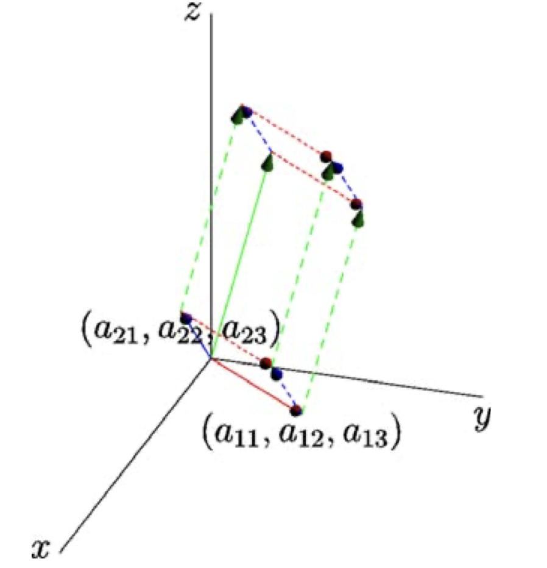
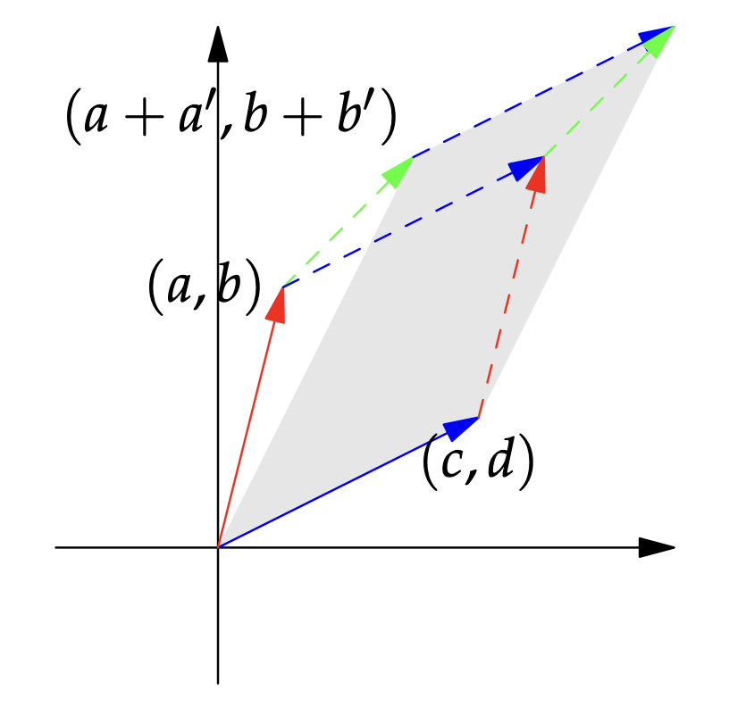

# Cramer's Rule, Inverse Matrix, and Volume

We know a formula for and some properties of the determinant. Now we see how the determinant can be used.

## Formula for A^-1

We know:

$$
\begin{bmatrix}
a & b \\ c & d
\end{bmatrix}^{-1}
=
\frac{1}{ad - bc}
\begin{bmatrix}
d & -b \\ -c & a
\end{bmatrix}
$$

Can we get a formula for the inverse of a 3 by 3 or n by n matrix? We expect that $\frac{1}{det A}$ will be involved, as it is in the 2 by 2 matrix, and by lookin at the cofactor matrix $\begin{bmatrix} d & -c \\ -b & a \end{bmatrix}$ we will guess that the cofactors will be involved.

In fact:

$$
A^{-1} = \frac{1}{det A} C^T
$$

where C is the matrix of cofactors(`Notice the transpose!`). Cofactors of row one of a go into column 1 of $A^{-1}$, and then we divide by the determinant.

The determinant of A involves products with n terms and the cofactor matrix involves products of n - 1 terms. A and $\frac{1}{det A} C^T$ might cancel each other. This is much easier to see from our formula for the determinant than when using Gauss-Jordan elimination.

To more formally verify the formula, we'll check that $AC^T = (det A) I$. 

$$
AC^T = 
\begin{bmatrix}
a_{11} & \cdots & a_{1n} \\
\vdots & \ddots & \vdots \\
a_{n1} & \cdots & a_{nn} \\
\end{bmatrix}
\begin{bmatrix}
C_{11} & \cdots & C_{1n} \\
\vdots & \ddots & \vdots \\
C_{n1} & \cdots & C_{nn} \\
\end{bmatrix}
$$

The entry in the first row and first column of the product matrix is:

$$
\sum_{j = 1}^{n} a_{1j}C_{j1} = det A
$$

This is just the cofactor formula for the determinant. This happens for every entry on the diagonal of $AC^T$.

To finish proving that $AC^T = (det A)I$, we just need to check that the off-diagonal entries of $AC^T$ are zero. In the 2 by 2 case, multiplying the entries in row 1 of A by the entries in column 2 of $C^T$ gives $a(-b) + b(a) = 0$. This is the determinant of $A_{s} = \begin{bmatrix} a & b \\ a & b \end{bmatrix}$. In higher dimensions, the product of the first of A and the last column of $C^T$ equals the determinant of a matrix whose first and last rows are identical. This happens with all the off diagonal matrices, which confirms that $A^{-1} = \frac{1}{det A} C^T$.

This formula helps us answer questions about how the inverse changes when the matrix changes.

## Cramer's Rule for x = A^-1 b

We know that if $A\mathbf{x} = \mathbf{b}$ and A is nonsingular, then $\mathbf{x} = A^{-1} \mathbf{b}$. Applying the formula $A^{-1} = C^T / (det A)$ gives us:

$$
\mathbf{x} = \frac{1}{det A} C^T \mathbf{b}
$$

`Cramer's Rule` gives us another way of looking at this question. To derive this rule we break $\mathbf{x}$ down into its components. Because the i'th component of $C^T\mathbf{b}$ is a sum of cofactors times some number, it is the determinant of some matrix $B_{j}$.

$$
x_{j} = \frac{det B_{j}} {det A}
$$

where $B_{j}$ is the matrix created by starting with A and then replacing column j with $\mathbf{b}$, so:

$$
B_{1} = \begin{bmatrix} \mathbf{b} & \text{last n - 1 columns of A} \end{bmatrix}
$$

$$
B_{n} = \begin{bmatrix} \text{first n - 1 columns of A} & \mathbf{b} \end{bmatrix}
$$

This agrees with our formula $x_{1} = \frac{det B_{1}} {det A}$. When taking the determinant of $B_{1}$ we get a sum whose first term is $b_{1}$ times the cofactor $C_{11}$ of A.

Computing inverses using Cramer's rule is usually less efficient than using elimination.

## |A| = volume of box

Claim:
> $det A$ is the volume of the box (parallelepiped) whose edges are  the column vectors of $A$.

We could usually well use the row vectors, forming a different box with the same volume.

If $A = I$, then the box is a unit cube and its volume is 1. Because this agrees with our claim, we can conclude that the volume obeys determinant property 1.

If $A = Q$ is an orthogonal matrix then the box is a unit in a different orientation with volume = $det Q = 1$. Because Q is an orthogonal matrix, $Q^TQ = I$ and so $det Q = \pm 1$.

Swapping two columns of A does not change the volume of the box or (remember that $det A = det A^T$) the absolute value of the determinant(property 2). If we show that the volume of the box also obeys property 3 we'll have proven $|det A|$ equals the volume of the box.

If we double the length of one column of $A$, we double the volume of the box formed by its columns. Volume satisfies property 3(a).

Property 3(b) says that the determinant is linear in the rows of the matrix:

$$
\begin{vmatrix}
a + a' & b + b' \\
c & d
\end{vmatrix}
=
\begin{vmatrix}
a & b \\
c & d
\end{vmatrix}
+
\begin{vmatrix}
a' & b' \\
c & d
\end{vmatrix}
$$

Although it's not needed for our proof, we can also see that determinants obey property 4. If two edges of a box are equal, the box flattens out and has no volume.

Important note: If you know the coordinates for the corners of a box, then computing the volume of the box is as easy as calculating a determinant. In particular, the area of a parallelogram with edges $\begin{bmatrix} a \\ b \end{bmatrix}$ and $\begin{bmatrix} c \\ d \end{bmatrix}$  is $ad - bc$. The area of a triangle with edges $\begin{bmatrix} a \\ b \end{bmatrix}$ and $\begin{bmatrix} c \\ d \end{bmatrix}$  is half the area of that parallelogram, or $\frac{1}{2} (ad - bc)$. The area of a triangle with vertices at $(x_{1}, y_{1}), (x_{2}, y_{2})$ and $(x_{3}, y_{3})$ is:

$$
\frac{1}{2}
\begin{vmatrix}
x_{1} & y_{1} & 1 \\
x_{2} & y_{2} & 1 \\
x_{3} & y_{3} & 1 \\
\end{vmatrix}
$$
