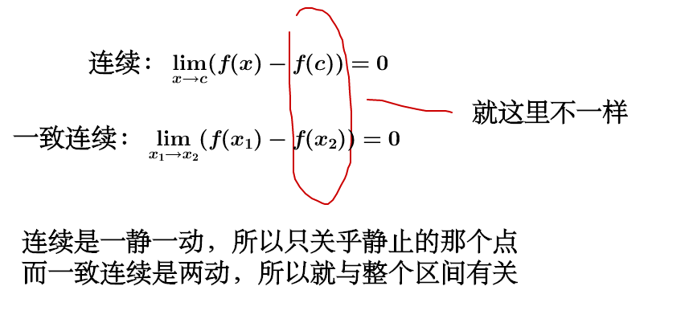
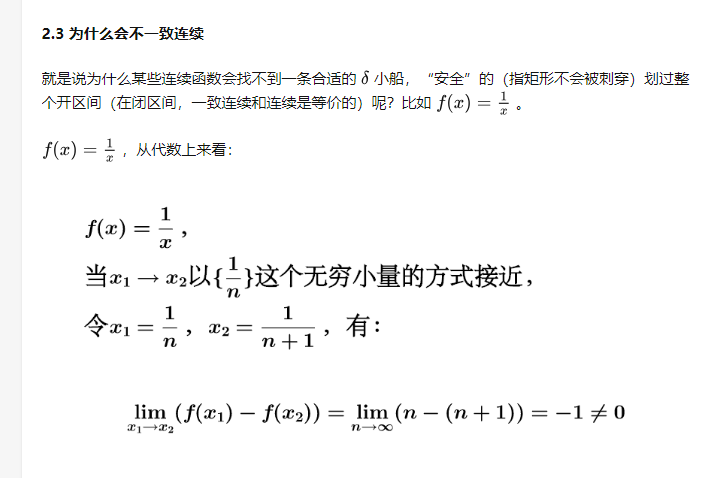

## 定义(一阶导数有界)

任取$x_1$和$x_2$ ，存在常数L：
$$ ||  f(x_1) -  f(x_2) || \le L||x_1 - x_2||$$
## 导数连续（光滑）、Lipschitz连续（导数有界）、一致连续、连续的关系

总体来说：导数连续（光滑） > Lipschitz连续（导数有界）>一致连续 》 连续

## 举例

- 导数连续（光滑）：$y=x^2$
-  Lipschitz连续（导数有界）:$y = |x|$，但是$y=x^2$本身不是Lipschitz连续，只有对定义域有规定才是Lipschitz连续
- 一致连续：https://www.zhihu.com/question/32201415
- 连续：只要每一个点的极限都是该点，那么函数就是连续的

## 性质

- 闭区间上的连续函数，此时连续性和一致连续性是等价的；
- Lipschitz连续则一定 一致连续（根据中值定理可以证明）