## 最优化问题的定义

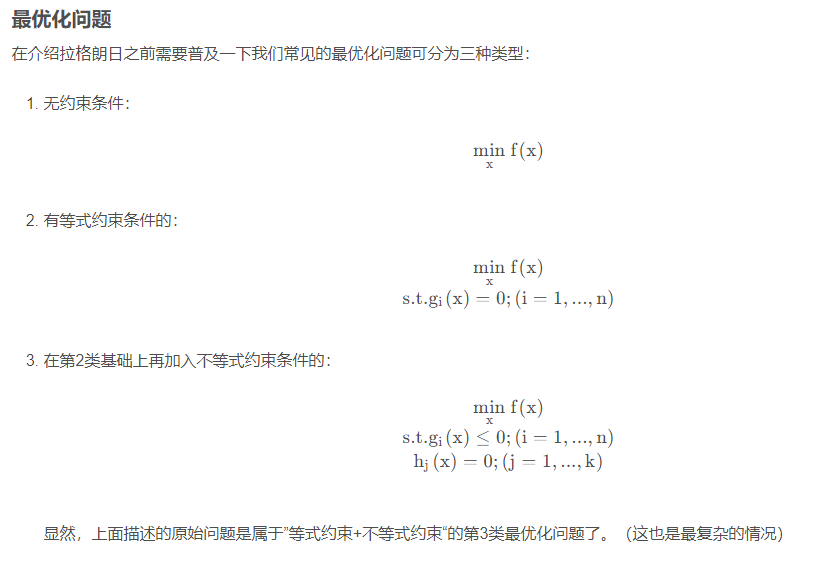

### 拉格朗日乘数法解决等式约束

将一个有**n个变量**与**k个约束条件**的**最优化问题**转换为一个有**n + k个变量的方程组的极值问题**，其变量不受任何约束。这种方法**引入了一个拉格朗日乘子**：约束方程的梯度（gradient）的线性组合里每个向量的系数。
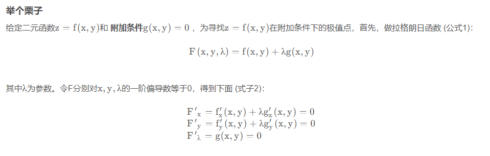
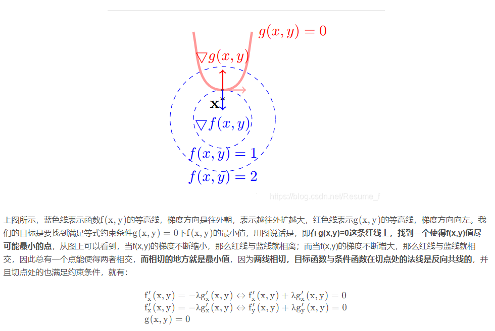

### KKT条件解决不等式约束

**KKT条件专门用于解决不等式约束条件的**，在上面，我们提到了**对于单个等式约束条件问题求解最优的方法，可直接将等式约束通过拉格朗日换成无约束**，但是对于含有不等式约束条件和等式约束条件的问题，则需要引入KKT条件。
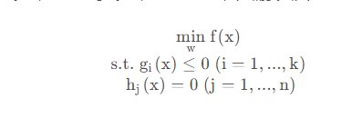
将约束问题转为无约束问题的做法分两步：
- 先把不等式约束条件转化为等式约束条件。-> 引入 **松弛变量**，即KKT乘子
- 再把等式约束转化为无约束优化问题。 ->  引入**拉格朗日乘子**

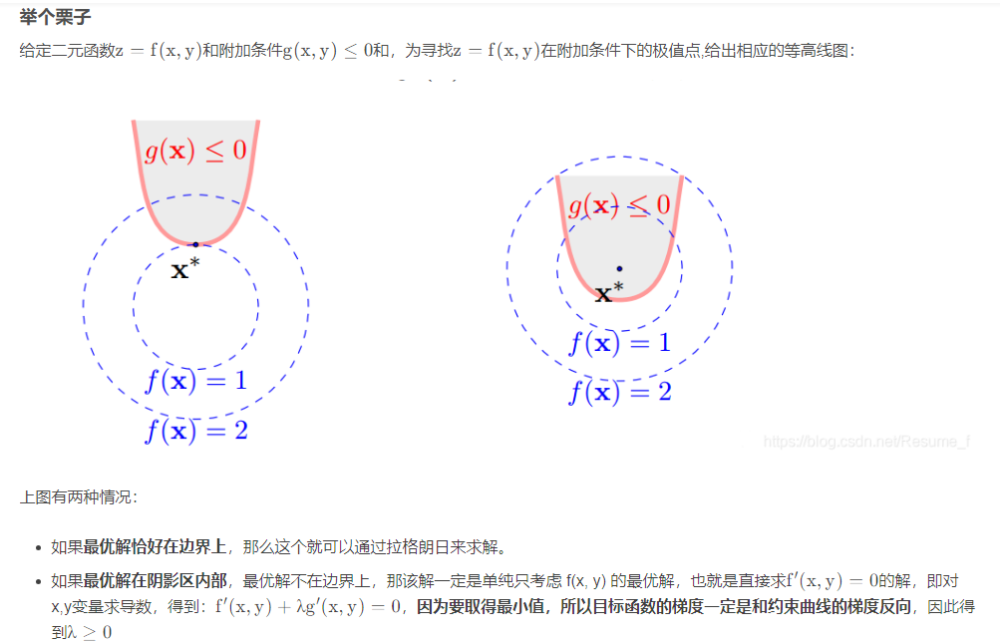
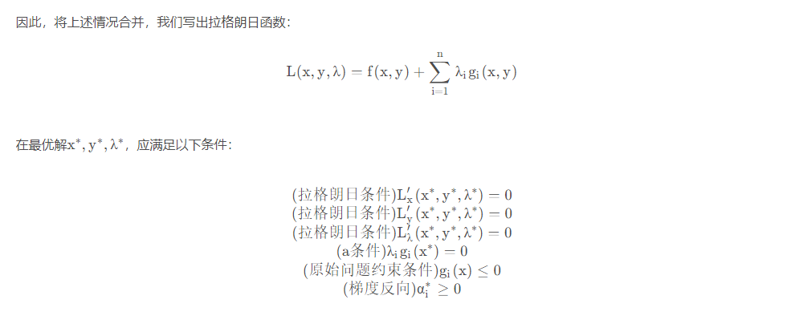
上面的(a条件)的由来是：
- 在第二种情况下，当最优解落在函数内部，此时的约束条件已经不起作用了，因此需要消除该约束条件，保证目标函数的梯度只和在边界上的解的梯度共线反向，所以让乘子为0，故得到(a条件)。
- 最优解在约束曲线上时，其表达式为0，所以乘子不必为0，回到了等式约束拉格朗日方法。该条件也称为KKT的对偶互补条件。

总的来说：对于不等式约束，两种情况，一种是解在边界上，那么等同于等式约束，把他写进拉格朗日函数中，保证梯度共线反向。一种是解在边界内，那么相当于没有约束，那么不应该写入拉格朗日函数中。而松弛互补条件就是控制要不要把约束写入拉格朗日函数中（在边界内g（x） <0 ，那么乘子为0，不写入拉格朗日函数；在边界上g（x）=0，乘子不为0，写入拉格朗日函数）。

## 对偶问题与原问题

对于一个凸问题，原始问题和对偶问题等价，对偶间隙为0。
 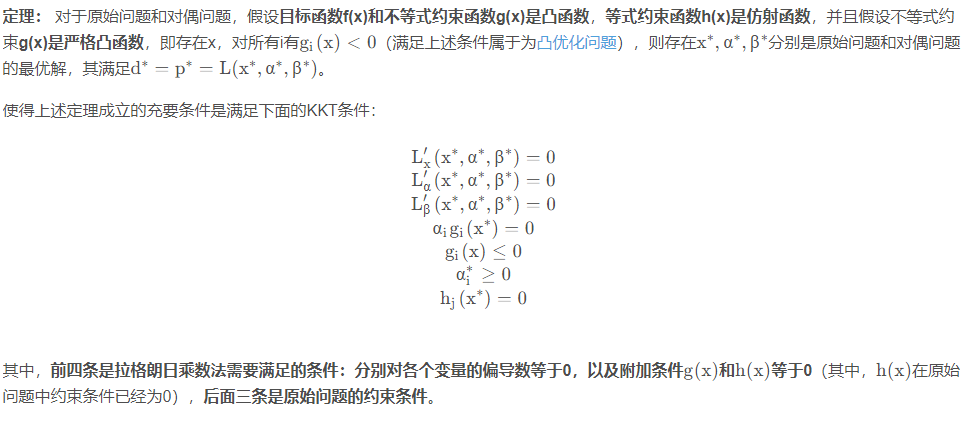

## 对偶理论

`对偶问题的意义在于无论原问题是凸还是非凸，对偶问题都是凸优化问题。通过将原问题转化为对偶问题，有将复杂问题简单化的可能性，并能够求得原问题的全局最优解。`
[博客](https://www.cnblogs.com/hjd21/p/16601516.html)
[知乎博客](https://zhuanlan.zhihu.com/p/103961917)

## 对偶理论（线性规划）

### 弱对偶定理（对偶间隙>=0）：

min 问题可行解的目标值  >= max问题可行解的目标值。两者之间的差为对偶间隙。

### 强对偶定理(对偶间隙=0)：

原问题与对偶问题只要有一个有最优解，那么两个都有最优解，且最优解对应的目标函数值相等，即对偶间隙为0.

### 最优性定理：
如果原问题的可行解x和对偶问题的可行解y对应的目标函数值相等，他们他们都是最优解。

### 互补松弛定理

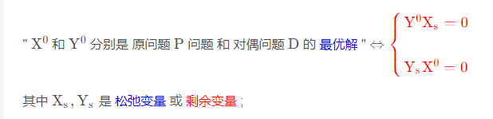

### 对偶线性规划

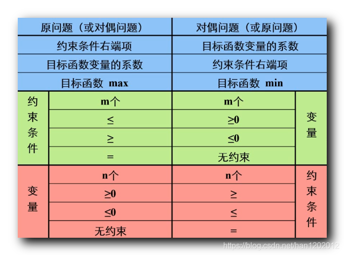

## 对偶理论（非线性规划）

`对偶问题的极大值等于原问题的极小值。这种现象对于线性规划中的对偶是必然的；但是对于非线性规划，这一结论并不是普遍成立。`

### 共轭函数（对偶函数）

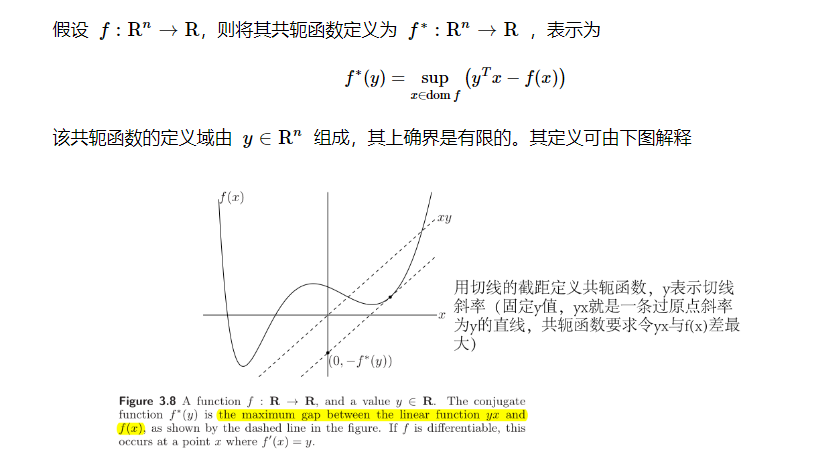
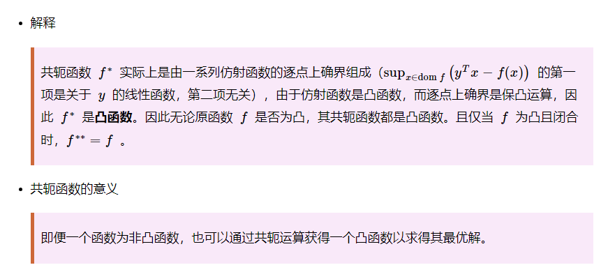

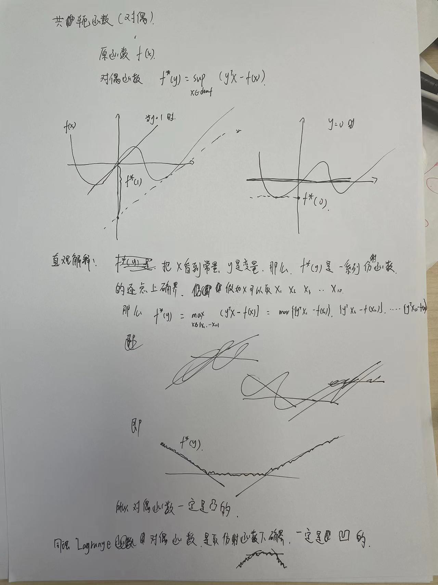

### 拉格朗日对偶

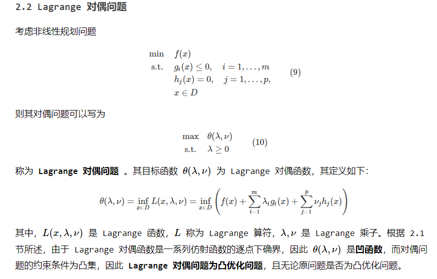

拉格朗日对偶问题是关于乘子$\lambda$ 和$\nu$ 的仿射函数，仿射函数取下确界，是凹函数，而对偶问题的约束是凸的，因此拉格朗日对偶问题一定是凸优化问题。

### 弱对偶定理(对偶间隙>=0)

在解存在的情况下，弱对偶总是成立的。

同线性规划对偶理论：
- min 问题可行解的目标值  >= max问题可行解的目标值。两者之间的差为对偶间隙。

- 如果min 问题可行解的目标值  <=  max问题可行解的目标值，那么可行解即为最优解

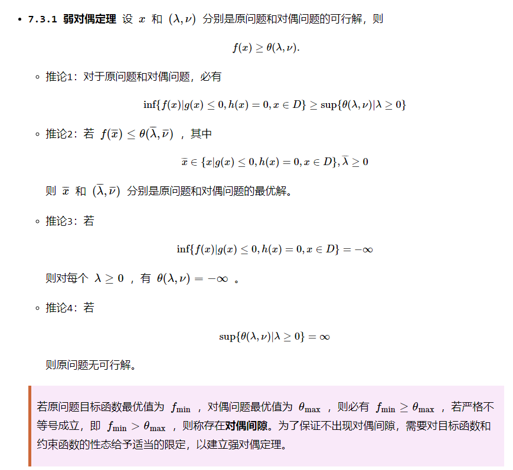

### 强对偶定理(对偶间隙=0)

对于**凸优化问题**，如果有slater点，满足强对偶，**原问题的极小值与对偶问题的极大值是相等的**（等价的）。
如果满足强对偶，可以通过求解对偶问题来得到原始问题的解。
### slater条件（在原问题是凸优化问题时，Slater 条件是强对偶成立的充分不必要条件）

通俗解释：slater条件的点为严格可行点，即<=中的=去掉。如果存在严格可行点，则满足slater条件。

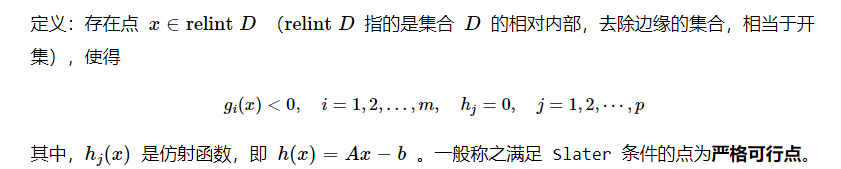

只要能找到一个这样的点使原凸问题等式约束依然成立且不等式约束都严格小于 0 即可。  
**幸运的是，对大多数一般的原凸问题，强对偶都是成立的。**

### KKT条件

- 对于凸优化问题：KKT是强对偶的充要条件
- 对于非凸优化问题：若原问题和对偶问题满足强对偶，则一定满足 KKT 条件，反之不成立

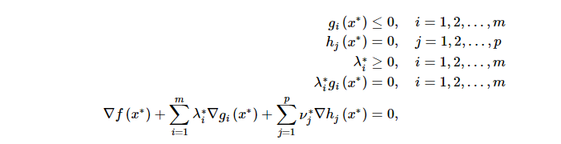
### 总结

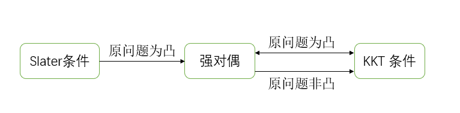

## 增广拉格朗日法

本质是通过**求解增广拉格朗日函数的对偶问题**(凸问题的对偶和原问题的解一致)，该对偶问题没有约束，其解为原问题的解。

进一步理解：原问题的解=拉格朗日函数的解=增广拉格朗日函数的解=增广拉格朗日函数的对偶函数的解。
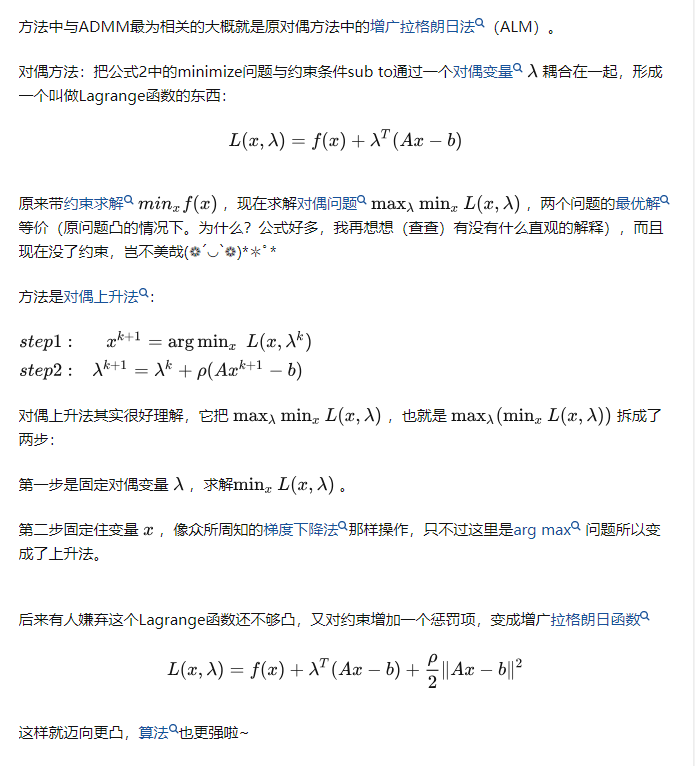
增广拉格朗日法：写出拉格朗日函数对偶函数，是一个$max_{\lambda} min_xL(x,\lambda)$ 的问题。具体的拉格朗日对偶函数看对偶理论（非线性规划）。该方法就是交替从内向外更新x和$\lambda$

- 第一步：固定$\lambda$，求$min_xL(x,\lambda)$ 
- 第二步：固定x，更新$\lambda$，更新的方向是对$\lambda$求导，即$Ax^{k+1} - b$，$\rho$是步长，因为求max，所以是+号。

## ADMM（交替方向乘子法）

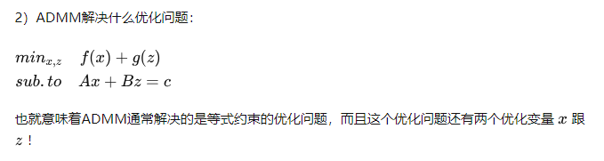

ADMM和增广拉格朗日法一样，之所以叫交替方向，是因为把原来一个变量x变为了两个变量x，z，交替更新x和z，以及乘子。本质还是通过**求解增广拉格朗日函数的对偶问题**(凸问题的对偶和原问题的解一致)，该对偶问题没有约束，其解为原问题的解。：

$$
max_\lambda min _{x,z} L(x,z,\lambda)
$$

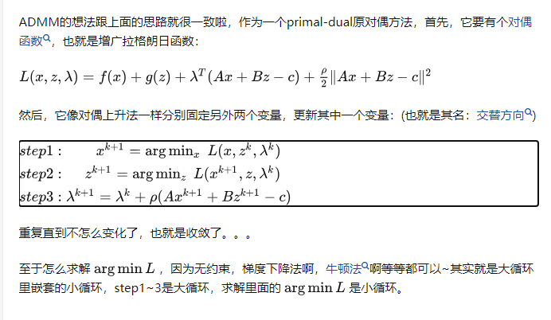

`补充:ADMM相当于把一个大的问题分成了两个子问题，缩小了问题的规模，分而治之。实际上有些算法用ADMM的思路，你看从ALM到ADMM相当于增加一个变量z，增加一个step就大大提升了算法性能，如果我再增加一个变量一个step呢~？但有工作指出理论上只有两个block的ADMM能够保证收敛
`

  