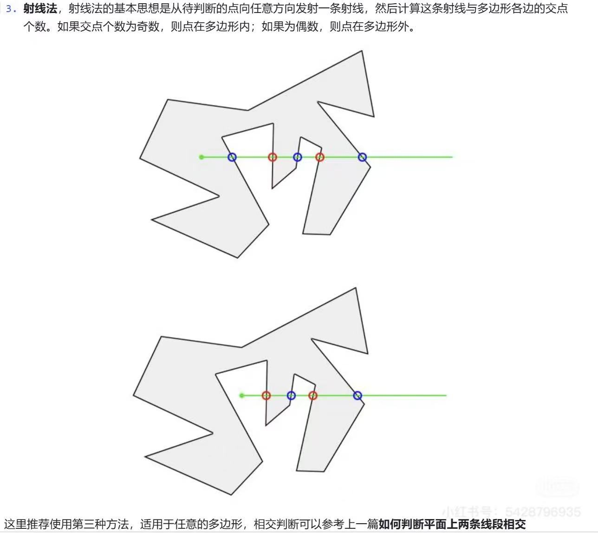
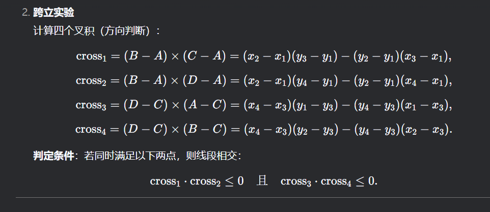
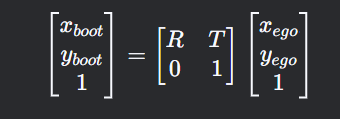

## 一个点在一个线段上的投影

## 点到直线的距离

## 点到线段的距离（三种情况）

## 线段到线段的距离（四个点到对方线段的最小值）

## 直线到直线的距离（两个直线中距离最近的点的向量的模）

## 确定点在线段的哪个方向（五种情况）

## 确定点在两个线段的哪个方向

## 求两条线段的交点

## 离散点求曲率

## 求点到polyline的最短距离（R-tree加速）

## 判断点是否在polygon内

射线法：

## 判断线段是否相交
叉乘法：叉乘可以判断点在线段的哪一侧，如果两个线段相交，那么线段AB的AB点在线段CD的两侧，线段CD的CD点在线段AB的两侧。

## 判断线段与平面是否相交

## 判断直线是否平行

## 坐标转换

### ego系转boot系

egopose:旋转矩阵R,平移向量T
ego系的点：$x_{ego},y_{ego}$
转到boot系：
$$
\begin{bmatrix}
  x_{boot} \\
  y_{boot}
\end{bmatrix}
= R 
\begin{bmatrix}
  x_{ego} \\
 y_{ego}
\end{bmatrix} + T
$$
齐次坐标形式：

### boot系转ego系

egopose:旋转矩阵R,平移向量T
boot系的点：$x_{boot},y_{boot}$
转到ego系：
$$
\begin{bmatrix}
  x_{ego} \\
  y_{ego}
\end{bmatrix}
= R^{-1} \left(
\begin{bmatrix}
  x_{boot} \\
 y_{boot}
\end{bmatrix} - T \right)
$$

齐次坐标形式
