## 一个点在一个线段上的投影

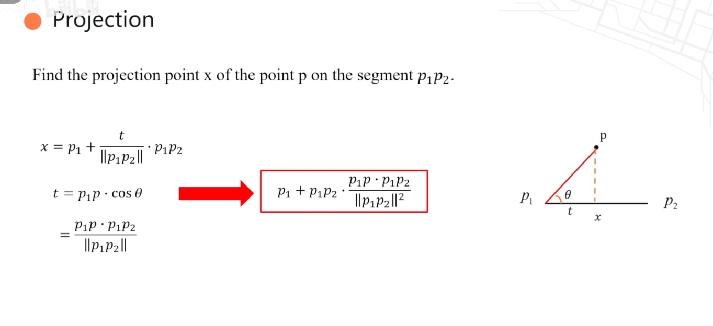
## 点到直线的距离

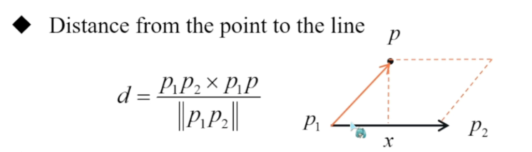

## 点到线段的距离（三种情况）

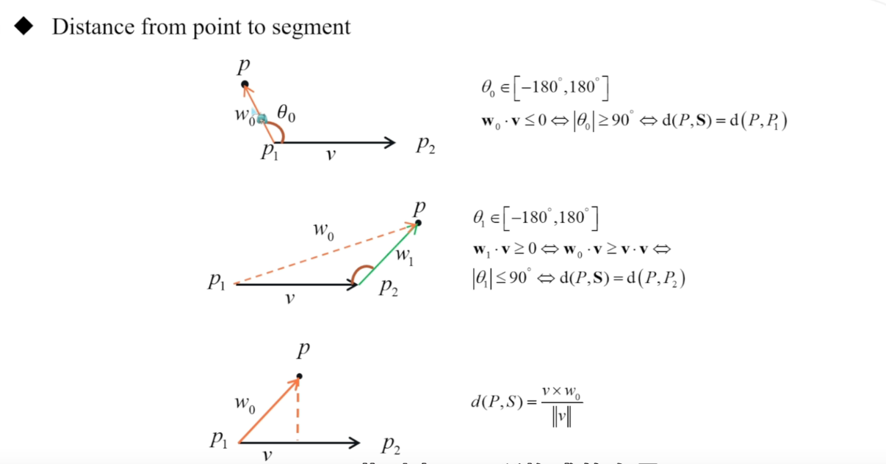

## 线段到线段的距离（四个点到对方线段的最小值）

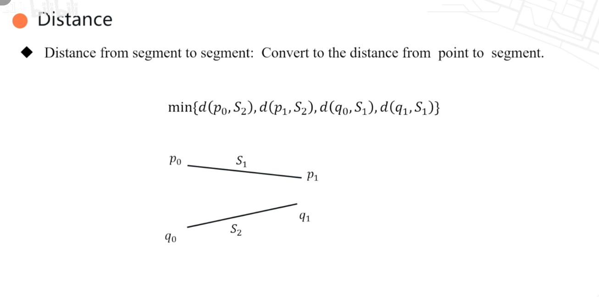

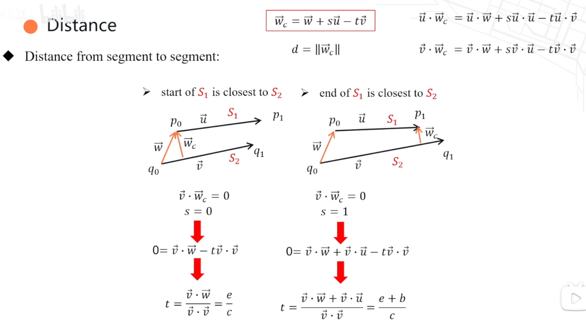

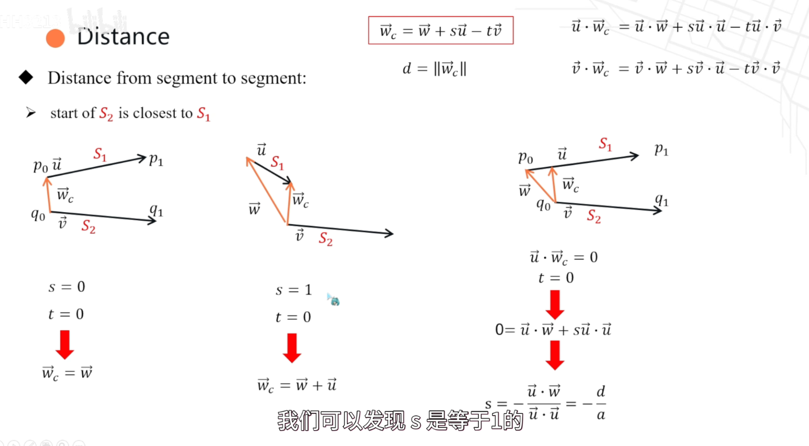

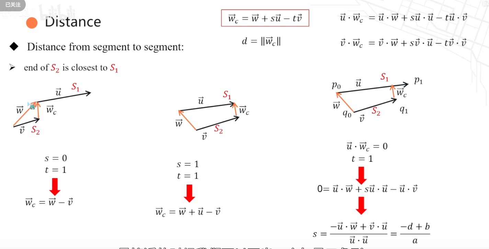

## 直线到直线的距离（两个直线中距离最近的点的向量的模）

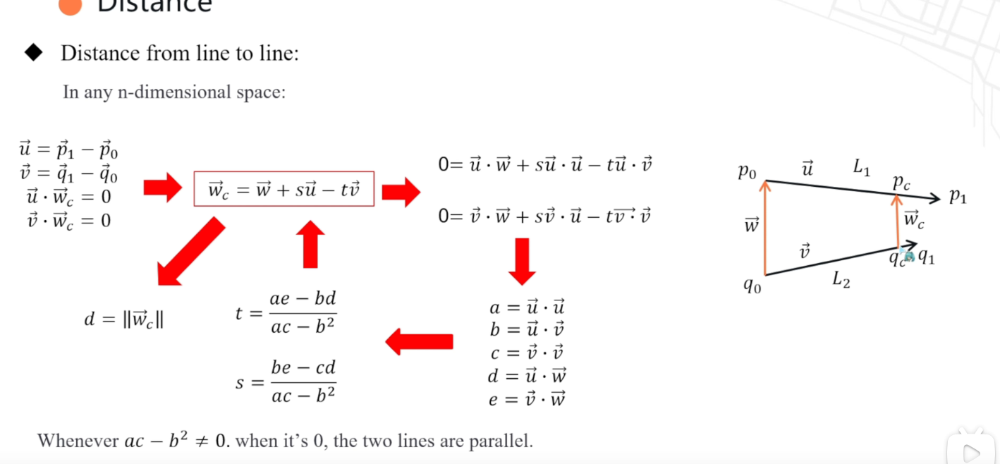

## 确定点在线段的哪个方向（五种情况）

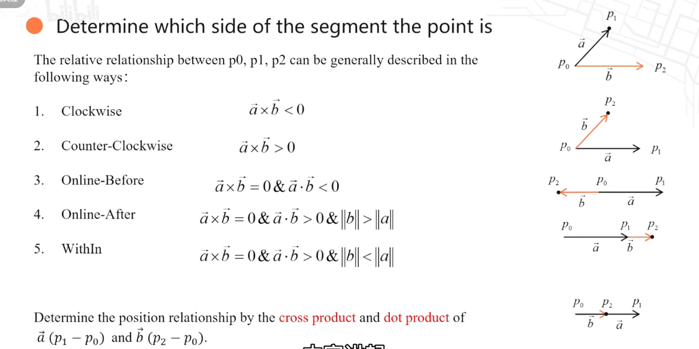

## 确定点在两个线段的哪个方向

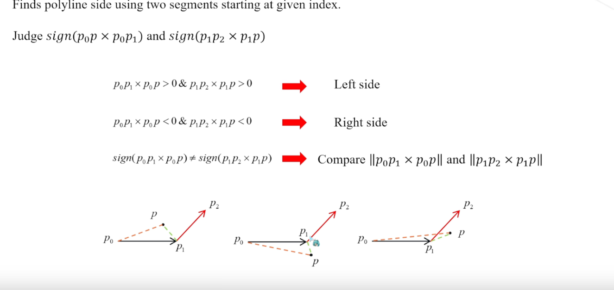

## 求两条线段的交点

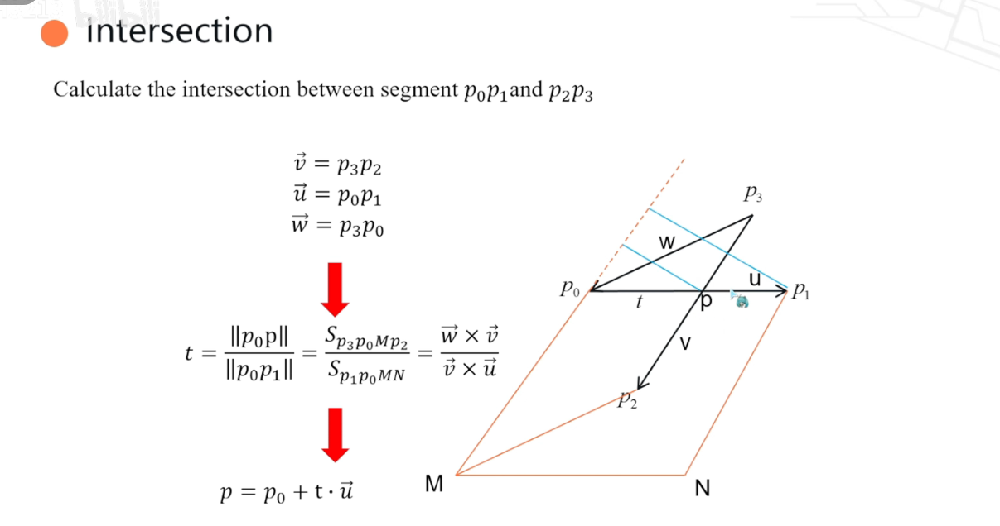

## 离散点求曲率

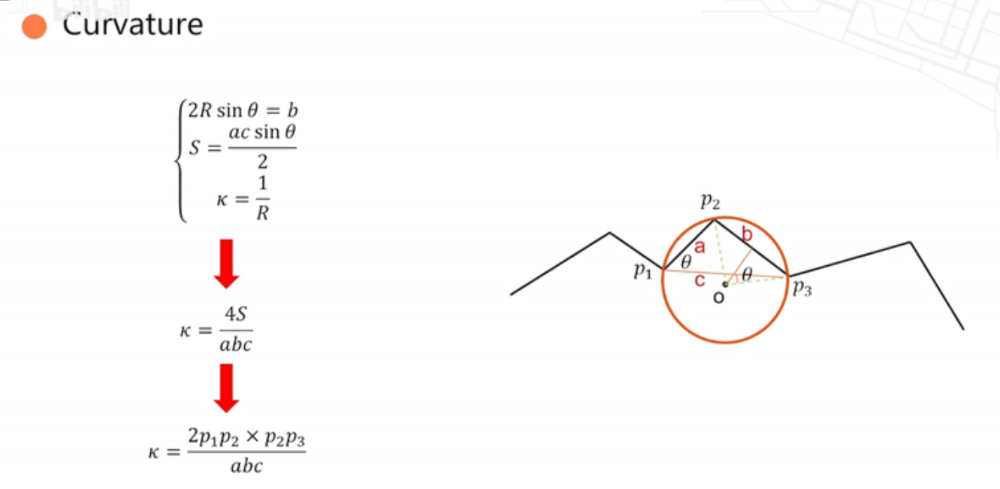
## 求点到polyline的最短距离（R-tree加速）

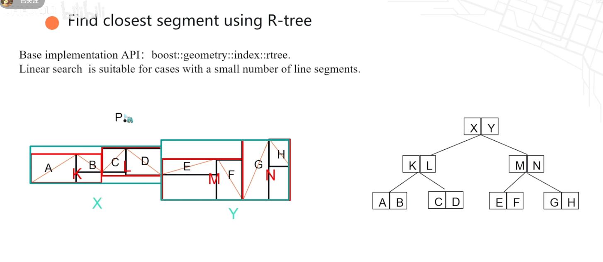