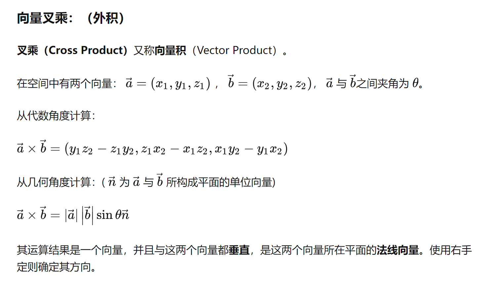

在刚体动力学中，如果你知道一个刚体上某一点（例如点A）的线速度和刚体的角速度，你可以使用下面的关系式来计算刚体上任何其他点（例如点B）的线速度。基本的关系式是：

$$ \vec{V_B} = \vec{V_A} + \vec{\omega} \times \vec{r_{B/A}} $$

其中：
- $\vec{V_B}$ 是点B的线速度（我们想要找的）。
- $\vec{V_A}$ 是点A的已知线速度。
- $\vec{\omega}$ 是刚体的已知角速度。
- $\times$ 代表向量叉积。
- $\vec{r_{B/A}}$ 是从点A到点B的位置矢量。

解释一下各个部分的含义：
- $\vec{V_A}$ 是已知的，它是点A的线速度。
- $\vec{\omega} \times \vec{r_{B/A}}$ 这部分是由于刚体的旋转产生的B点的线速度。这是利用向量叉积找到B点由于刚体绕A点旋转引起的线速度。

注意：
- 向量叉积的方向遵循右手法则，即如果你用你的右手指从$\vec{\omega}$方向弯曲至$\vec{r_{B/A}}$方向，你的大拇指指向的方向就是$\vec{\omega} \times \vec{r_{B/A}}$的方向。
- 向量的大小可以用标量的方式写出，方向则通常用单位向量表示。

为了应用这个公式，你需要知道A点到B点的位置矢量$\vec{r_{B/A}}$，这通常由点B的坐标减去点A的坐标得到。需要注意的是所有的这些变量都是矢量，意味着它们有大小和方向。

```cpp
#include <iostream>
#include <Eigen/Dense>

int main() {
    // 定义已知参数
    Eigen::Vector3d V_A(1, 2, 3);  // A点的速度 (单位: 米/秒)
    Eigen::Vector3d omega(0, 0, 1);  // 角速度 (单位: 弧度/秒)
    Eigen::Vector3d r_A(1, 0, 0);  // A点的位置向量 (单位: 米)
    Eigen::Vector3d r_B(2, 2, 0);  // B点的位置向量 (单位: 米)

    // 计算从A点到B点的位置向量
    Eigen::Vector3d r_BA = r_B - r_A;

    // 计算B点的速度
    Eigen::Vector3d V_B = V_A + omega.cross(r_BA);

    // 输出结果
    std::cout << "Velocity of point B: \n" << V_B << std::endl;

    return 0;
}

```

