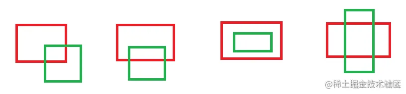

## 判断两个线段是否相交

快速排斥+跨立实验
### 快速排斥实验

我们首先判断两条线段在 x 以及 y 坐标的投影是否有重合。   
也就是判断下一个线段中 x 较大的端点是否小于另一个线段中 x 较小的段点，若是，则说明两个线段必然没有交点，同理判断下 y。

   
如上图所示，代码表示如下：

```cpp
max(C.x,D.x)<min(A.x,B.x) || max(C.y,D.y)<min(A.y,B.y) ||max(A.x,B.x)<min(C.x,D.x) || max(A.y,B.y)<min(C.y,C.y)
```

### 跨立实验
对于两个向量：P = (x1, y1)，Q = ( x2, y2 )，矢量叉积定义为：P × Q = x1*y2 - x2*y1。

叉积的一个非常重要性质是可以通过它的符号判断两矢量相互之间的顺逆时针关系：   
　　若 P × Q > 0 , 则 P 在 Q 的顺时针方向。   
　　若 P × Q < 0 , 则 P 在 Q 的逆时针方向。   
　　若 P × Q = 0 , 则 P 与 Q 共线，但可能同向也可能反向。

跨立实验原理，主要原理：

进行叉积运算，向量AC×向量AB，向量AD×向量AB，如果两个向量（AC，AD）都排在两边，那么两个结果则分别指向纸内和纸外，这样，**将上面叉积的结果进行点积运算，就可以得到一个负值**。
当最终点积等于0的时候，说明两条重合，这时也符合条件（由于通过了第一步的快速排斥实验）
交换两条直线，同理。
综上，最终点积小于0的情况为两条直线相交的情况。

```cpp
// An highlighted block
#include<iostream>
using namespace std;

struct Line {
	double x1;
	double y1;
	double x2;
	double y2;
};

// 快速排斥实验  Rapid rejection experiments
bool RapidRejExper(Line& l1, Line& l2) {
	if ((l1.x1 > l1.x2 ? l1.x1 : l1.x2) < (l2.x1 < l2.x2 ? l2.x1 : l2.x2) ||
		(l1.y1 > l1.y2 ? l1.y1 : l1.y2) < (l2.y1 < l2.y2 ? l2.y1 : l2.y2) ||
		(l2.x1 > l2.x2 ? l2.x1 : l2.x2) < (l1.x1 < l1.x2 ? l1.x1 : l1.x2) ||
		(l2.y1 > l2.y2 ? l2.y1 : l2.y2) < (l1.y1 < l1.y2 ? l1.y1 : l1.y2)) {
		return false;
	}
	return true;
}

// 跨立实验
bool Cross(Line& l1, Line& l2) {
	if ((((l1.x1 - l2.x1) * (l2.y2 - l2.y1) - (l1.y1 - l2.y1) * (l2.x2 - l2.x1)) *
		((l1.x2 - l2.x1) * (l2.y2 - l2.y1) - (l1.y2 - l2.y1) * (l2.x2 - l2.x1))) > 0 ||
		(((l2.x1 - l1.x1) * (l1.y2 - l1.y1) - (l2.y1 - l1.y1) * (l1.x2 - l1.x1)) *
			((l2.x2 - l1.x1) * (l1.y2 - l1.y1) - (l2.y2 - l1.y1) * (l1.x2 - l1.x1))) > 0)
	{
		return false;
	}
	return true;
}


int main() {
	Line l1, l2;
	cin >> l1.x1 >> l1.y1 >> l1.x2 >> l1.y2;
	cin >> l2.x1 >> l2.y1 >> l2.x2 >> l2.y2;
	if (RapidRejExper(l1, l2) && Cross(l1, l2)) {
		cout << "Yes";
	}
	else {
		cout << "No";
	}
}

```


## 判断两个矩形是否相交

### 不考虑旋转（AA-BOX）：


反向考虑：如果不相交只有四种情况：

A在B的左边 （A.r < B.x）
A在B的右边 ( B.r < A.x)
A在B的上边 （A.b < B.y ）
A在B的下边 （B.b < A.y ）

上述四个条件，只要满足一个就不相交。因此取或：
A.r < B.x || B.r < A.x || A.b < B.y || B.b <A.y

取反就是相交：
！(A.r < B.x || B.r < A.x || A.b < B.y || B.b <A.y)

### 考虑旋转：

GJK等方法


