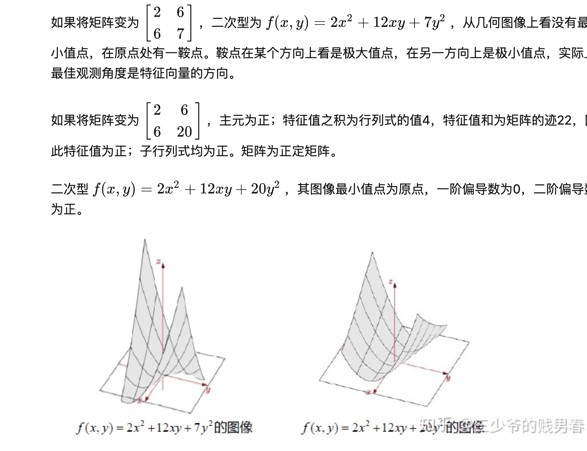

凸优化相关
# 1 凸优化问题的定义：

目标函数是凸函数，优化变量的可行域是凸集，这样的问题称为凸优化问题。

凸优化一定有全局最小值。

如果一个系统的hessian矩阵是正定的，那么这个系统一定有全局最小值。
如果一个系统的hessian矩阵是负定的，那么这个系统一定有全局最大值。
如果hessian矩阵不定，那么这个系统有鞍点。

# 2正定矩阵的判断方法
- **正定矩阵 Positive definite matrices**

给定一个2x2矩阵 ，有四个途径判定矩阵是否正定矩阵：

1. 特征值： 全部大于0
2. 行列式所有子行列式大于0
3. 表达式 $x^TAx>0$（**x**=0除外）。通常这就是正定的定义，而前三条是用来验证正定性的条件。
举个例子：

# 2 凸函数和凸集的定义
凸函数>=0，强凸函数>0s

# 3. 正定矩阵与凸优化的关系：
对于一个优化问题的目标函数，如果目标函数的二阶导数是半正定的，那么这个函数是凸函数。
比如二次规划问题，
$$f(x) = \frac{1}{2}(x-x_0)^T H(x-x_0)+ g^T(x-x_0)+c$$
$$st. Ax \leq b $$

- 对于H矩阵，如果是半正定，那么一定存在全局最小值，但是全局最小值的x可能不唯1，可能多个x或者无穷多个x都满足全局最小值。在这种情况下，优化算法可能会收敛到任意一个全局最小值或者局部最小值，而无法保证找到唯一的全局最小值。

- 如果H矩阵是正定的，那么存在唯一的全局最小值，对应唯一一个x。
