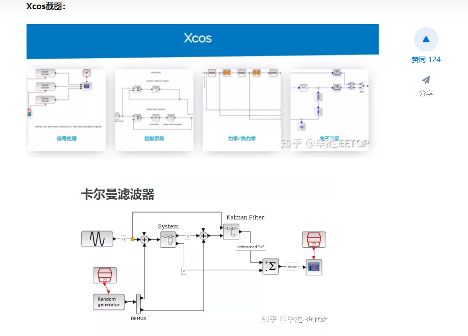
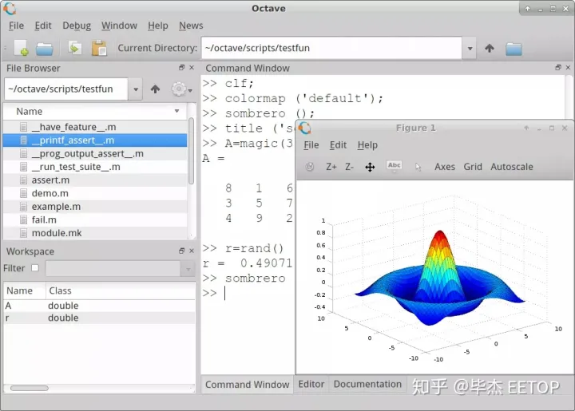

## **1. SCILAB(包括simulink，Xcos**)

SCILAB 是一款与 MATLAB 类似的开源软件，可以实现 MATLAB 上所有基本的功能，如科学计算、矩阵处理及图形显示等。

由于 SCILAB 的语法与 MATLAB 非常接近，熟悉 MATLAB 编程的人很快就会掌握 SCILAB 的使用。有意思的是，SCILAB 提供的语言转换函数可以自动将用 MATLAB 语言编写的程序翻译为 SCILAB 语言。目前，SCILAB 可在 Linux、Windows 和 Mac OS 全 PC 平台运行。

作为开放源码的软件，SCILAB 遵循 GPL 2.0 开源协议，源代码、用户手册及二进制的可执行文件都可以通过官网免费直接下载使用。用户不仅可以在 SCILAB 的许可证条件下自由使用该软件，还可以根据自己需要修改源代码。

**更重要的是SCILAB 是由法国国家信息、自动化研究院的科学家们开发的“开放源码”软件，和美国没有关系！**

**此外最关键的是SCILAB也一个有类似 MATLAB simulink的工具Xcos**！simulink能做的Xcos也可以完成，并且界面和使用也很类似！很多网友担心的simulink无法替代问题迎刃而解！

## 2. Octave（没有simulink）

如果已经对MATLAB语言非常熟悉，暂时不想学习一门新的语言，那么可以尝试一下Octave。Octave是GNU项目成员之一，提供了与MATLAB语法兼容的开放源代码科学计算及数值分析的工具。

Octave 是一个类似 MATLAB 和 Scilab 的数学软件包，可以进行各种运算，编程。它还有丰富的 C++ 接口可以让用户编程时调用。其配套的绘图工具采用 gnuplot 。Octave 的使用也是基于字符终端模式的，当需要绘图时，将会调用 gnuplot 进行数据绘图，并显示出来。

Octave 是用 C++ 编写的，它内容丰富的库也可以供用户在编写软件时调用。Octave 同时还支持 Fortran 等的调用，GSL 绑定等。可以由用户定制自己的函数、子程序等。

## 3.simupy（python中模仿simulink的工具）

