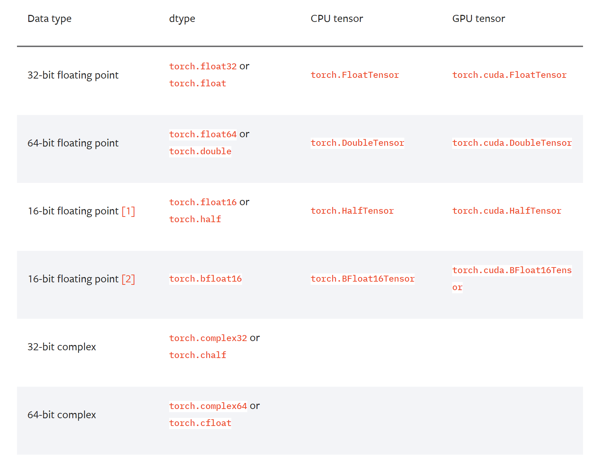

## 1.dtype和type()的区别

### 1.1 dtype是属性，返回的是pytorch自己定义的类型，看不出是cpu还是gpu

比如tensor1.dtype返回的是torch.float32

### 1.2type()是方法，返回时的tensor的类型，可以看出是gpu还是cpu

比如tensor1.type()返回的是torch.FloatTensor

## 2.类型转换

假设tensor1 = torch.tensor( \[\[1,2,3\],\[4,5,6\]\] )

	1.通过tensor1.type_as(tensor0) 将tensor1转换成tensor0的数据类型
	2.tensor1.type(torch.IntTensor)
	3.tensor1.long(),tensor1.char(),tensor1.int(),tensor1.byte(),tensor1.double()
	4.tenosr1.to(torch.long) #这里用的是dtype