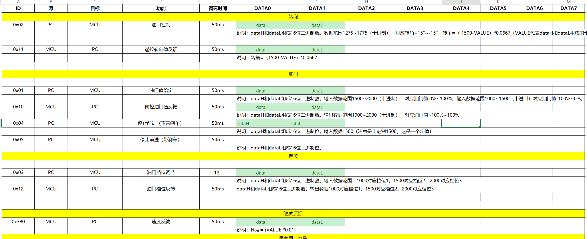
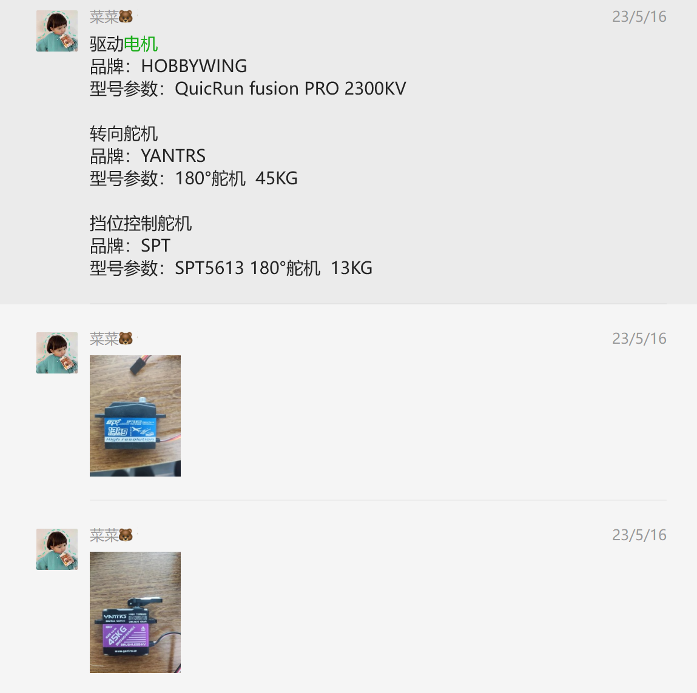

THICV卡车模型使用手册
# 1 硬件连接

## 1.1 硬件概述
小车硬件主要分为三大部分：底盘、传感器、jetson nano。
- 底盘：包含小车的1：14的塑料模型和用于小车地盘线控的STM32单片机。32主要驱动车辆的底盘运动，底盘运动主要靠电机和舵机来驱动，驱动的通信形式为can。

can通信协议

电机和舵机的资料

- 传感器：传感器主要有RTK/GPS（集成了IMU）、intel深度相机、思岚A2激光雷达。所有的传感器均由jetson nano驱动，与底盘无关。

- jetson nano：该小车配备jetson nano作为主控，并通过RS485转can来驱动底盘的行驶。

## 1.2 硬件连接
硬件连接顺序为：
- 蓄电池为12V
- jetson nano连接电池（12V转5V，nano为5V供电）
- stm32连接电池（12V直接供电）
- 传感器都插到nano的usb口上，注意雷达和TRK需要单独供电，雷达由nano供电，RTK由电池供电。

## 1.3遥控器的使用

遥控器开机后主要有四个通道：
- 通道1为转向控制
- 通道2为油门刹车控制
- 通道3挡位控制（-100、0、100三档）
- 通道4为控制权切换，-100为遥控器控制，+100为nano控制。

如果不知道哪个按钮对应哪个通道，可以挨着试一下。

# 2 系统设置
第二部分主要针对jetson开机后的配置。

- 系统镜像烧录（已经烧录好）
- 配置ssh以便于通过外部可以连接到jetson nano的终端。
- 配置vnc server，以便于能够通过外部连接到jetson nano的桌面。
- 配置好公网，使其不受局域网的限制。
- 配置好各个传感器的驱动（目前只需要RTK和激光雷达，摄像头暂时不用。)

# 3 传感器使用说明

## 3.1 激光雷达
- 为激光雷达配置好dev映射
- 配置ros驱动
详细说明请见思岚官方说明书。

## 3.2 RTK

- 为RTK配置好dev映射
- 配置ros驱动（官方给了一个demo，可以通过串口读取0x50 id下的数据，把我们需要用到的数据拿出来）
详细说明请见fdilink官方文档。