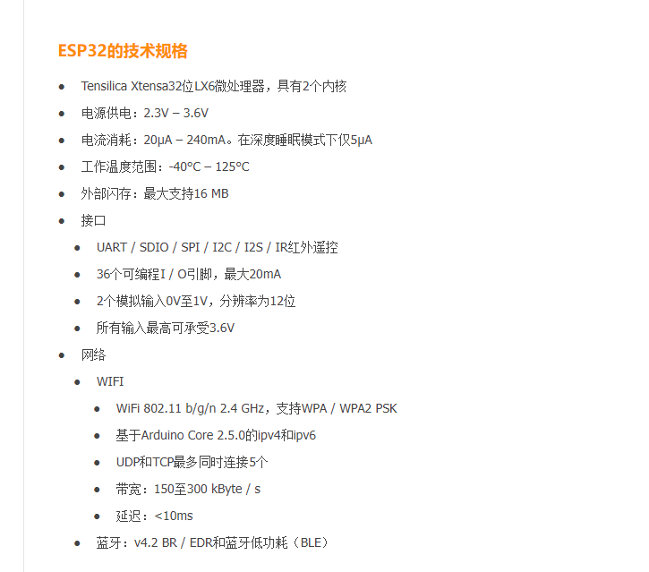
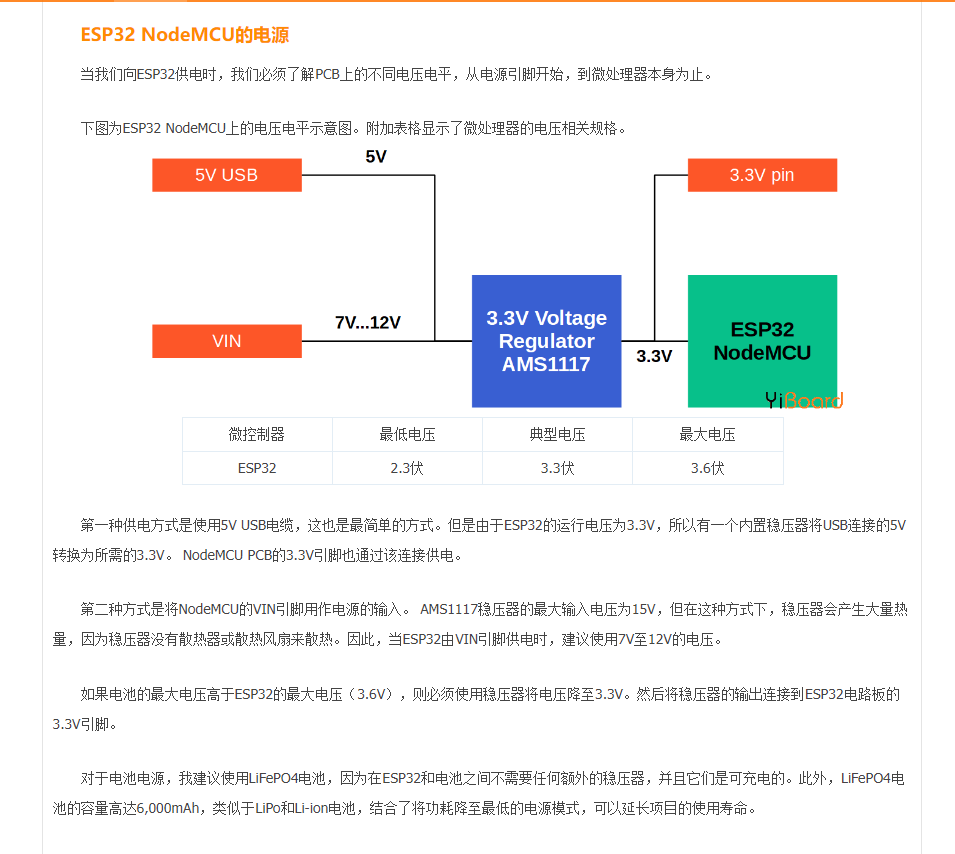
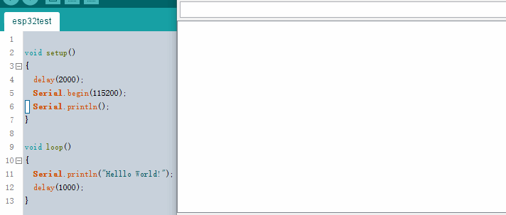
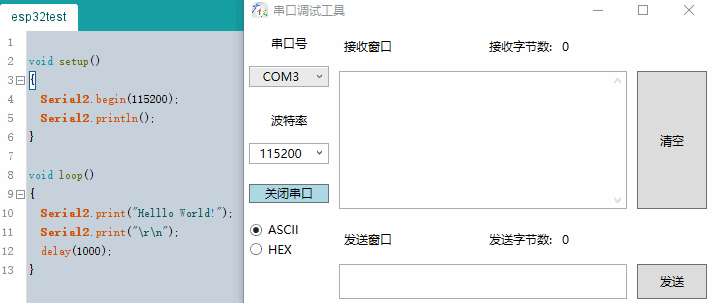

注意：
esp32有自己的SDK，叫ESP-IDF。vscode里有一个专门的ide插件espressif idf

但esp32同样可以用arduino的SDK，vscode里的插件是platformIO IDE
建议使用arduino

[学习教程](https://blog.csdn.net/naisu_kun/category_8449560.html)

esp32的技术规格：

esp32的供电（3.3v）：但是esp32内置两个电压转换：

1.usb 5v 转3.3v
2.vin引脚：7-15v 转3.3v

ESP32一共有三个串口，Arduino中通过`Serial`、`Serial1`、`Serial2`控制这三个串口。

[# 使用Arduino开发ESP32（02）：串口（Serial port）使用说明](https://blog.csdn.net/Naisu_kun/article/details/86004049)

## Arduino常用的一些库

LVGL：可视化gui库
[如何把LVGL8移植到ESP32，使用vscode的pio环境arduino开发](https://www.bilibili.com/video/BV1rZ4y197hj/?spm_id_from=333.788.recommend_more_video.-1&vd_source=d31a858cc26ae1ffa19e14058b339f40)
http://wiki.waaax.top/index.php?title=ESP32_LVGL

轻量级操作系统：FreeRTOS

servo：舵机库
simplefoc：无刷电机和步进电机库

[看这个视频](https://www.bilibili.com/video/BV1tv411w74d?p=9&vd_source=d31a858cc26ae1ffa19e14058b339f40)