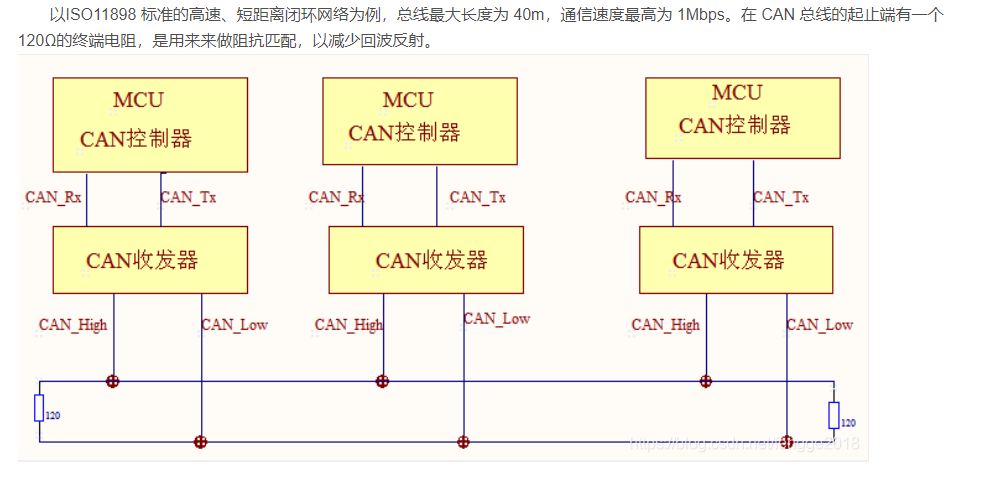
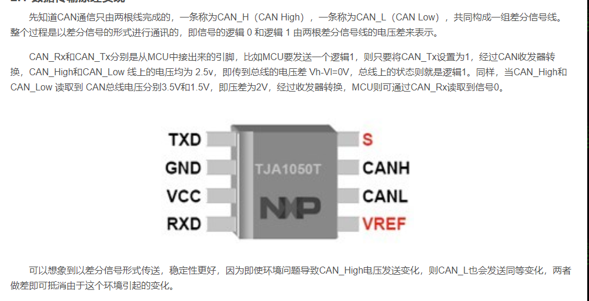

## can的组成方式

CAN的组成一般有两种方式：
1. 一种是CPU与CAN控制器集成到一起、再外接CAN收发器；
2. 另一种是CPU与CAN控制器分开的，使用的时候需要配置CAN接口电路，比较麻烦。
3. STM32中就是采用第一种方式，将CAN接口集成在芯片内，使用的时候再外接CAN收发器（顾名思义，可发送，可接收），常用的有TJA1050或者82C250。
4.CAN收发器是用于TTL电平与差分电压信号相互转换的，TTL电平即单片机引脚直接提供的电平，逻辑0代表低电平，逻辑1代表高电平；而差分电压信号则为固定的电压值。

## can的通信过程

### can的传输原理

## STM32的can
[可以看这篇文章](https://blog.csdn.net/fengge2018/article/details/107592487)
STM32 的所有型号芯片中都具有 bxCAN 控制器 (Basic Extended CAN)，即基本扩展 CAN，它支持 CAN 协议 2.0A(不支持扩展格式) 和2.0B 标准。
它的设计目标是，以最小的 CPU 负荷来高效处理大量收到的报文。它也支持报文发送的优先级要求(优先级特性可软件配置)。对于安全紧要的应用，bxCAN 提供所有支持时间触发通信模式所需的硬件功能。

在 STM32 互联型产品中，带有 2 个 CAN 控制器，而常用的 STM32F103ZET6 属于增强型，不是互联型，只有 1 个 CAN 控制器

