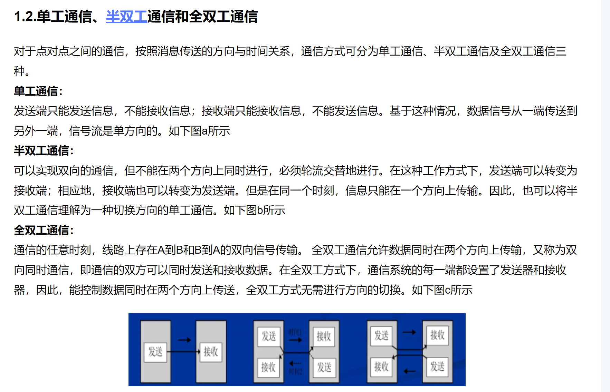
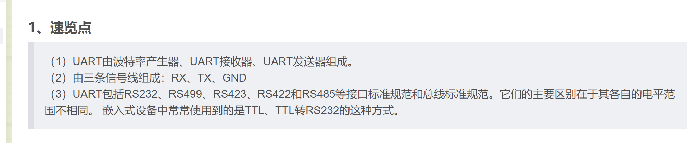
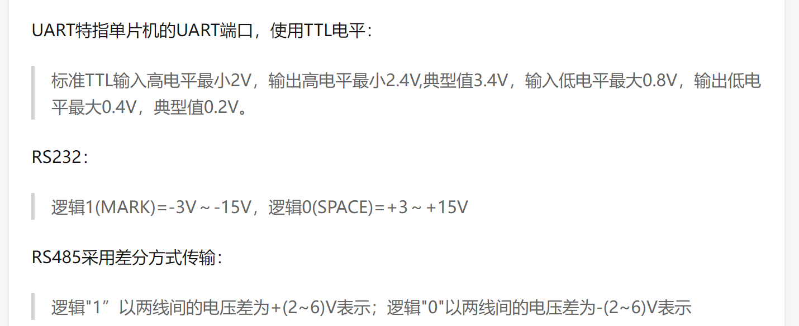
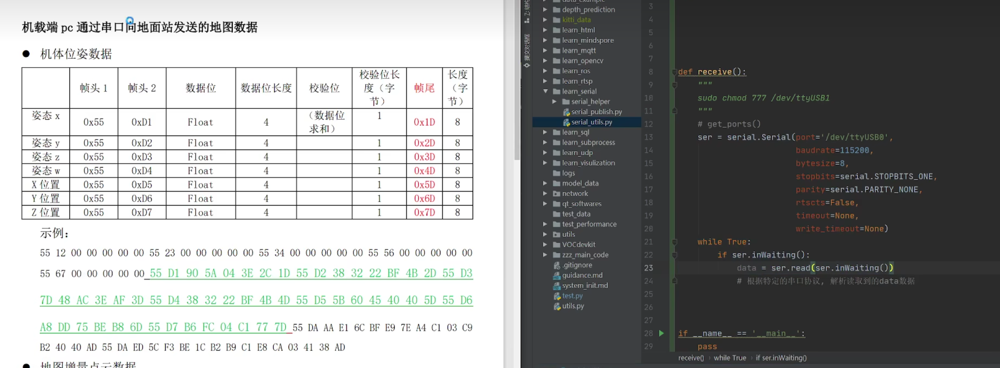
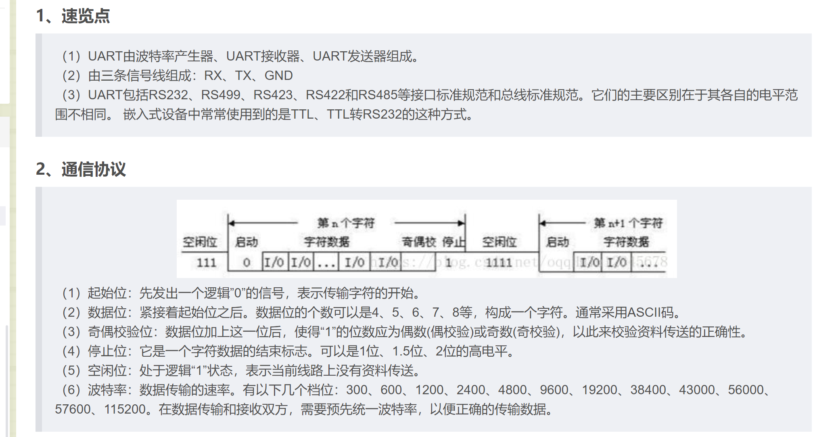
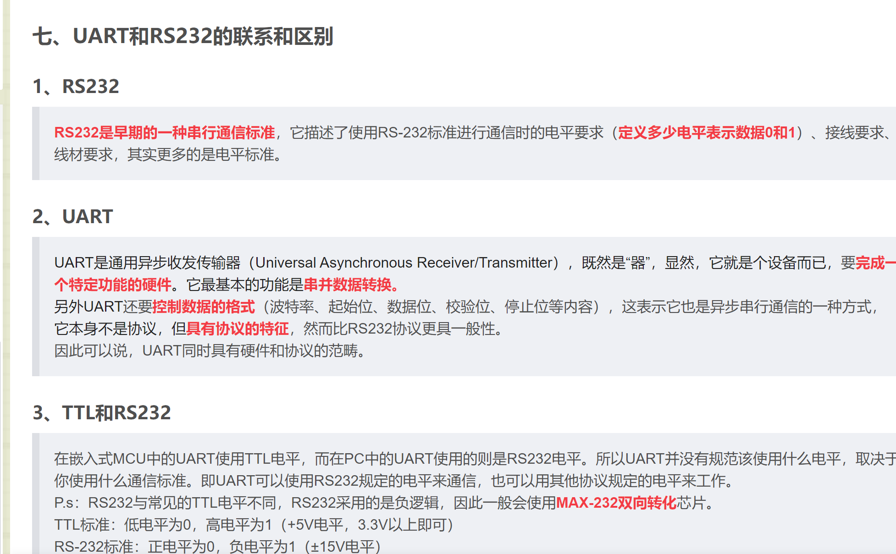

## 1. 单片机通信的种类

[具体可以看这个](https://www.guyuehome.com/42907)

### 1.1. 同步和异步
	发送方和接收方按照同一个时钟节拍工作就叫同步。
	发送方和接收方没有统一的时钟节拍、而各自按照自己的节拍工作就叫异步。 
### 1.2 串行通信与并行通信

		
### 1.3 单工通信、半双工通信和全双工通信

## 2.串口通信的**原理**

### 2.1串口通信属于全双工串行，既有同步(USART)也有异步(UART)

1. USART：**通用同步异步收发器**(Universal Synchronous Asynchronous Receiver and Transmitter)是一个串行通信设备，可以灵活地与外部设备进行全双工数据交换，既可以同步通信也可以异步通信。  
2. UART：**通用异步收发器(Universal Asynchronous Receiver and Transmitter)**，它是在 USART 基础上裁剪掉了同步通信功能（时钟同步），只有异步通信。简单区分同步和异步就是看通信时需不需要对外提供时钟输出，**我们平时用的串口通信基本都是 UART**。
3. UART、USART不是协议，而是一种“设备”。因为cpu处理数据的最小单元是字节，而串口发送的是位，所以需要把

	 **UART**，是通用异步收发传输器（Universal Asynchronous Receiver/Transmitter），既然是“器”，显然，它就是个设备而已，要完成一个特定的功能的硬件，它本身并不是协议。那么它要完成什么功能呢？它的最基本功能，是串行数据和并行数据之间的转换。我们知道，**计算机中的数据以Byte为基本单位，对一个Byte的存取是并行的，即，同时取得/写入8个bit。而串行通信，需要把这个Byte“打碎”，按照时间顺序来收发以实现串行**。例如：
	 比如确认一个Byte的这8个bit是什么时候开始的，又是什么时候结束的，两个班次之间至少要隔多长时间的缓冲，等等。这一部分，也具有协议的特征，但是相对于道路上的协议，更具有一般性，或曰，是与车在什么道路上开，相对独立的。
	 
4. 总结：从某种意义上，可以说，线路上存在的仅仅是电流，RS232/RS485规定了这些电流在什么样的线路上流动和流动的样式；在UART那里，电流才被解释和组装成数据，并变成CPU可直接读写的形式。

注意下边的说法可以帮助理解，但是不对。UART本身既包含协议（TTL），也是一个硬件设备，但是平时默认UART TTL，但是实际上UART支持TTL RS232 485等所有的串口协议。它本身既有物理特性也有协议特性。

### 2.2 串口通信的数据缓冲区

1. 串口通信一般有一个环形队列作为数据缓冲区，在linux中，串口的输出据缓冲区一般为4096个字节。
2. 在linux中读取串口数据时，可以自行设置串口缓冲区的大小，但是一次读取的数据不能超过串口缓冲区的大小。
3. 串口缓冲区能够有效解决，**数据发的快，但是读的慢**的问题。如果数据已经发送过来了，但是还没读，就先存在数据缓冲区，等到读取了一部分数据以后，就在缓冲区队列**把已经读了的这部分数据删除掉**。
4. 可以看这个[视频](https://www.bilibili.com/video/BV1oA411i7sq/)

### 2.3 串口通信的解析的例子

每个两个十六进制数(hex)，也就是8位代表一个字节，也就是串口通信的一次发送/接收。我们通过他给的数据定义去解析数据。[具体可以看这个视频](https://www.bilibili.com/video/BV1sG4y1e7Jf/)

## 3. 各种通信协议的区别

[具体可以看这个](https://blog.csdn.net/oqqHuTu12345678/article/details/65445338)

### 3.1 UART、RS485、RS232的区别(串口)

他们首先都是串口通信（串行、异步、全双工）
其次：

### 3.2 SPI
[具体可以看这个](https://blog.csdn.net/oqqHuTu12345678/article/details/65445338)

[和这个](https://www.guyuehome.com/42907)
SPI通信有四条线，SDO，SDI，SCLK，SS。是总线通信协议，存在主从设备。
因为有四条线，可以实现全双工通信。速度比I2C快，速度可达几Mbps。

### 3.3 I2C
[具体可以看这个](https://blog.csdn.net/oqqHuTu12345678/article/details/65445338)

[和这个](https://www.guyuehome.com/42907)

I2C通信有两条线SCL和SDA，是一种总线通信协议，存在主从设备。用地址选择从机。
因为只有一条数据线（SDA），所以他是半双工通信。但是由于是总线通信，所以两条线可以驱动多个设备（最多256个0x 00- 0xFF）