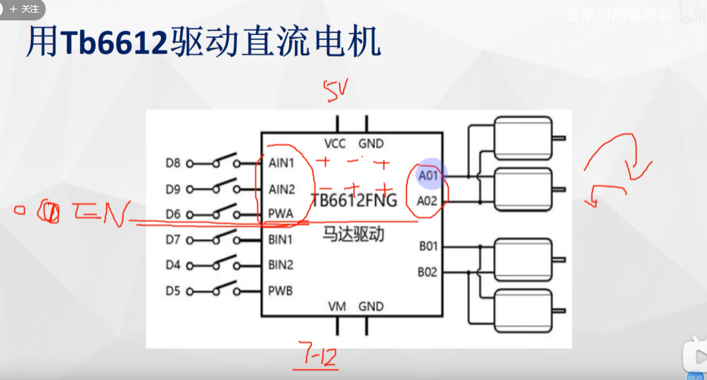

## 1.直流有刷电机

## 3.直流减速电机
[123的区别看这篇文章](https://www.bilibili.com/read/cv6425129/)

直流电机一般用pwm驱动，一般会有一个驱动板。AN1 2 控制正反转，PWA 0 1 代表pwm的输出。

## 2.直流无刷电机（simpleFOC）

## 4.直流伺服电机，也叫舵机（servo）

## 5.步进电机（simpleFOC）

