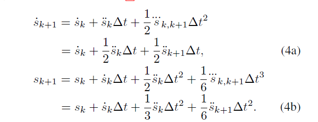
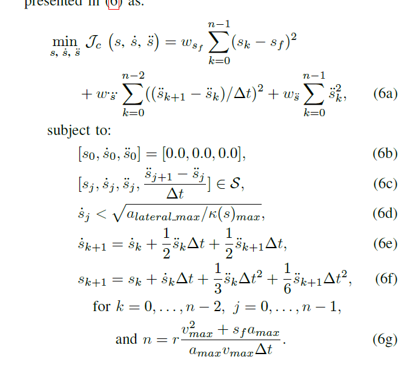

Apollo中纵向规划是PJSO算法，用来优化速度。
最基本的假设如下，引入jerk项：

优化问题构建如下：
决策变量有3k个：$s,\dot{s},\ddot{s}$

目标函数总共有三项：与终点的距离差，加速度平方和，jerk平方和
约束除了最基本的box约束外，还有一个向心加速度的约束（6d），即转弯的时候速度不能太快。
$$
a_{lat} = \frac{v^2}{r}
$$
在Frenet坐标系（又称为切向-法向坐标系）中，法向（或向心）加速度 $a_{lat}$与弧长速度 $\dot{s}$ 和曲率 $k(s)$ 的关系为：
$$ a_n = \dot{s}^2 \times k(s) = \frac{\dot{s}^2}{r} $$

这里：
-  $a_{lat}$是沿法向方向的加速度，也是向心加速度。
- $\dot{s}$ 是物体沿曲线的速度，也就是弧长随时间的变化率。
- $k(s)$ 是物体当前位置的曲率。

从这个公式可以看出，向心加速度与弧长速度的平方和曲率成正比。这与我们先前提到的向心加速度的定义（\( a_c = \frac{v^2}{r} \)）是一致的，其中曲率 \( k \) 与半径 \( r \) 的关系为 \( k = \frac{1}{r} \)。

