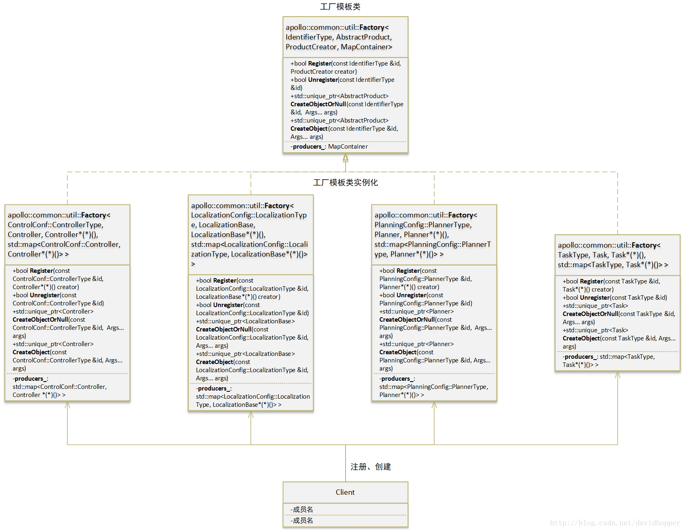
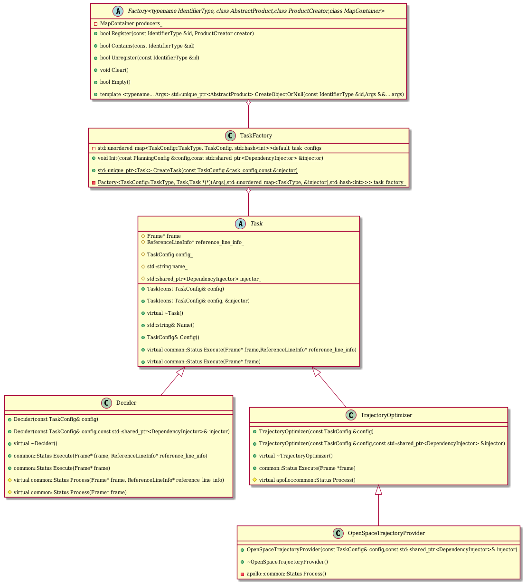
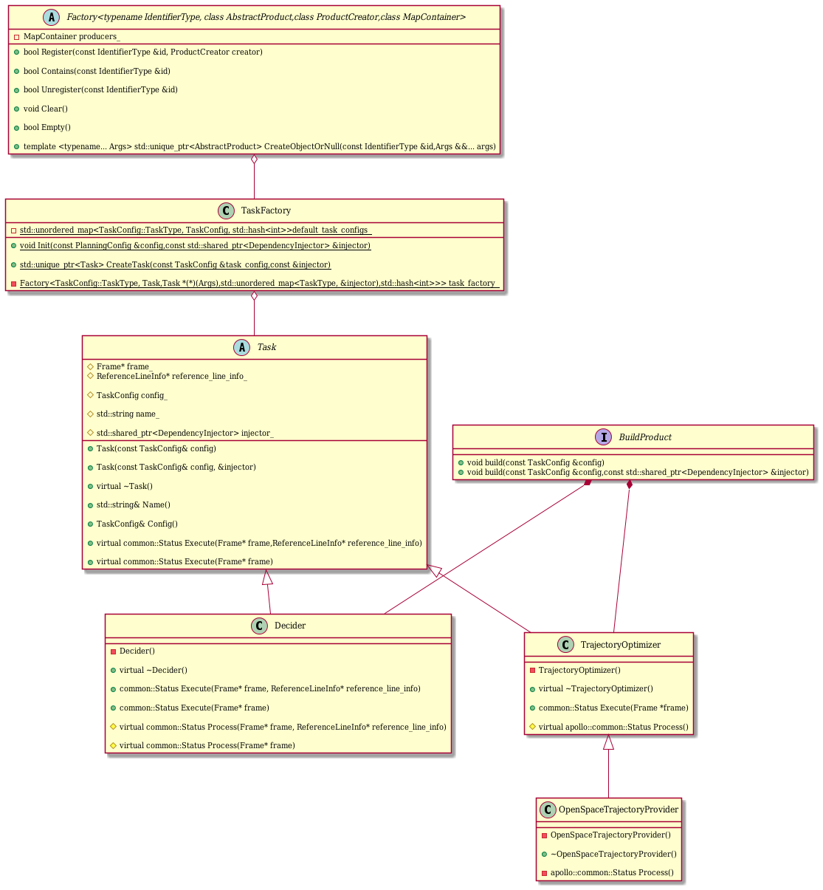

## Apollo中工厂模式简介
[Apollo](https://so.csdn.net/so/search?q=Apollo&spm=1001.2101.3001.7020)项目（[https://github.com/apolloauto](https://github.com/apolloauto)）的对象创建，大多使用直接法，例如：

```cpp
// 在栈(stack)上直接创建对象
ADCTrajectory not_ready_pb;
// 在堆(heap)上直接创建对象
ZeroCopyOutputStream *output = new FileOutputStream(file_descriptor);
```

还有部分对象使用单例（Singleton）模式创建，例如：
```cpp
DECLARE_SINGLETON(AdapterManager);
```
这里，`DECLARE_SINGLETON(AdapterManager)`是一个定义单例对象的宏，其定义如下：
```cpp
#define DECLARE_SINGLETON(classname)        \
 public:                                    \
  static classname *instance() {            \
    static classname instance;              \
    return &instance;                       \
  }                                         \
  DISALLOW_IMPLICIT_CONSTRUCTORS(classname) \
 private:
```
内嵌宏`DISALLOW_IMPLICIT_CONSTRUCTORS(classname)`的定义如下：
```cpp
#define DISALLOW_IMPLICIT_CONSTRUCTORS(classname) \
 private:                                         \
  classname();                                    \
  DISALLOW_COPY_AND_ASSIGN(classname);
```

继续看内嵌宏`DISALLOW_COPY_AND_ASSIGN(classname)`的定义：
```cpp
#define DISALLOW_COPY_AND_ASSIGN(classname) \
 private:                                   \
  classname(const classname &);             \
  classname &operator=(const classname &);
```
于是，`DECLARE_SINGLETON(AdapterManager)`展开后的定义为：
```cpp
public:                                   
  static AdapterManager *instance() {            
    static AdapterManager instance;              
    return &instance;                       
  }                                          
private:                                        
  AdapterManager();                                    
private:                                   
  AdapterManager(const AdapterManager &);            
  AdapterManager &operator=(const AdapterManager &);  
 private:
```

上述代码的意义一目了然，首先定义一个静态公有函数instance()，该函数在栈上创建一个AdapterManager类的静态对象，然后以指针形式将其返回。同时，将AdapterManager类的默认（或称缺省）构造函数、复制（或称拷贝）构造函数、复制赋值运算符（或称操作符）定义为私有函数，意即禁止进行隐式类型转换和复制操作。
还有部分对象，采用工厂模式创建，例如：
```cpp
control_conf_ = control_conf;
for (auto controller_type : control_conf_->active_controllers()) {
  auto controller = controller_factory_.CreateObject(
     static_cast<ControlConf::ControllerType>(controller_type));
  if (controller) {
     controller_list_.emplace_back(std::move(controller));
  } else {
     AERROR << "Controller: " << controller_type << "is not supported";
     return Status(ErrorCode::CONTROL_INIT_ERROR,
                    "Invalid controller type:" + controller_type);
}
```



## Apollo中工厂模式举例（task工厂）

规划的**原子操作**也可以叫做动作执行元素是`task`. 由于 `task` 太多, Apollo 里进行了 3 步抽象.  
第一步: 抽象类: `Task base` 类.  
第二步: `Task` 类的子类次抽象类, 主要分为三种类: `Optimizer`类, `Decider` 类以及 `Learning` 类:
```
SpeedOptimizer,  
TrajectoryOptimizer,  
PathOptimizer,  
  
Decider,  
PathDecider,  
PathReferenceDecider,  
RSSDecider,  
SpeedDecider,  
  
LearningModelInferenceTask,  
LearningModelInferenceTrajectoryTask
```

第三步: 对三个大类进一步地细分. 例如 `Decider` 类下面有 `STBoundsDecider`, `SpeedBoundsDecider`, `RuleBasedStopDecider`, `PathLaneBorrowDecider` 等 12 个子类.  
最后每个子类通过参数 `const TaskConfig &config,const std::shared_ptr<DependencyInjector> &injector` 即 Task 的 `config`( protobuf 消息), 以及输入依赖 `DependencyInjector` 去进一步执行细分的具体的 `task`.

那么问题来了这么多类, 如何在运行时动态地产生管理呢? 总不能每次都用 swtich case 语句进行判断然后生成所需要的类.  
由于产生类的具体(组装)过程, 我们并不关心, 只想要最终的类的结果, 因此**建造者模式不适用**, 采用抽象工厂模式. 为了对生成类对象进行管理, 采用了`std::unordered_map` 存储/查询生成的对象. 同时为了生产不同类型的类, 采取了模板模式, 最终结合为**模板抽象工厂模式**.

## 模板抽象工厂模式详解

下图为 Apollo 中整个模式的 UML 图(基于 PlantUML).  



下面对其进行一步步拆解.
抽象模板工厂 base 类

```cpp
//FILE_PATH:modules/common/util/factory.h  
template <typename IdentifierType, class AbstractProduct,  
          class ProductCreator = AbstractProduct *(*)(),  
          class MapContainer = std::map<IdentifierType, ProductCreator>>  
class Factory {  
 public:  
  bool Register(const IdentifierType &id, ProductCreator creator) {  
    return producers_.insert(std::make_pair(id, creator)).second;  
  }  
  
  bool Contains(const IdentifierType &id) {  
    return producers_.find(id) != producers_.end();  
  }  
  
  bool Unregister(const IdentifierType &id) {  
    return producers_.erase(id) == 1;  
  }  
  
  void Clear() { producers_.clear(); }  
  
  bool Empty() const { return producers_.empty(); }  
  
  template <typename... Args>  
  std::unique_ptr<AbstractProduct> CreateObjectOrNull(const IdentifierType &id,  
                                                      Args &&... args) {  
    auto id_iter = producers_.find(id);  
    if (id_iter != producers_.end()) {  
      return std::unique_ptr<AbstractProduct>(  
          (id_iter->second)(std::forward<Args>(args)...));  
    }  
    return nullptr;  
  }  
  
  template <typename... Args>  
  std::unique_ptr<AbstractProduct> CreateObject(const IdentifierType &id,  
                                                Args &&... args) {  
    auto result = CreateObjectOrNull(id, std::forward<Args>(args)...);  
    AERROR_IF(!result) << "Factory could not create Object of type : " << id;  
    return result;  
  }  
 private:  
  MapContainer producers_;  
};
```

`Factory` 存在 4 个模板参数:

- `typename IdentifierType`: 对象 id, 即产品容器 `std::unordered_map` 的 key.
- `class AbstractProduct` : 抽象产品(类), 最终生产出来的类.
- `class ProductCreator` : 函数指针, 输入为 `void`, 输出为`AbstractProduct` 对象的函数指针. 这个函数执行具体的生产过程.
- `class MapContainer` : key 为`IdentifierType`, value 为 `ProductCreator`的管理容器, 方便查询某个类是否已经被制造出来.

`Factory`有两类操作:

- 对 `std::unordered_map` 容器的操作: Register(插入), Contains(查询), Unregister(删除), Clear(清空), Empty(判断为空).
- 生产模板函数 `CreateObject` (调用`CreateObjectOrNull`): 逻辑也很简单, 先查询容器里是否已经制造了某类的对象, 如果已经制造好了, 直接去容器里拿, 如果查询不到就地生产一个出来并放入容器里.

生产的函数 `CreateObjectOrNull` 第一眼看起来很复杂, 其实也很简单.

- 模板参数: `<typename... Args>` 不定参数, 因为每个类的生产函数的输入参数都不一样.
- 返回值: `std::unique_ptr<AbstractProduct>` 抽象产品的唯一智能指针, 使用智能指针不需要手动 new~delete,由系统来管理产品最终的生命周期. 同时使用 `std::unique_ptr` 保证了指针指向单一性, 所以这里不用声明为 `static`函数.
- `std::forward<Args>(args)...)`: 完美转发保证参数的左右值引用性不会被改变.
- return 语句整体为, 先基于输入的参数, 使用容器里的 key (制造函数)制造出一个抽象产品类的对象, 并用一个 `std::unique_ptr` 智能指针去指向它.

**抽象工厂类**

首先注意到的是 `TaskFactory` 不是继承 `Factory` 的, 而是采用了聚合的形式 ( private 的 `Factory` 类的实例 `task_factory_`, 符合**合成复用原则**.

所有的函数以及成员变量均为 `static`, 保证单例或者只执行一次.

```cpp
//FILE_PATH:modules/planning/tasks/task_factory.h  
class TaskFactory {  
 public:  
  static void Init(const PlanningConfig &config,  
                   const std::shared_ptr<DependencyInjector> &injector);  
  static std::unique_ptr<Task> CreateTask(  
      const TaskConfig &task_config,  
      const std::shared_ptr<DependencyInjector> &injector);  
  
 private:  
  static apollo::common::util::Factory<  
      TaskConfig::TaskType, Task,  
      Task *(*)(const TaskConfig &config,  
                const std::shared_ptr<DependencyInjector> &injector),  
      std::unordered_map<  
          TaskConfig::TaskType,  
          Task *(*)(const TaskConfig &config,  
                    const std::shared_ptr<DependencyInjector> &injector),  
          std::hash<int>>>  
      task_factory_;  
  static std::unordered_map<TaskConfig::TaskType, TaskConfig, std::hash<int>>  
      default_task_configs_;  
};
```

有两点需要注意：

- `Init` 函数: 初始化 `TaskFactory` 类, 做了 2 件事情.
    
 一是把当前代码中的 `Task` 的 Derived 类都 Register 到容器中方便后面直接查询使用, 提高效率. 其中使用 lambda 表达式 `new` 出来一个对象. 总共 Register 了 25 个类.

```cpp
task_factory_.Register(  
    TaskConfig::OPEN_SPACE_TRAJECTORY_PROVIDER,  
    [](const TaskConfig& config,  
       const std::shared_ptr<DependencyInjector>& injector) -> Task* {  
      return new OpenSpaceTrajectoryProvider(config, injector);  
    });
```

二是把 `const PlanningConfig& *config*` 里的 task 也拿出来放到容器中, 实现更灵活的添加方式.

- 综合两点来看起来制造函数已经不需要了, 因为所有需要制造的实例都已经 `new` 出来放到容器里了. 但是对于更一般的场景还是需要下面的函数来应对.
    
- `CreateTask` 函数为制造实例的方法. 先把 `TaskConfig` 与 `PlanningConfig` 里的 task 都放到容器里, 然后调用 base 类的 `CreateObject` 函数创建对象.
    
其中 `MergeFrom` 为 protobuf 的合并函数 API.

```cpp
std::unique_ptr<Task> TaskFactory::CreateTask(  
    const TaskConfig& task_config,  
    const std::shared_ptr<DependencyInjector>& injector) {  
  TaskConfig merged_config;  
  if (default_task_configs_.find(task_config.task_type()) !=  
      default_task_configs_.end()) {  
    merged_config = default_task_configs_[task_config.task_type()];  
  }  
  merged_config.MergeFrom(task_config);  
  return task_factory_.CreateObject(task_config.task_type(), merged_config,  
                                    injector);  
}
```

**抽象产品类**

`Task` 类, 没有 private 成员, 所有成员均可被 public 继承. 可以讲的有 2 处.

- 成员变量: 均为 Planning 模块的核心输入类指针, 例如 `Frame,ReferenceLineInfo,TaskConfig,DependencyInjector`.
- `Execute` 成员函数负责执行后续每个 task 的具体任务内容, 为了实现多态, 两个重载的函数均为 `virtual`.

```cpp
class Task {  
 public:  
  explicit Task(const TaskConfig& config);  
  
  Task(const TaskConfig& config,  
       const std::shared_ptr<DependencyInjector>& injector);  
  virtual ~Task() = default;  
  const std::string& Name() const;  
  const TaskConfig& Config() const { return config_; }  
  virtual common::Status Execute(Frame* frame,  
                                 ReferenceLineInfo* reference_line_info);  
  virtual common::Status Execute(Frame* frame);  
 protected:  
  Frame* frame_ = nullptr;  
  ReferenceLineInfo* reference_line_info_ = nullptr;  
  TaskConfig config_;  
  std::string name_;  
  std::shared_ptr<DependencyInjector> injector_;  
};
```

**次抽象产品类**

以 `TrajectoryOptimizer` 为例, override 了父类的 `Execute` 函数(这里没有再往下传递这个函数里, 取而代之的是 `Process` , 子类里的执行函数入参不够满足子类的复杂度要求). 没有 private 成员, 所有成员均可被 public 继承. 同时增加了新的虚函数 `Process` 强制子类必须重载之.

```cpp
class TrajectoryOptimizer : public Task {  
 public:  
  explicit TrajectoryOptimizer(const TaskConfig &config);  
  TrajectoryOptimizer(const TaskConfig &config,  
                      const std::shared_ptr<DependencyInjector> &injector);  
  virtual ~TrajectoryOptimizer() = default;  
  
  apollo::common::Status Execute(Frame *frame) override;  
  
 protected:  
  virtual apollo::common::Status Process() = 0;  
};
```

**产品类**

以 `OpenSpaceTrajectoryProvider` 为例, 重载了 `Process` 函数, 实现多态.

```cpp
class OpenSpaceTrajectoryProvider : public TrajectoryOptimizer {  
 public:  
  OpenSpaceTrajectoryProvider(  
      const TaskConfig& config,  
      const std::shared_ptr<DependencyInjector>& injector);  
  ~OpenSpaceTrajectoryProvider();  
  void Stop();  
  void Restart();  
 private:  
  apollo::common::Status Process() override;  
  void GenerateTrajectoryThread();  
  bool IsVehicleNearDestination(const common::VehicleState& vehicle_state,  
                                const std::vector<double>& end_pose,  
                                double rotate_angle,  
                                const common::math::Vec2d& translate_origin);  
  
  bool IsVehicleStopDueToFallBack(const bool is_on_fallback,  
                                  const common::VehicleState& vehicle_state);  
  void GenerateStopTrajectory(DiscretizedTrajectory* const trajectory_data);  
  void LoadResult(DiscretizedTrajectory* const trajectory_data);  
  void ReuseLastFrameResult(const Frame* last_frame,  
                            DiscretizedTrajectory* const trajectory_data);  
  void ReuseLastFrameDebug(const Frame* last_frame);  
 private:  
  bool thread_init_flag_ = false;  
  std::unique_ptr<OpenSpaceTrajectoryOptimizer>  
      open_space_trajectory_optimizer_;  
  size_t optimizer_thread_counter = 0;  
  OpenSpaceTrajectoryThreadData thread_data_;  
  std::future<void> task_future_;  
  std::atomic<bool> is_generation_thread_stop_{false};  
  std::atomic<bool> trajectory_updated_{false};  
  std::atomic<bool> data_ready_{false};  
  std::atomic<bool> trajectory_error_{false};  
  std::atomic<bool> trajectory_skipped_{false};  
  std::mutex open_space_mutex_;  
};
```

### 总结

Apollo 的这套模板抽象工厂模式有如下优点(我认为设计模式是可变可组合的, 只有设计原则是不变的):

- 符合**开闭原则**, 后面即便有新的 task 要加入进来, 也只需要使用跟大多数现存 task 类相同的接口 `const TaskConfig& config, const std::shared_ptr<DependencyInjector>& injector` 在 `TaskFactory` 中 Register 即可. 如果无法使用一样的接口也可以另起炉灶使用模板基类的`CreateObject` 函数自定义制造函数.
- 如前文所说部分符合**合成复用原则**, `TaskFactory` 通过复合的方式联合 `Factory`.
- 符合**单一职责原则**, 每个类的定位单一, 整体层次明晰.
- 由于产品类内部的成员变量基本为相同的类指针(或者是智能指针)也间接地实现了**享元模式**.

也有些我觉得可以提升的地方:

- register 的部分可以考虑使用接口实现, 可以参考[知乎文章](https://zhuanlan.zhihu.com/p/83537599), 这样可以让产品继承/聚合接口类. 这样就不会出现几百行的 register 重复类似代码.
- 可以考虑所有的产品类都继承自一个抽象产品类而不是先抽象一波再次抽象一波. 至于不同类的 `Process` 不同可以设置专门的 `Process` 接口类, 通过继承/重载实现不同功能. 当然 Apollo 这么分也有可能是为了语义/分工上的现实意义.

下图为改进后的 UML 示意图, 其中 task 的各产品类聚合了 Interface 产品制造方法, 并且各自的构造函数被禁止(private 属性

