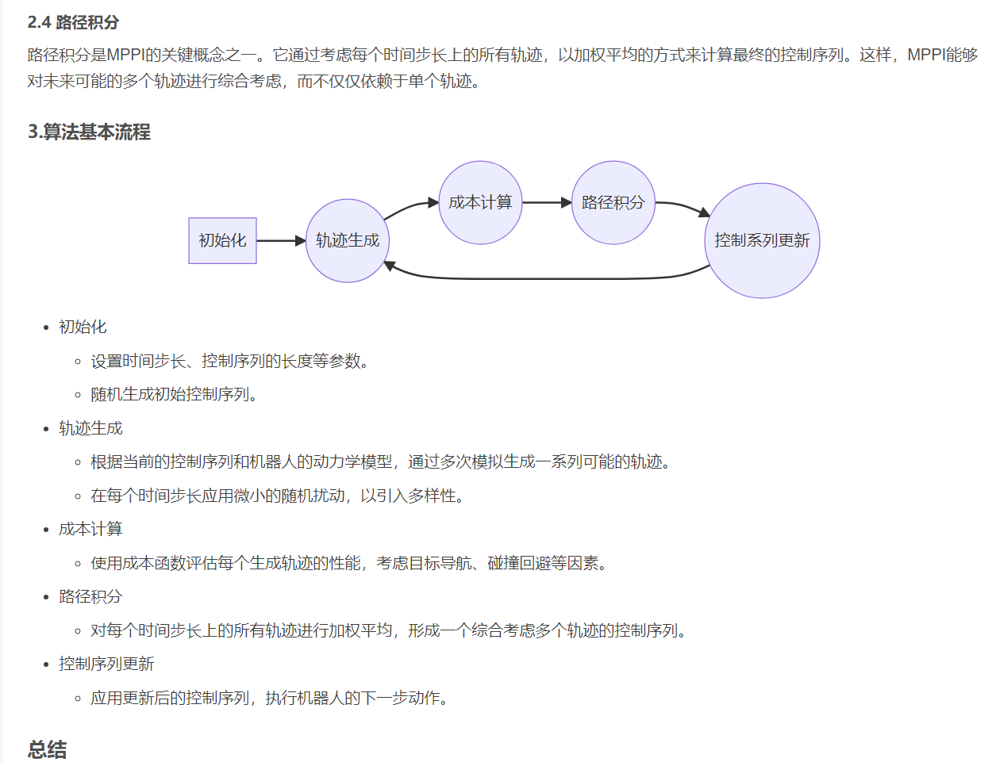
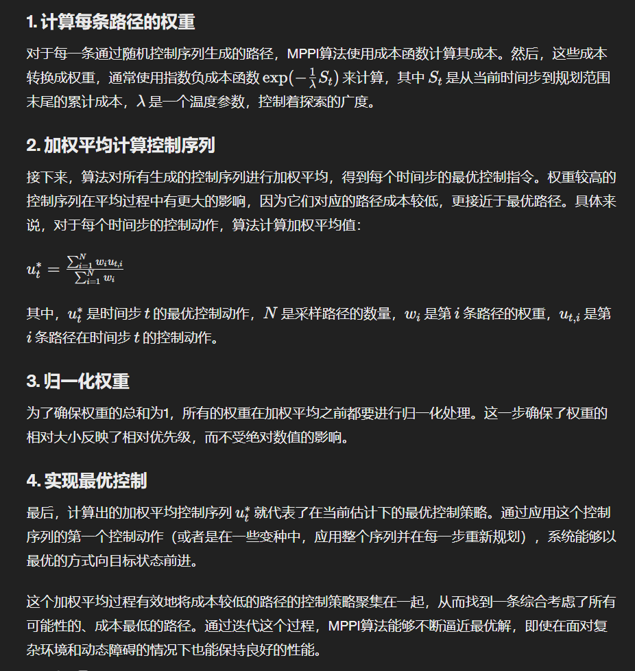
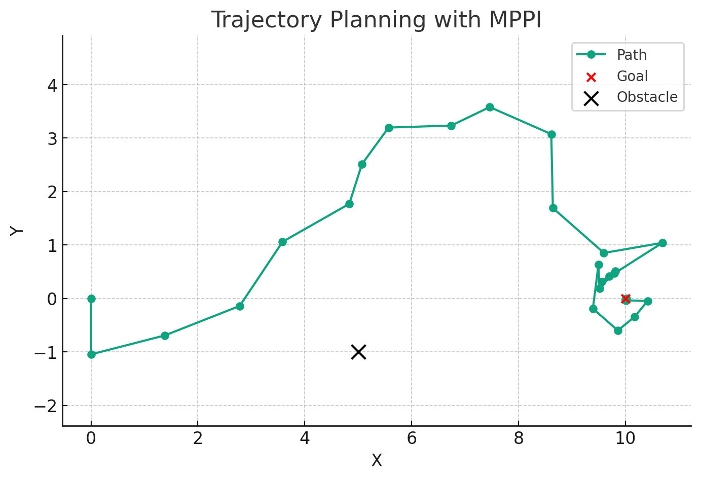
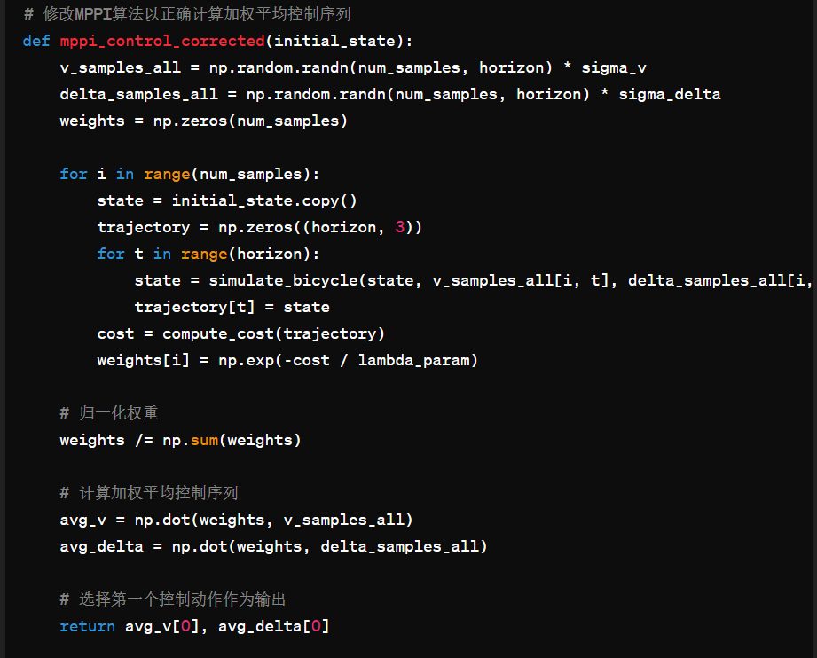

MPPI规划器，全称是模型预测路径积分（Model Predictive Path Integral）算法。他主要是通过随机生成控制序列，根据控制序列前向模拟车辆的轨迹，然后评价轨迹的质量。根据轨迹的质量求出来相应的权重，对之前随机生成的控制序列加权，最终得到一个较好的控制序列的算法。他的思想非常简单，通过多个for循环即可实现，不用调用任何求解器。

MPPI最主要的优点就是考虑了不确定性和动态环境中的变化，生成机器人的最佳轨迹。积分的含义是在每一个时间步，对所有的路径进行加权，得到当前时间步下的最优控制量。





```python
import numpy as np
import matplotlib.pyplot as plt

# 环境和MPPI参数
goal_pos = np.array([10, 0])  # 目标位置
obstacle_pos = np.array([5, -1])  # 障碍物位置
obstacle_radius = 1.0  # 障碍物半径
num_samples = 500  # 随机样本数
horizon = 20  # 控制序列的长度
sigma_v = 1.0  # 速度的随机扰动强度
sigma_delta = 0.5  # 转角的随机扰动强度
lambda_param = 0.1  # 温度参数

# 自行车模型模拟函数
def simulate_bicycle(state, v, delta, dt=0.1, L=1.0):
    x, y, theta = state
    x += v * np.cos(theta) * dt
    y += v * np.sin(theta) * dt
    theta += v / L * np.tan(delta) * dt
    return np.array([x, y, theta])

# 成本函数
def compute_cost(trajectory):
    # 到达目标的成本
    goal_cost = np.linalg.norm(trajectory[-1, :2] - goal_pos)
    # 避免障碍物的成本
    obstacle_cost = np.sum(np.exp(-np.linalg.norm(trajectory[:, :2] - obstacle_pos, axis=1)**2 / (2 * obstacle_radius**2)))
    return goal_cost + obstacle_cost

# MPPI算法
def mppi_control(initial_state):
    best_sequence = None
    best_cost = float('inf')
    weights = np.zeros(num_samples)
    for i in range(num_samples):
        v_samples = np.random.randn(horizon) * sigma_v
        delta_samples = np.random.randn(horizon) * sigma_delta
        state = initial_state.copy()
        trajectory = np.zeros((horizon, 3))
        for t in range(horizon):
            state = simulate_bicycle(state, v_samples[t], delta_samples[t])
            trajectory[t] = state
        cost = compute_cost(trajectory)
        weights[i] = np.exp(-cost / lambda_param)
        if cost < best_cost:
            best_cost = cost
            best_sequence = (v_samples, delta_samples)
    weights /= np.sum(weights)  # 归一化权重
    # 加权平均控制序列
    avg_v = np.sum(np.array([w * best_sequence[0] for w in weights]))
    avg_delta = np.sum(np.array([w * best_sequence[1] for w in weights]))
    return avg_v, avg_delta

# 运行MPPI算法并绘制轨迹
initial_state = np.array([0, 0, np.pi/2])
states = [initial_state[:2]]
for _ in range(30):
    v, delta = mppi_control(initial_state)
    initial_state = simulate_bicycle(initial_state, v, delta)
    states.append(initial_state[:2])

states = np.array(states)

# 可视化
plt.figure(figsize=(8, 5))
plt.plot(states[:, 0], states[:, 1], marker='o', label='Path')
plt.scatter([goal_pos[0]], [goal_pos[1]], color='r', zorder=5, label='Goal')
plt.scatter([obstacle_pos[0]], [obstacle_pos[1]], color='k', s=100, zorder=5, label='Obstacle')
plt.xlabel('X')
plt.ylabel('Y')
plt.title('Trajectory Planning with MPPI')
plt.legend()
plt.grid(True)
plt.axis('equal')
plt.show()

```





核心代码：

