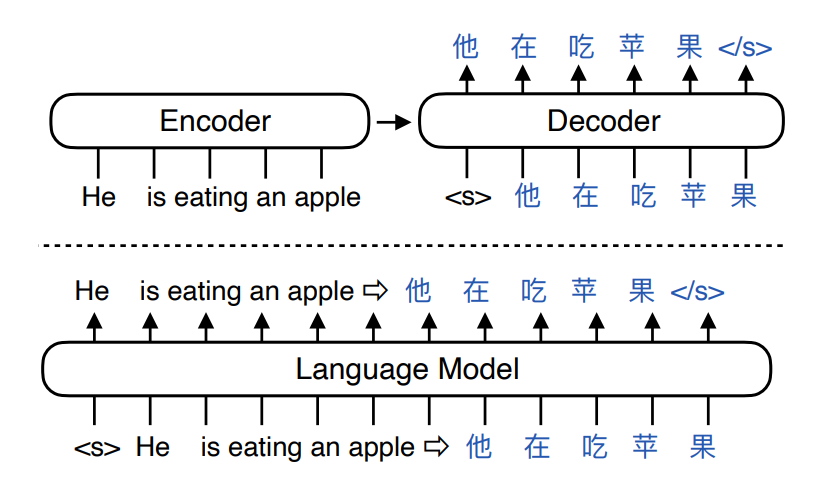

## Attention结构
对于Transformer encoder，一般是selft attention
对于Transformer decoder，一般是cross attention

Encoder-Decoder架构一般适用于翻译、文本分类等任务，Decoder only架构适用于续写等任务。

## Transformer训练快，推理慢；RNN训练慢推理快

### Transformer训练快：
对于Transformer这种自回归任务，模型的输入通常是一个具体，真值是句子中每个字的下一个字

在训练过程中，真值（ground truth）是目标序列中的每个词的**实际词汇索引**。对于序列生成任务来说，每个时间步的真值是输入序列的下一个词，也就是我们希望模型正确预测的词汇。

#### 例子：

假设我们有以下输入句子：

`"The quick brown fox"`

目标序列（即真值）是：

`"quick brown fox jumps"`

则模型的输入维度是(1, 4, d_embeding),输出也是(1, 4, d_embeding)，最终会接一个预测头，将d_embeding映射至词汇表大小，比如10000，即最终输出维度是(1, 4, 10000),真值的维度是(1,4)，模型输出的是一个长度为 (4,10000)的概率分布，而真值是一个长度为 4的词汇索引列表,Loss为交叉熵损失。

注意，在训练过程中须有mask，让模型看不到下一个token，一般是一个下三角为1的矩阵。本质上是通过The预测quick，通过The quick预测brown依次类推。

这样，transformer在训练时，一直都是并行的，所以训练快。

### Transformer推理慢：
transformer在推理时是自回归的，比如对于一个翻译任务，输入是l love you，
1. 首先会根据i love you 输出 我
2. 然后根据  i love you 我，输出 爱（需要跟 i love you 我，4个token计算注意力权重）
3. 然后根据 i love you 我 爱 ，输出 你（需要跟 i love you 我 爱，5个token计算注意力权重）

所以在推理过程中自注意力计算的复杂度是 O(n2)，即总的计算量是 3+4+5=12

## RNN训练慢，推理快

### RNN训练慢：
RNN的当前步依赖上一步的隐藏状态，无法并行训练。

### RNN推理快：
RNN推理时，输出仅依赖上一个隐状态，例如 i love you ，输出我时，仅依赖you的隐状态，输出爱时仅依赖 我 的隐状态，所以在推理过程中自注意力计算的复杂度是 O(n)，即总的计算量是 1+1+1=3