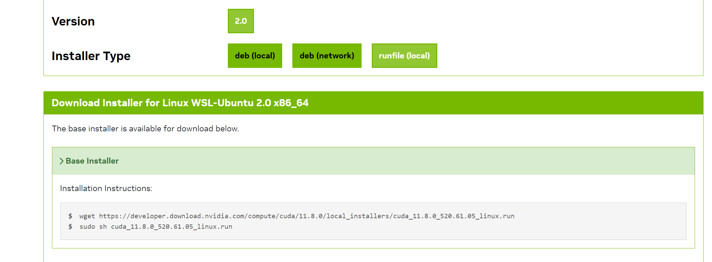

## cuda

主机没有安装cuda，去cuda官网 安装11.1 版本（单独torch是不需要安装cuda的，因为torch的cuda版本已经集成好了二进制的cuda，但是mmdet3d需要cuda来编译，所以还是需要安装cuda的，很坑爹！！！）：

https://developer.nvidia.com/cuda-toolkit-archive
最好用runfile




安装后
```
export LD_LIBRARY_PATH=$LD_LIBRARY_PATH:/usr/local/cuda/lib64
export PATH=$PATH:/usr/local/cuda/bin
export CUDA_HOME=/usr/local/cuda
```

多版本切换：
```bash
# 软链接方式
$ ls -lh /usr/local
lrwxrwxrwx  1 root root   19 Jul 15  2018 cuda -> /usr/local/cuda-10.1/
drwxr-xr-x 19 root root 4.0K Jun  5  2019 cuda-10.0/
drwxr-xr-x 14 root root 4.0K Sep 21 22:54 cuda-10.1/
......

# 需要切换版本时，执行如下操作
$ sudo rm -rf /usr/local/cuda
$ sudo ln -s /usr/local/cuda-10.0 /usr/local/cuda
```

为了确认，需要查看一下软连接


```
source ~/.zshrc
```

其实不需要sudo ldconfig：


LD_LIBRARY_PATH的优先级高于/etc/ld.so.conf.d，ldconfig命令只会影响ld.so.conf.d，与LD_LIBRARY_PATH无关。


检验安装的版本是否正确

```
nvcc -V
```

note:不要从conda中安装cuda，不管选什么版本，conda都会安装12.4很坑


## cudnn

cudnn是一个加速库，cuda是一个工具的集合，里面有很多工具，例如nvcc编译器等，cudnn是一个加速度库，他是cuda里的一个工具，但是没有集成在里边，需要自行安装。

[cuDNN Archive | NVIDIA Developer](https://developer.nvidia.com/rdp/cudnn-archive)

下载对应的cuda版本的cudnn，并解压到cuda的文件夹中

```
tar -xvf cudnn-linux-x86_64-8.4.0.27_cuda11.6-archive.tar.xz
cd cudnn-linux-x86_64-8.4.0.27_cuda11.6-archive
sudo cp lib/* /usr/local/cuda-11.2/lib64/
sudo cp include/* /usr/local/cuda-11.2/include/
sudo chmod a+r /usr/local/cuda-11.2/lib64/*
sudo chmod a+r /usr/local/cuda-11.2/include/*

```