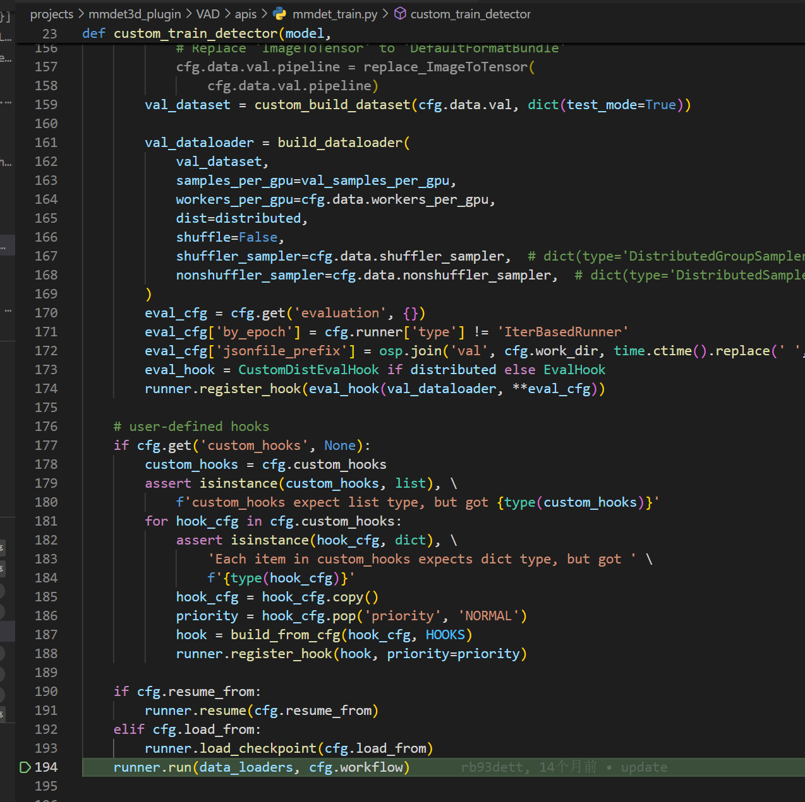
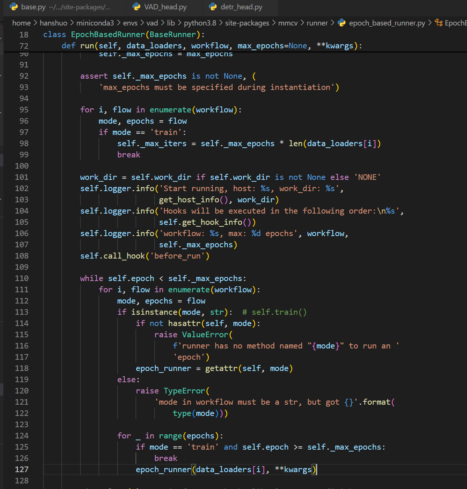
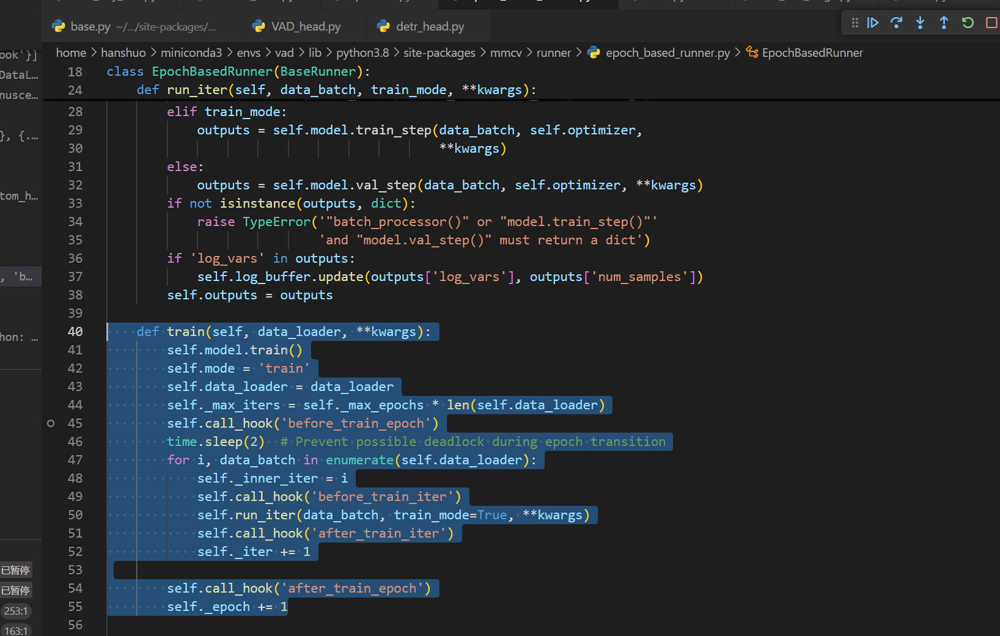
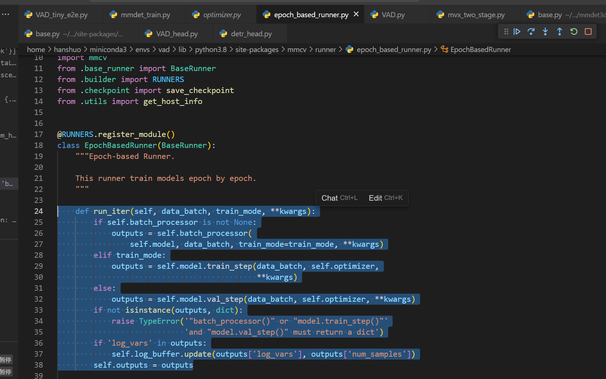
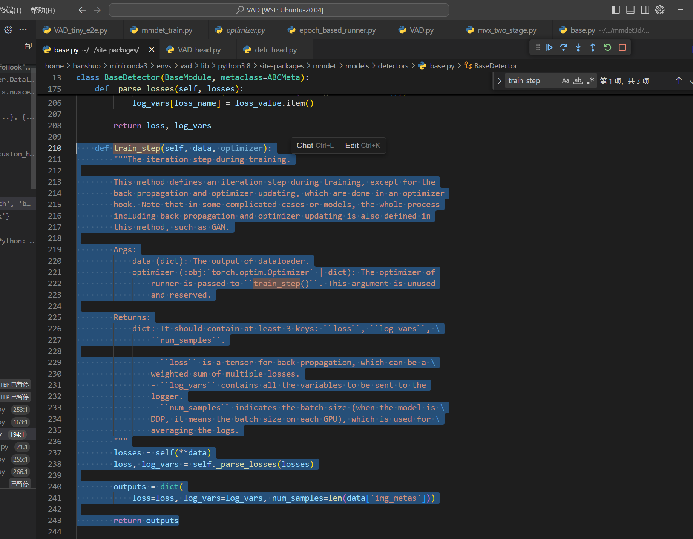
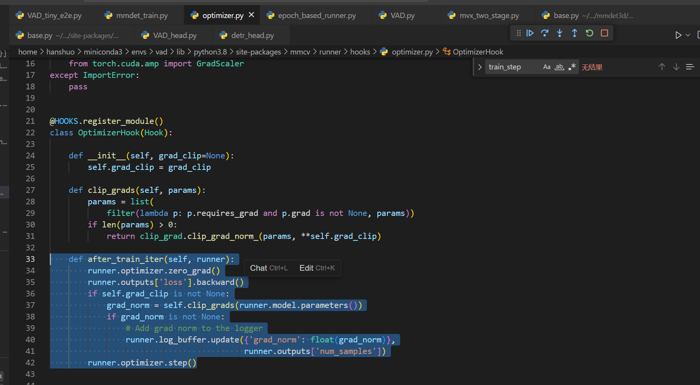
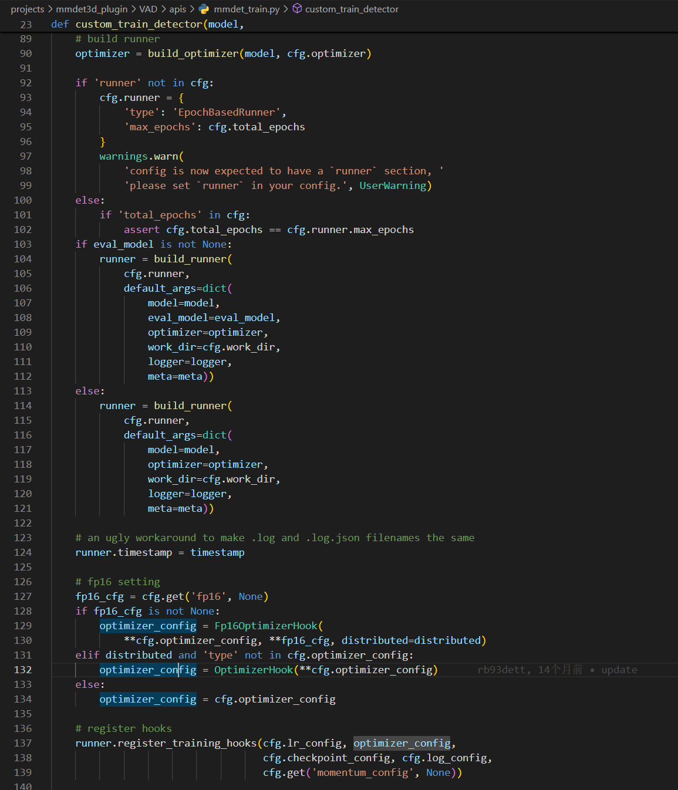

## 1 mmdet3d 梯度回传

首先在train.py中的main函数中构建Runner，runner.run是整个训练的开始

进入run函数，根据mode，找到对应的函数，比如mode=train，则在127行运行train函数

在runner中的run_iter函数中，调用model的train_step函数

在model的train_step函数中，会调用实例self，即进行forward前向传播，得到一个losses，为一个dict，存了模型的所有loss，train_step会将loss返回到上边run_iter中的outputs中

在run_iter运行完后，会调用after_train_iter这个hook，首先会遍历runner中的所有hook，然后找到有after_train_iter这个function的hook，依次运行，这样就会调用到OptimizerHook，在这里进行反传和梯度清零以及梯度裁剪、梯度更新。

OptimizerHook是在构造runner的同一个文件中构造的，构造完runner后会注册一些hook。

## 2 一些教程

轻松掌握 MMDetection 中 Head 流程
https://zhuanlan.zhihu.com/p/343433169

轻松掌握 MMDetection 整体构建流程(一)
https://zhuanlan.zhihu.com/p/337375549

轻松掌握 MMDetection 整体构建流程(二)
https://zhuanlan.zhihu.com/p/341954021

带你玩转 3D 检测和分割（一）：MMDetection3D 整体框架介绍
https://zhuanlan.zhihu.com/p/478307528

带你玩转 3D 检测和分割 （二）：核心组件分析之坐标系和 Box
https://zhuanlan.zhihu.com/p/491614921

带你玩转 3D 检测和分割 （三）：有趣的可视化
https://zhuanlan.zhihu.com/p/504862433

MMDetection3D从入门到放弃（3）-魔改BEV
https://zhuanlan.zhihu.com/p/578459489

MMDetection3D从入门到放弃（2）-数据集转换
https://zhuanlan.zhihu.com/p/518872688