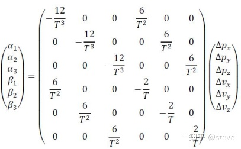

## 1. 前端

前端的作用是给出一条“看起来还行”**粗轨迹**，不用太关注曲率是否连续，是否复合动力学等等。只要这条轨迹能避免碰撞，几何上相对较优即可。

前端规划一般注重效率，后端一般注重舒适。

前端常用到的两类算法：搜索算法和采样算法

### 1. 1搜索算法

#### 1.1.1 dijkstra

#### 1.1.2 a \*

#### 1.1.3 混合a\*

### 1.2采样算法（概率）

#### 1.2.1 RRT

#### 1.2.2 RRT\*

### 1.3采样算法（规则），也可以直接用做后端

#### 1.3.1 lattice

#### 1.3.2 dwa

## 2. 后端

### 2.1 直接优化

### 2.2 参数化曲线+优化(贝塞尔、B样条、5次多项式)

#### 2.2.1 五次多项式（BVP、OBVP）

首先，我们考虑一个最简单的BVP（Boundary Value Problem）问题，即限定了轨迹的初始点及目标点，构造出一条平滑的轨迹。

假设我们边界条件为起始点的（p,v,a）及目标点的（p,v,a），那么我们至少需要构造一个五阶多项式（包含6个系数）来进行连接才能够满足起止点的约束条件。

该问题的边界条件限制为：

因此，该问题的求解可以简单地列出矩阵等式如下：

最简单的BVP问题是**假设了时间一定**=T的情况，其解是固定且唯一的。如果我们加入一个代价函数，这就变成了一个OBVP（Optimal Boundary Value Problem）问题，此时时间T就不是固定不变的，我们需要找到一个最优的T，使得代价函数的值最小。

例如，我们设定代价函数只考虑Jerk的平方，**状态空间为位置、速度、加速度**，**系统的输入为jerk值**，然后再根据系统的模型来构造出状态转移方程。这样一个典型的OBVP问题也就构造好了。

求解上述OBVP问题需要用到庞特里亚金最小值原理，这里的数学推导比较复杂，本篇文章也就不赘述了，感兴趣的读者可以[参考论文](https://zhuanlan.zhihu.com/p/505132215)

最终可以推导出cost function只与T有关，公式如下所示：

因此要使得cost function J最小，只需要对其求一阶导并令其为0即可(多项式求根)，这里的求解方法有多种，可以利用伴随矩阵求特征值的方法，也可以利用Eigen内置的多项式求解器等等。最终可以求得**最优的时间段T**，使得这条轨迹的代价函数最小。（$\Delta p_x,\Delta p_y,\Delta p_z,\Delta v_x,\Delta v_y,\Delta v_z$ 可以带入公式求值，和起点与终点的位置、速度、加速度有关）。最终可以求得协变量，进入求得状态和控制量随t得解析解。

**需要注意的是，这里限制了目标点的v,a，这使得J只与时刻T相关而不与T时刻的v，a状态相关**。关于不限制目标点v，a的OBVP问题读者感兴趣的话可以自行搜索。

- 用到五次多项式的论文minimum snap
#### 2.2.2 贝塞尔曲线

- 用到贝塞尔曲线的论文：epsilon

#### 2.2.3 B样条曲线

- 用到B样条的论文：
