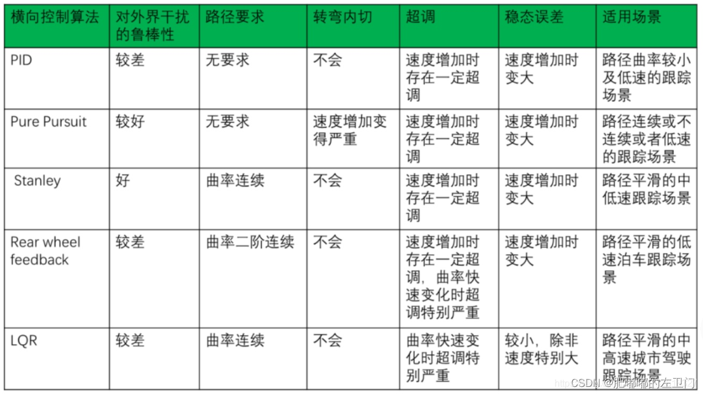
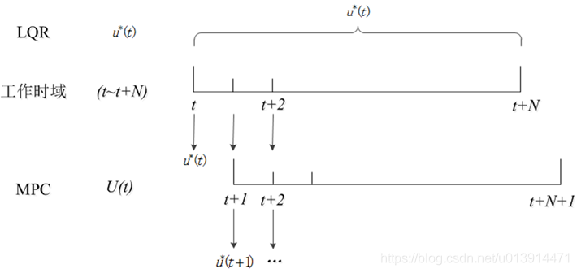

## 1，LQR和LQR：
适用场景：
**路径曲率较小并连续且不能变化过快**，故非常适合**中高速的城市驾驶跟踪场景**。

## 2， PP、stanly、PID

适用场景：
曲率较大，不连续，**低速的场景**。

## 2，MPC vs LQR vs PID：

LQR:
（1）计算未来固定时间段内的最优，**只计算一次，得到状态反馈增益**，在该时域内，根据实时的状态求反馈控制量，没有考虑执行时产生的误差以及干扰对于系统的影响。
（2）LQR没有约束，不是转化为QP问题进行求解，而是通过求解Riccati黎卡提方程，最终u = -kx进行求解
（3）LQR可以当作MPC中的一步，没有滚动的过程。

优点：先相对于MPC，算力较小。因为求解Riccat方程可以离线进行。
缺点：没有滚动导致对干扰的抵抗能力弱，没有办法处理约束。

MPC:
（1）计算未来一小段时间内的最优，滚动计算，只执行第一个序列的控制值，下一个周期继续滚动计算最优控制序列。
（2）MPC模型有约束，可以添加多个约束
（3）MPC最终转化为QP问题，调用工具求解器进行求解

优点：可以处理约束，滚动更新使鲁棒性比较好。
缺点：算力要求较高。

PID:
只关注当前时刻的误差，不关注未来时间段内的误差，没有预见性，易造成超调和“画龙”现象。

针对同一工作时域\[ t , t + N\] :
- LQR在该时域中，只计算一次，有唯一最优控制解$u^*(t)$ ,他是一个状态的反馈量u=-kx，根据该时域内的状态实时更新控制量前轮转角。
- 而MPC仅在t时刻有最优解$u^*(t)$ 。会计算N次，它会计算出一个控制序列U ( t )，并仅将序列的第一个值$u^*(t)$作为控制量输出给控制系统，该解直接是一个控制量而不是反馈（反馈隐藏在求解的过程中），然后在下一采样时间结合车辆当前状况求取下一个最优控制解$u^*(t+1)$ 这就是MPC所谓的滚动优化。这么做的目的是为了使控制效果在一定时间内可期，并且能根据控制效果尽早调整控制变量，使实际状态更切合期望状态。
- 此外，LQR的工作时域可以拓展到无限大，即可以求取无限时域的最优控制解，当然，一般并不会这么用。而MPC只针对有限时域。

## 3，Pure Pursuit:
适用场景：
低速，低速，低速，速度过高易产生转弯内切以及超调