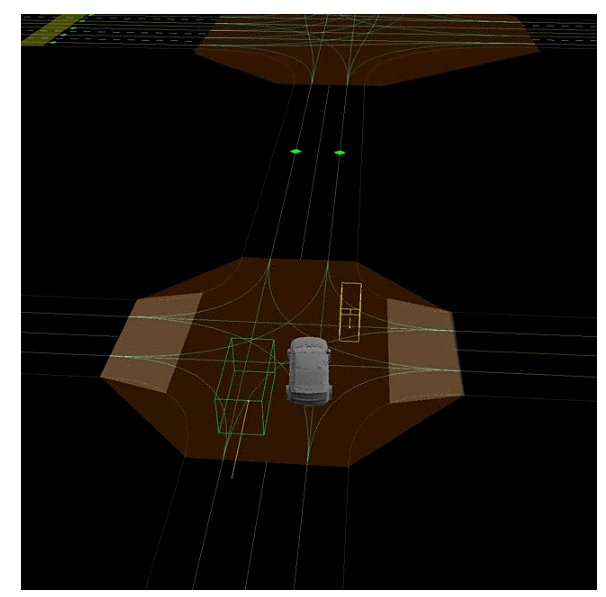
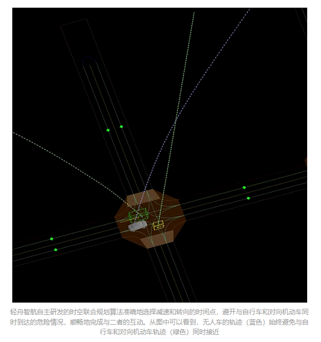
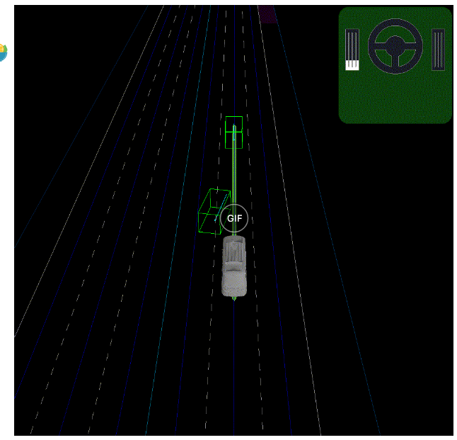
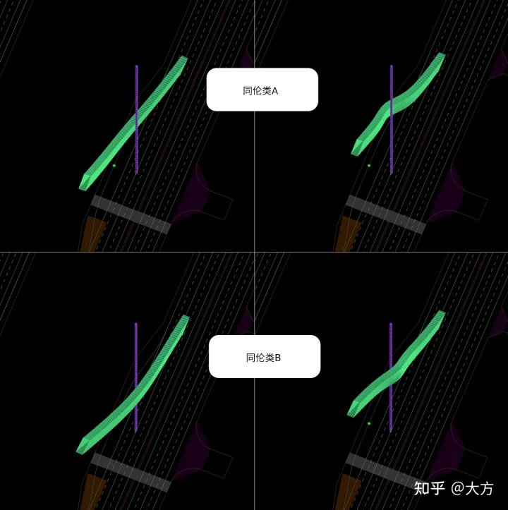
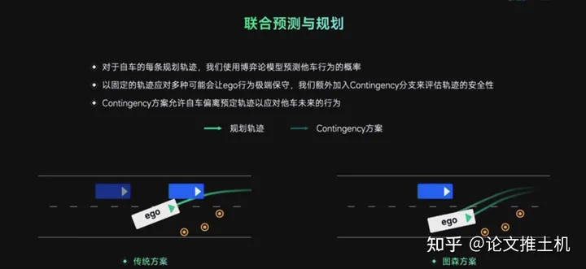
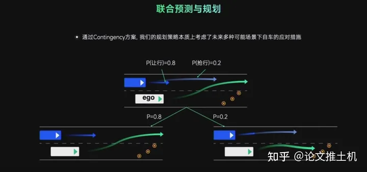
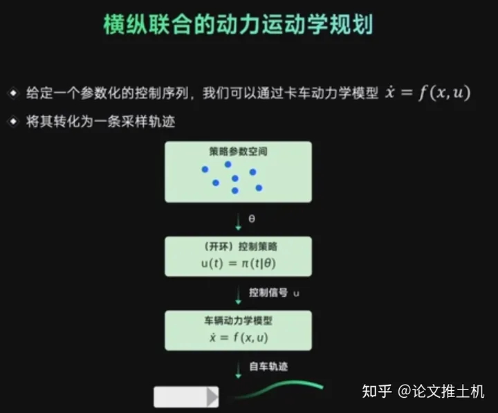
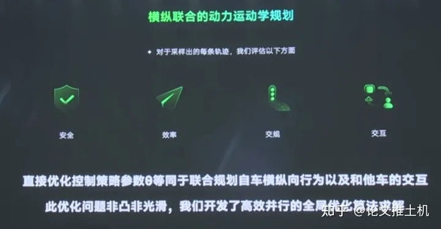
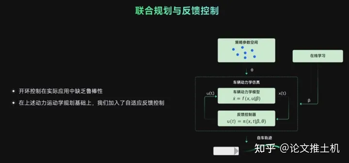
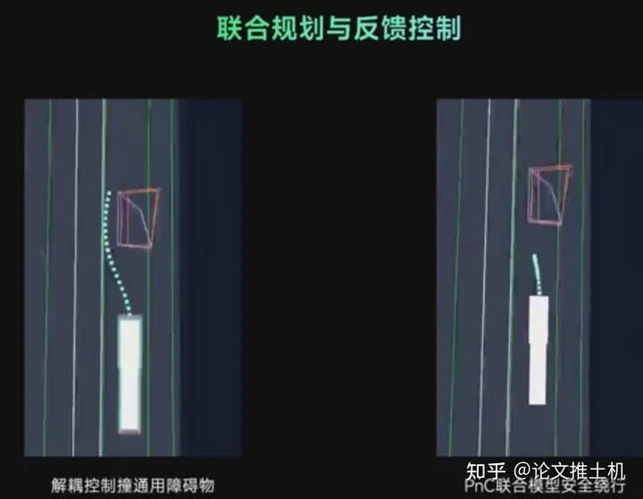

时空规划的部分概念：
## 0 规划的两个自由度

上一期运动规划技术分享[《运动轨迹仅仅是2D的？——论自动驾驶运动规划的维度》](https://zhuanlan.zhihu.com/p/259268408)中我们提到，如果不考虑过去时间维度的话，无人车对未来规划的运动轨迹（trajectory）是在二维空间和一维未来时间中的曲线，可以理解为空间位置（2D坐标）对时间的函数。自动驾驶控制和线控系统中的_纵向控制_和_横向控制_，驾驶员操控的_刹车/油门踏板_和_方向盘_这两个模态，规划中常用的Frenet坐标系的_切向_和_法向_两个方向，都体现了车辆有两个自由度（degrees of freedom）这一基本事实。基于这一理解，业界的运动规划技术通常把对轨迹的规划拆分成两个子问题，即路径规划（path planning，或者叫geometry planning）和速度规划（speed planning）。路径规划对应于横向控制（方向盘角度），表达形式通常是Frenet坐标系的横向偏移量l对弧长s的函数，也就是路径（path）；路径描述的是一个纯粹的空间形状，与时间无关。速度规划对应于纵向控制（刹车/油门踏板开度），表达形式通常是s对时间t的函数，即速度曲线（speed profile）；速度曲线描述的是在路径上的进度，与路径的空间形状无关。虽然具体的规划算法千变万化，但归根结底都是生成两个一维函数，l(s)和s(t)。这就是我们通常所说的“时空解耦规划”（space-time decoupled planning）。今天的讨论里，我们要挑战这个思维定式。

回到运动轨迹的语义来看，最终评判一个轨迹好坏的标准中，两个空间维度是不可分割的。比如，安全性要求我们对轨迹和所有障碍物做碰撞检测，而与动态物体碰撞的定义是在同一时间占据同一空间位置，因此只用路径或者只用速度曲线都无法准确检测碰撞（业内时空解耦规划常见的处理思路是在路径确定后，用速度曲线检查碰撞）。另一方面，舒适性要求我们从多角度全方位地评估运动轨迹的平滑性，其中最重要的几个指标，像横向加加速度（lateral jerk），纵向加加速度（longitudinal jerk）等，都不可避免地同时跟方向盘转角/角速度和刹车/油门踏板开度/变化率有关（同样，业内常见的思路是在路径确定后，在速度曲线优化中考虑这些因素）。时空解耦规划的弱点在这里彰显无遗：不论先规划路径后规划速度，还是先规划速度后规划路径，二者共同影响的因素只能留到最后，而先规划的那一半就很难考虑到这些因素。比如，**在常见的先路径后速度的框架下，我们在规划路径的时候无法知道最终的速度曲线，等到速度规划完成了，回过头可能发现这样的速度下，这条早已规划好的路径其实并不是最优的，甚至可能是很差的**。

**一个复杂互动场景的例子，无人车的车道右方有低速同向行驶的自行车，路对面有高速对向行驶的机动车，二者间距不足以直接通过，因此无人车需要兼顾路径（对自行车的避障动作）和速度（选择与自行车和机动车各自交互的时间点），找到合适的时间和合适的地点绕过自行车。**

https://vdn6.vzuu.com/SD/86b89cfe-171f-11ed-b5b2-6ebd6d1e2a6e.mp4?pkey=AAUDTOcYaJHPaHDJ7b4-PnrZ-Zy9OmfexqiUTEufqaThb2vJJFRaT3ux5w-8FZedvBxlaMowPgxh3K09zlRHyVyG&c=avc.1.1&f=mp4&pu=078babd7&bu=078babd7&expiration=1691386817&v=ks6

当然，很多朋友可能对解决这个问题作过一些尝试，可能还找到了一些效果不错的技巧。比如，在优化路径的时候，如果需要用到速度（比如，需要决定在什么位置绕过动态障碍物），可以用上一个规划周期的速度曲线来作为近似。在一些实际应用场景中，可能这样也就够了。甚至还有人尝试过在一个规划周期之内先做路径规划，再做速度规划，然后回过头来用最新的（可能更准确的）速度结果再重做路径规划。但这些技巧终究只是近似，总是有许多情况会让近似效果不理想；比如如果当前有新的障碍物刚被检测和追踪到，两个规划周期之间的速度曲线可能会大相径庭，这就会严重影响根据旧的速度曲线规划出来的路径的质量。

## 1 时空规划的优点

两个场景：
### 1.1 旁车道对向快车，自车道慢车

**一个复杂互动场景的例子，无人车的车道右方有低速同向行驶的自行车，路对面有高速对向行驶的机动车，二者间距不足以直接通过，因此无人车需要兼顾路径（对自行车的避障动作）和速度（选择与自行车和机动车各自交互的时间点），找到合适的时间和合适的地点绕过自行车。**
https://vdn6.vzuu.com/SD/86b89cfe-171f-11ed-b5b2-6ebd6d1e2a6e.mp4?pkey=AAUDTOcYaJHPaHDJ7b4-PnrZ-Zy9OmfexqiUTEufqaThb2vJJFRaT3ux5w-8FZedvBxlaMowPgxh3K09zlRHyVyG&c=avc.1.1&f=mp4&pu=078babd7&bu=078babd7&expiration=1691386817&v=ks6

### 1.2 cut-in场景

在上游输入（定位，感知等）保持稳定的情况下给出平滑的规划是比较容易的，但无人车在城市公开道路上需要处理大量不可预料的情况，不论是因为上游定位感知等模块给出不稳定、跳变的结果，还是因为现实世界中实际存在突变（比如被遮挡的物体突然可见，或者近距离的邻车突然决定变道等），都会造成规划的输入无法保证稳定连续。下面这个图中展示的是一个比较常见的场景，就是我们通常称为cut in的情况：

这些情况很常见，而经验丰富的人类司机总是能泰然处之，很少需要做急刹车之类的紧急操作，这就给致力于打造自动驾驶“老司机”的轻舟智航团队设立了很高的目标。在输入发生突变的情况下，保证安全性是首要任务，但通常在保证安全的前提下，我们仍然有很多轨迹的选择，这时候如何选择体感最优的轨迹就尤为重要。人类司机向我们证明了，只要耐心打磨驾驶技术，就能在绝大多数情况下，找到又安全又舒适的驾驶轨迹。那么根据我们上面对轨迹平滑性和体感之间关系的分析，我们应该怎样处理cut in这个场景呢？

## 2时空规划的难点

### 2.1初始解

数值优化效果的重要决定因素之一，是初始解的质量。规划问题本身是个高度非凸（non-convex）的优化，有很多局部极值，而基于梯度的数值优化方法，由于其根据函数局部特征逐步收敛的工作原理，都很难跳出初始解所选定的局部范围，也就是说，初始解的选择决定了数值优化会探索哪些局部极值。因此，初始解的生成就是在众多局部极值中，找到全局最优的过程，其实也就是我们通常所说得“决策”（decision making）的过程。那么，我们怎么知道有哪些局部极值可供选择呢？

 在上文的障碍物绕行场景中，几个从无人车当前位置（右上方）出发的可能的轨迹。第一行两个轨迹都是从障碍物一侧绕行，第二行都是从另一侧绕行。从左侧绕行的轨迹无法在不碰撞障碍物的条件下通过连续变形转变成从右侧绕行，因此第一行两个轨迹属于同一个同伦类，第二行属于另一个同伦类。
 
拓扑学（topology）给我们提供了分析这个问题的工具。在轨迹空间中，有很多可行的轨迹是相似的，一个轨迹可以经过连续变换转化成另一个轨迹，而在变换过程中始终保持可行（不会跨过任何一个障碍物）；直观地讲，对这些轨迹的探索可能都会被同一个初始解覆盖到。如果我们把轨迹看作是空间位置对时间的连续函数，那么描述这种轨迹“相似性”的数学概念就是同伦（homotopy），相似轨迹的分组就是同伦类（homotopy classes），而对于每一个同伦类中的所有轨迹，我们只需要生成一个与之同伦的初始解，就可以覆盖了。枚举所有同伦类可以通过推广维诺图（generalized Voronoi diagram）等算法来实现。不过，这个领域在学术界还在活跃的研究中，在时空中如何高效地处理同伦类还有待探索， 而且也有学者质疑同伦类可能并不是离散、定性地描述轨迹分类（也就是决策）的理想形式。时空联合规划能力的最大限度的发挥，离不开这个领域的突破。

## 3 图森的时空规划

### 3.1耦合预测决策规划

图森的方案是**耦合预测还有决策规划**，对于每个自车规划的意图轨迹，会首先使用博弈论模型去预测车辆可能的反应以及多种可能反应的概率分布。

图森的方案，会在对方让行的情况下，选择抢行。

规控模块中，业界非常关心的问题是**时空以及横纵联合的搜索与优化**，传统的轨迹规划会首先固定横向行为去优化纵向行为或者是固定纵向行为优化横向行为，**限制了空间会导致规划的结果丧失敏捷性，在一些非常危险的情况下有可能使得本车规划不出安全的轨迹**。

#### **（1）预测（博弈）**
然后决策上面则是采用了博弈模型，前面的预测同学讲用的level-k博弈，不过没有人对他们怎么做的决策有详细介绍的，我们暂且默认就是level-k吧，level-k博弈模型下，根据自车的不同轨迹，博弈出其他车的意图概率，因为有level-k，所以可以产生多个目标不同激进程度的概率，然后在这个分布下进行contingency。然后上面说了，有多个自车的轨迹，所以每个轨迹下都会演化出对应的环境，现在就通过reward function来评估一下cost, 找到最好的自车策略，到这里还没结束，他们的优化目标是策略参数而不是控制策略本身，所以还有一道对策略参数进行全局优化的过程，得到自车最优的控制策略。

#### **（2）规划（contingency方案+时空联合规划（参数化），联合多模态的预测，给出规划结果）**

- **contigency方案**

如上图contingency能够同时考虑交互目标的多模态，在同时考虑目标的不同意图下做出自车的综合考虑下的最佳策略。不好意思，大疆很早以前就用了。

- **时空联合规划**
图森的方案是耦合的横纵行为的优化，同时也要保证规划的轨迹能够满足非常复杂的车辆动力学模型。具体而言使用一个参数化的控制序列(用一些参数去控制生成多条轨迹，可以说就是时空采样，然后优化这些参数)，对于每个参数所生成的自车轨迹会评估他的好坏，参考因素包括安全性、效率、交规、交互，等等。
图森的方法是“principle based, 即基于数学分析与建模的方法”，建立起策略参数和具体控制策略之间的联系。

由于现在的轨迹是由控制策略参数所确定的，因此优化目标是控制策略参数的一个函数，那通过对这个参数进行优化，就可以同时优化横向和纵向的行为以及如何和其他车辆交互。

时空联合优化确实不再被人为限制解空间，所以肯定比解耦方案要优越。图森的做法是先搞一个时空间联合采样，并且是在策略参数空间上的采样，给定策略参数，再给定车辆模型，得出对应的开环推演的轨迹：

- 轨迹评估
说这个reward function肯定是高度非凸非光滑的，怎么整，有一个高端的全局优化器，具体是啥思路没有：

### 3.2 耦合规划控制
见4
上面讲了用开环推演得到未来轨迹，最后得到的控制序列那肯定不够，不能直接提供控制，就算是高频刷新planning，也不保证稳定性，所以后面还有一个反馈控制。这就不多解释了，肯定得有反馈控制。这里还有一个在学学习模块。学的什么东西呢，就是planning中会低频更新策略参数。

最后给了一个例子，把控制序列的优化和planning放在一起的好处就是planning的结果非常丝滑，且控制能够很好执行它：

## 4 规划控制耦合的优点

可以举例说明传统的**规划控制解耦和耦合规划控制**的区别。

**缺点：**
如自车想绕过前面比较大的障碍物，传统的方案可能规划鼓励的生成目标轨迹，控制的独立追踪目标轨迹，这两者之间在一些情况下会产生比较大的偏差。当偏差比较大的时候，虽然规划的轨迹觉得自己绕过障碍物，但是控制的过程中造成比较大的误差使得自车生成的轨迹还是和障碍物发生了刮蹭。

**优点：**
而反馈控制和规划耦合的系统，会实时的根据当前测量的状态重新规划和控制，从而保证了这个大范围绕障碍物过程中侧向间距安全性。

## 5 Tesla的规划模块
