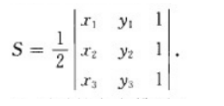

## Menger曲率（三点曲率）

```
K = 4A/(|P1-P2|·|P2-P3|·|P3-P1|)

A是由这三个点构成的三角形的面积: A = 1/2 |(x2 - x1) * (y3-y1) - (y2 - y1) * (x3 - x1)|

|Pi-Pj|表示两点间的距离
```


```python
numerator = 2 * abs((x3 - x2) * (y2 - y1) - (x2 - x1) * (y3 - y2))
denominator = np.sqrt(
    ((x3 - x2) ** 2 + (y3 - y2) ** 2)
    * ((x2 - x1) ** 2 + (y2 - y1) ** 2)
    * ((x3 - x1) ** 2 + (y3 - y1) ** 2)
    )
if denominator >= epsilon:
     curvatures[i] = numerator / denominator
```


## 曲率方向

```python
vector1 = (x2 - x1, y2 - y1)
vector2 = (x3 - x2, y3 - y2)
cross_product = vector1[0] * vector2[1] - vector1[1] * vector2[0]
if cross_product > 0:
    curvatures[i] *= 1 # 左转
else:
    curvatures[i] *= -1 # 右转
```